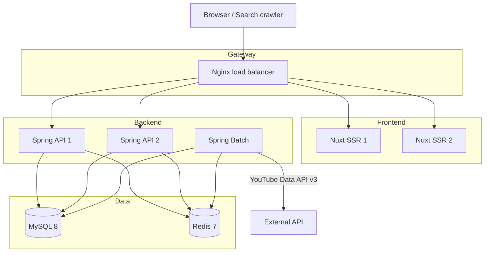

<p align="center">
  
</p>

<h1 align="center">TubeTen</h1>

<p align="center">
  YouTube 공개 데이터로 현재 빠르게 성장하는 영상과 채널을 찾는 트렌드 인텔리전스 플랫폼
</p>

<p align="center">
  <strong>데이터 파이프라인 · 랭킹 · API · 운영 자동화 · SSR 서비스</strong>
</p>

<p align="center">
  <a href="https://www.tubeten.co.kr"><strong>Live Service</strong></a>
</p>

<p align="center">
  
  
  
  
  
  
  
</p>

---

<p align="center">
  <a href="#핵심-성과">핵심 성과</a>
  &nbsp;·&nbsp;
  <a href="#주요-기여와-의사결정">주요 기여</a>
  &nbsp;·&nbsp;
  <a href="#대표-문제-해결">문제 해결</a>
  &nbsp;·&nbsp;
  <a href="#운영-기획과-신뢰성">운영</a>
  &nbsp;·&nbsp;
  <a href="#품질-검증">품질 검증</a>
</p>

## 프로젝트 한눈에 보기

TubeTen은 조회수 총량이 아니라 **최근 4시간의 조회수·좋아요·댓글 증가량과 상대 성장률**을 이용해 급상승 흐름을 계산합니다. 한국·미국·일본의 국가·카테고리별 트렌드, Shorts 분석, 영상 탐색, 크리에이터 성장 리포트와 채널 벤치마크를 제공합니다.

| 항목 | 내용 |
|---|---|
| 프로젝트 성격 | 기획부터 개발·배포·운영까지 이어지는 개인 실운영 서비스 |
| 주요 수행 영역 | 백엔드 아키텍처, 데이터·배치 파이프라인, 랭킹, API, DB, 캐시, 배포·운영 |
| 운영 기간 | 2026.01 ~ 현재 |
| 데이터 주기 | 국가·카테고리별 30분 수집·스냅샷·랭킹 집계 |
| 런타임 | Nginx, Nuxt ×2, Spring API ×2, Spring Batch, MySQL, Redis — 8 containers |
| 백엔드 구조 | Java 21·Spring Boot 3.5 멀티 모듈, JPA·QueryDSL·JdbcTemplate 병행 |
| 현재 랭킹 | 검증된 `velocity-v1` 공개, `velocity-v2-shadow` 병행 평가 |
| 운영 원칙 | 비용·성능·데이터 신뢰도를 계측한 뒤 feature flag와 승격 gate로 점진 적용 |

> YouTube 공식 실시간 순위를 복제하는 서비스가 아니라, 공개 API로 발견한 후보를 자체 스냅샷으로 추적하고 TubeTen 알고리즘으로 성장 속도를 분석하는 서비스입니다.

## 핵심 성과

| 개선 영역 | 이전 | 개선 후 | 핵심 결정 |
|---|---:|---:|---|
| 영상 스냅샷 수집 | 790개, 9분 24초 | 약 35초, 최근 운영 786개 39초·실패 0 | Virtual Thread와 DB Semaphore 분리 |
| 크리에이터 갱신 | 537명, 약 1,297초 | 약 160초 | I/O 병렬화와 커넥션 동시성 상한 설정 |
| 랭킹 집계 병목 | 약 182초 | 약 2초 | 일별 RANGE 파티션과 조회 범위 제한 |
| 무한 스크롤 | offset 기반 중복·누락 가능 | 동일 snapshot cursor | 데이터 변경 중에도 페이지 일관성 보장 |
| 배치 중복 실행 | JVM 로컬 guard 중심 | DB owner·lease claim | 다중 인스턴스·timeout 잔존 작업 보호 |
| 랭킹 개선 배포 | 공식 변경 후 결과 확인 | V1 serving + V2 Shadow 평가 | 품질 수치 없이 자동 승격하지 않음 |

성능 수치는 동일한 합성 벤치마크가 아니라 실제 운영 데이터량과 YouTube API 응답 조건에서 관측한 값입니다. 따라서 절대 성능보다 병목 원인과 개선 전후의 운영 추세를 판단하는 지표로 사용합니다.

## 주요 기여와 의사결정

| 영역 | 문제 정의 | 설계·구현 |
|---|---|---|
| 제품 | 단순 인기 영상 목록으로는 “지금 성장 중”인 흐름을 설명하기 어려움 | 30분 스냅샷과 4시간 비교 윈도우 기반 Velocity 랭킹 설계 |
| 후보 수집 | `mostPopular` 단일 소스는 후보 대표성이 제한적 | 기본 소스 유지 + 우수 채널·Search 후보를 비용 측정형 source로 분리 |
| 성능 | 외부 API I/O와 JDBC 작업을 같은 동시성 정책으로 처리 | Virtual Thread executor와 DB Semaphore를 분리해 병목별 제어 |
| 데이터 | 원본 시계열 누적으로 조인 비용과 NAS 디스크 사용량 증가 | 일별 파티션, 일일 집계, 주간 영구 콘텐츠의 다층 보관 정책 |
| 신뢰성 | 배치 timeout 후 작업 스레드가 남거나 여러 인스턴스가 중복 실행 가능 | 원자적 DB claim, timeout보다 긴 lease, 작업별 executor 적용 |
| API 계약 | 배치 경계에서 offset 페이지의 snapshot이 달라질 수 있음 | snapshot 시각·마지막 rank·video ID를 담은 opaque cursor 도입 |
| 알고리즘 | 새 점수 공식을 즉시 공개하면 회귀 원인을 검증하기 어려움 | V1/V2 동시 계산, 미래 성장 label, Recall·NDCG·Churn 승격 gate |
| 운영 | 신규 기능을 한 번에 켜면 quota·DB 부하·품질 원인을 분리하기 어려움 | feature flag, 국가 단위 canary, 지표 확인 후 단계적 확대 |

## 시스템 아키텍처



백엔드는 실행 책임과 변경 주기를 기준으로 세 모듈로 나눴습니다.

```text
tubeten-common  Domain · Application · Repository · YouTube/Redis infrastructure
tubeten-api     Public/Admin API · Security · OpenAPI · API cache
tubeten-batch   Collection · Aggregation · Cleanup · Flyway migration
```

API와 Batch를 별도 실행 JAR로 패키징해 조회 트래픽과 데이터 처리 부하를 분리했습니다. Flyway는 Batch 한 인스턴스만 실행하고 API는 스키마 검증만 수행해 다중 API 재기동 시 migration lock 경쟁을 피합니다.

## 30분 데이터 파이프라인

```text
05·35분  Target 수집
15·45분  Snapshot 수집
25·55분  Velocity 랭킹 집계 → 캐시 워밍 → 대시보드 데이터 생성
30분     크리에이터 영상 트렌딩 상태 동기화
01:00    D-1 일일 집계 → 파티션 생성·만료 제거
```

17개 작업을 `batch_master`에서 관리하며 cron, 활성 여부, timeout, retry를 런타임 설정으로 분리했습니다. 핵심 30분 파이프라인은 수집·스냅샷·랭킹의 시작 시각을 엇갈리게 배치해 같은 테이블과 커넥션 풀을 동시에 압박하지 않도록 했습니다.

후보 수집은 아래처럼 비용과 품질을 함께 봅니다.

| 후보 source | 운영 정책 | 관측 지표 |
|---|---|---|
| `MOST_POPULAR` | 항상 유지하는 기준선 | 후보 수, Top 100 진입률 |
| `TRACKED_CHANNEL` | feature flag, 국가 단위 점진 활성화 | 채널별 발견 기여, API 호출 수 |
| `SEARCH` | 기본 비활성, cadence·quota 상한 적용 | 24시간 진입률, 오류율, quota 비용 |

Search는 `search.list` 100 units와 상세 `videos.list` 호출을 함께 고려합니다. 후보 observation과 tracking state를 원본 타겟과 분리해 “어디서 발견했고 실제 랭킹에 진입했는지”를 추적할 수 있게 했습니다.

## 대표 문제 해결

### 1. 외부 API I/O와 DB 동시성을 분리했습니다

**문제**

고정 스레드 풀에서는 YouTube 응답을 기다리는 동안 플랫폼 스레드가 점유됐고, 단순히 동시성을 높이면 HikariCP 커넥션 풀이 먼저 고갈됐습니다.

**결정**

- 외부 HTTP I/O는 Java 21 Virtual Thread로 병렬화
- JDBC 저장 구간에만 Semaphore 적용
- 수집·랭킹·크리에이터 작업별 executor와 상한 분리
- interrupt 전파와 작업 종료를 배치 timeout 정책에 연결

**결과**

790개 스냅샷 처리 시간이 9분 24초에서 약 35초로 줄었고, 최근 운영에서도 786개를 39초·실패 0건으로 처리했습니다. 핵심은 “스레드를 많이 생성”한 것이 아니라 외부 I/O와 제한된 DB 자원에 서로 다른 동시성 정책을 적용한 것입니다.

### 2. 트랜잭션 경계를 네트워크가 아닌 저장 단위로 축소했습니다

**문제**

YouTube API 호출을 포함한 상위 메서드의 `@Transactional`이 느린 네트워크 응답 동안 DB 커넥션을 점유했습니다. 루프 내부에서 예외를 잡아도 외부 트랜잭션이 rollback-only가 되어 전체 작업이 실패하는 경우도 있었습니다.

**결정**

- 조율·외부 API 계층에서 장기 트랜잭션 제거
- 실제 DB 저장에만 짧은 트랜잭션 적용
- 단건 `REQUIRES_NEW` 반복을 정렬된 batch UPSERT로 통합
- video ID 기준 정렬로 동시 UPSERT의 lock 획득 순서 통일
- 채널·청크별 실패를 격리해 부분 성공 허용

**결과**

API 지연이 DB 커넥션 점유 시간으로 전이되는 구조를 제거했고, 한 채널 또는 한 청크의 오류가 전체 수집을 오염시키지 않도록 만들었습니다.

### 3. 데이터 수명주기를 기능 설계에 포함했습니다

30분 원본을 계속 보관하면 조회 쿼리와 디스크 모두 지속적으로 악화됩니다. 반대로 원본을 너무 빨리 지우면 랭킹 검증과 제품 신뢰도를 확보하기 어렵습니다.

| 데이터 | 보관 | 목적 |
|---|---:|---|
| `yt_trend_rank` | 3일 | 최신 snapshot 랭킹과 장애 분석 |
| `yt_video_snapshot` | 7일 | Velocity 계산과 상세 단기 시계열 |
| 후보 observation·V2 feature | 7일 | 후보 기여와 Shadow 설명 |
| 미래 성장 label·일별 평가 | 35일 | 2~4주 알고리즘 비교 |
| 일별 랭킹·스냅샷 요약 | 35일 | 원본 삭제 이후 추세 조회 |
| 주간 리포트 | 영구 | 검색·공유 가능한 장기 콘텐츠 |

고용량 시계열은 일별 RANGE 파티션으로 생성하고 만료 시 `DROP PARTITION`으로 제거합니다. 매일 미래 파티션을 미리 만들며, 행 단위 cleanup은 파티션이 적용되지 않은 환경과 예외 상황의 fallback으로 유지합니다.

### 4. 읽기 API와 배치 모두에서 일관성 기준을 명시했습니다

랭킹 응답에는 실제 데이터 기준 시각, 이전 snapshot 존재 여부, 알고리즘 버전과 커서 상태를 함께 제공합니다. 무한 스크롤 커서는 최초 snapshot을 고정하므로 페이지를 넘기는 사이 새 배치가 완료되어도 중복·누락이 생기지 않습니다.

배치 실행은 JVM 내부 guard에 더해 MySQL `batch_job_claim`을 사용합니다. owner instance와 lease를 원자적으로 선점하고, timeout 이후 실제 작업이 남아 있을 가능성을 고려해 claim을 즉시 해제하지 않습니다.

### 5. 알고리즘 변경을 배포가 아니라 실험으로 관리했습니다

현재 공개 순위는 운영 검증된 `velocity-v1`입니다. V2는 같은 snapshot에서 별도로 계산하고 사용자 응답에는 영향을 주지 않습니다.

```text
V1 serving ──────────────── 사용자 공개 랭킹
       └─ V2 shadow score
          └─ 6h / 24h future-growth label
             └─ Recall@K · NDCG@K · Overlap · Churn
                └─ 최소 14일 paired evaluation + 운영 승인
```

V2는 영상 포맷·업로드 연령 cohort 안에서 속도, 가속도, 좋아요·댓글 비율, 지속성을 정규화합니다. channel lift는 표본이 부족하면 결측 처리하고 나머지 가중치를 재정규화합니다. 승격 API의 `eligible=true`도 자동 전환 명령이 아니라 운영 의사결정 근거로만 사용합니다.

## API와 하위 호환성

OpenAPI 3.1 명세를 계약의 기준으로 관리합니다. 주요 호환성 원칙은 다음과 같습니다.

- `offset` 사용 클라이언트를 보호하면서 snapshot cursor를 추가
- `dataRefTime`에 KST offset을 명시해 데이터 기준 시각과 응답 시각을 구분
- legacy `isShorts` 규칙은 유지하고 V2용 4단계 `video_format`과 confidence를 별도 저장
- 새 필드에는 nullable·fallback 정책을 두고 프론트 전환 이후 폐기 여부 결정
- V1 raw score와 V2 normalized score를 혼합하지 않고 알고리즘 버전을 함께 노출

이 방식은 새 모델을 도입하면서도 기존 사용자 화면과 API 소비자를 동시에 보호하기 위한 선택입니다.

## 운영 기획과 신뢰성

| 운영 시나리오 | 대응 |
|---|---|
| YouTube 5xx·429·일시 오류 | Resilience4j Retry·CircuitBreaker, 예외별 재시도 정책 |
| YouTube quota 증가 | source별 cadence·호출 수 기록, 고비용 source 기본 비활성 |
| Redis 장애 | 캐시 miss로 간주하고 DB 조회 fallback, 캐시 오류가 응답 장애로 전파되지 않게 처리 |
| 캐시 대량 무효화 | Redis `KEYS` 대신 크리에이터별 index SET으로 O(K) 삭제 |
| Batch 중복·timeout | DB claim·lease, 작업별 executor, interrupt·잔존 작업 보호 |
| 원본 데이터 증가 | 일별 파티션 자동 생성·만료 DROP, 일일·주간 집계 유지 |
| DB migration | Batch 단독 Flyway, API schema validate, 배포 전 history·DDL 확인 |
| API 배포 | API 2개 인스턴스 순차 교체와 Actuator health gate |
| Nuxt 배포 | web-1 → web-2 롤링 교체, 실패 시 이전 Docker image rollback |
| V2 품질 회귀 | Shadow flag 즉시 비활성, V1 serving 유지 |

운영 정책은 “문제가 나면 재시작”이 아니라 실패 범위를 줄이고 이전 상태로 돌아갈 수 있는 경로를 먼저 설계하는 것을 기준으로 삼았습니다.

## Frontend와 SEO까지 연결한 이유

백엔드에서 만든 데이터가 검색·탐색 가능한 제품으로 전달되지 않으면 운영 가치가 제한됩니다. 기존 Vue SPA를 Nuxt SSR로 전환하고 페이지 성격에 따라 SSR·CSR·`noindex`를 구분했습니다.

- 허브·크리에이터·주간 리포트는 SSR과 동적 메타 적용
- 실시간 차트는 서버 shell과 클라이언트 데이터 렌더링 분리
- 휘발성이 높은 영상 상세는 CSR + `noindex`
- DB 기반 sitemap, 주간 RSS, 트랜잭션 커밋 이후 IndexNow 알림
- `/youtube-top10` 첫 페이지 SSR hydration 이후 snapshot cursor로 추가 조회
- 390·768·1280px 시각 회귀와 axe·키보드·SEO 계약 검사

프론트엔드를 별도 결과물로 보지 않고 API 계약, 캐시 TTL, 검색 노출, 데이터 보관 정책의 최종 소비자로 다뤘습니다.

## 기술 스택

| 분류 | 기술 | 적용 |
|---|---|---|
| Language | Java 21 | Virtual Thread, record, modern concurrency |
| Backend | Spring Boot 3.5 | Web, Security, Actuator, multi-module |
| Persistence | JPA, QueryDSL, JdbcTemplate | 도메인 CRUD와 집계·batch SQL 분리 |
| Resilience | Resilience4j | Retry·CircuitBreaker와 오류 분류 |
| Database | MySQL 8 | RANGE partition, window function, FULLTEXT |
| Cache | Redis 7 | Gzip 랭킹, 스냅샷, 크리에이터 인사이트 캐시 |
| Frontend | Nuxt 3.21, Vue 3, Pinia | SSR·CSR, hydration, 상태 관리 |
| Visualization | ECharts | 성장·순위·비교·히트맵 |
| Infra | Docker Compose, Nginx | 8 containers, health gate, rolling deployment |
| Contract | OpenAPI 3.1 | 공개·관리자 API 계약과 버전 관리 |

## 품질 검증

| 검증 | 현재 기준 |
|---|---|
| Backend | JUnit 5 — 25 suites, 51 tests, failure 0 |
| Spring context | API·Batch 전체 context를 H2 test profile로 기동 |
| Build | API·Batch bootJar와 Nuxt production build 검증 |
| Static gate | ESLint, vue-tsc typecheck |
| Frontend regression | 사용자 화면 14개 변형 × 3 viewport = 기준 이미지 42개 |
| E2E matrix | 141 project cases 중 77 pass, viewport 중복 64 intentional skip |
| Accessibility | axe WCAG A·AA, keyboard interaction, overflow 검사 |
| SEO contract | canonical·title·description·OG, 동적 meta, IndexNow key 응답 |

H2 테스트는 MySQL의 Flyway DDL, native query, `ON DUPLICATE KEY UPDATE`, 실제 파티션 재구성을 완전히 대체하지 못합니다. 이를 숨기지 않고 실제 MySQL 배포 전 migration history·테이블·파티션을 별도로 확인하는 운영 gate로 관리합니다.

## 이 프로젝트가 보여주는 역량

- 기능 구현을 넘어 **데이터 수명주기와 운영 비용**까지 포함한 백엔드 설계
- 외부 API, DB pool, Redis, scheduler의 병목을 분리해 보는 **시스템 관점의 성능 개선**
- 트랜잭션·락·배치 timeout·중복 실행을 실제 장애 범위로 연결하는 **운영형 문제 해결**
- API 하위 호환성과 snapshot 일관성을 제품 경험까지 연결하는 **계약 중심 개발**
- 새 알고리즘을 Shadow·미래 label·승격 gate로 관리하는 **데이터 기반 의사결정**
- 측정하지 않은 효과와 남은 검증 범위를 명시하는 **기술적 투명성**

---

<p align="center">
  <strong>프로젝트 기간</strong>: 2026.01 ~ 현재
  &nbsp;·&nbsp;
  <strong>현재 공개 랭킹</strong>: velocity-v1
  &nbsp;·&nbsp;
  <strong>업데이트</strong>: 2026-07-17
</p>
