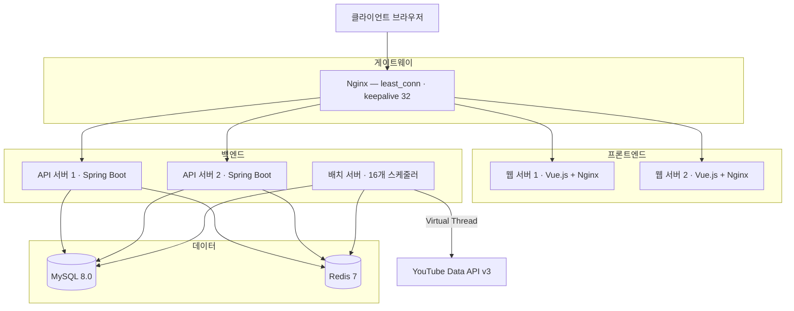

<p align="center">
  
</p>

<h1 align="center">TubeTen</h1>

<p align="center">
  YouTube 실시간 트렌드 분석 플랫폼 — Velocity 알고리즘 기반 급상승 영상 탐지
</p>

<p align="center">
  <strong>Live Demo</strong> &nbsp;·&nbsp; <a href="https://www.tubeten.co.kr">https://www.tubeten.co.kr</a>
  &nbsp;|&nbsp;
  <strong>API Docs</strong> &nbsp;·&nbsp; <a href="https://app.swaggerhub.com/apis-docs/tubeten/tubeten-api/v3.7.0?view=uiDocs">SwaggerHub</a>
</p>

<p align="center">
  
  
  
  
  
  
</p>

---

## 개요

조회수 절댓값이 아닌 **단위 시간당 증가 속도(Velocity)**로 YouTube 트렌드를 탐지하는 풀스택 웹 서비스입니다.  
3개국(KR·US·JP), 지역당 최대 9개 카테고리를 30분 주기로 수집·분석하며, 캐시 히트 기준 평균 **50ms** 응답을 제공합니다.

<div align="center">

| 지표 | Before | After |
|:---|:---:|:---:|
| 스냅샷 수집 시간 (Virtual Thread 도입) | 9분 24초 | **35초** |
| 타겟 수집 시간 (병렬 스레드 상한 제거) | ~29분 (KR) | **~10분 예상** |
| 랭킹 집계 시간 (DB 파티셔닝) | 182초 | **2초** |
| 번들 크기 (Gzip 압축) | 869 KB | **88.4 KB** |
| Redis 메모리 (Gzip 직렬화) | — | **70% 절감** |
| 배치 성공률 | 50% 미만 | **98.5%** |
| 캐시 히트율 | — | **95.2%** |

</div>

---

## 아키텍처

Docker Compose 8개 컨테이너로 구성된 자체 호스팅(NAS) 환경입니다.



**멀티 모듈 구조** — `Controller → Facade → Domain Service → Repository`  
계층 의존 방향은 **ArchUnit**으로 빌드 시 자동 검증합니다.

```
tubeten-back/
├── tubeten-common/   # 도메인, Facade, 인프라 공통 라이브러리
├── tubeten-api/      # REST API 서버
└── tubeten-batch/    # 배치 스케줄러 (batch_master 기반 16개 작업)
```

---

## 기술 스택

### Backend

| 기술 | 선택 이유 |
|------|----------|
| **Java 21** | Virtual Thread — I/O 블록 중 플랫폼 스레드 반납, 배치 병렬화 극대화 |
| **Spring Boot 3.5** | 멀티 모듈, Spring Security + Actuator 생태계 |
| **Spring Data JPA + QueryDSL** | 정적 타입 동적 쿼리, N+1 방지를 위한 fetch join / 벌크 쿼리 |
| **Resilience4j** | CircuitBreaker + Retry(지수 백오프) — YouTube API 장애 자동 차단 |
| **MySQL 8.0** | 일별 RANGE 파티셔닝 + DROP PARTITION(O(1)), 윈도우 함수 활용 |
| **Redis 7** | 3단계 캐시 계층 · AOF 영속화 · Gzip 압축 · ETag |
| **Logback** | 5파일 구조 + AsyncAppender + 14일 자동 롤링 |

### Frontend

| 기술 | 용도 |
|------|------|
| **Vue.js 3** (Composition API) | UI 프레임워크, 컴포저블 기반 관심사 분리 |
| **ECharts** | 트렌드 차트 · 랭킹 이력 · 채널 벤치마크 (레이더/바/라인) |
| **Webpack** (Vue CLI) | 코드 스플리팅 · Tree Shaking · Gzip 3중 최적화 |
| **@prerenderer/webpack-plugin** | 빌드 타임 정적 HTML 생성 — Google 봇 SEO 최적화 |

### Test

**JUnit 5** · **jqwik** (Property-based, Velocity 불변식) · **ArchUnit** (계층 의존성) · **Testcontainers** (MySQL 통합)

---

## 기술적 도전과 해결

### 1. 배치 수집 시간 94% 단축 — Virtual Thread

790개 영상을 `FixedThreadPool(4)`로 처리하면 순차 실행으로 **9분 24초** 소요.  
`VirtualThreadPerTaskExecutor`로 전환해 16개 배치를 동시 실행하고, I/O 블록 중 플랫폼 스레드를 반납하도록 변경 → **35초**로 단축.  
30분 파이프라인 안에서 여유 구간이 확보되어 배치 실패율이 구조적으로 감소했습니다.

### 2. 랭킹 쿼리 타임아웃 → 일별 파티셔닝

모든 데이터가 `pMAX` 파티션에 집중되어 랭킹 쿼리(3중 조인)가 타임아웃 반복, 배치 성공률 50% 미만.  
`yt_video_snapshot` · `yt_trend_rank` 두 테이블에 일별 RANGE 파티셔닝 적용.  
만료 파티션을 `DROP PARTITION`(O(1) — InnoDB 테이블스페이스 직접 제거)으로 정리 → 집계 시간 **182초 → 2초**, 성공률 **98.5%**.

### 3. YouTube API 호출을 @Transactional로 감싸 DB 커넥션 누수

`collectTargets()`에 `@Transactional`이 선언된 상태에서 YouTube API(최대 23분) 대기 중 커넥션을 보유 → HikariCP 경보 반복.  
`@Transactional`을 제거하고 트랜잭션 경계를 DB 저장 메서드 단위로 분리.  
커넥션 보유 시간이 API 레이턴시(최대 23분)에서 INSERT 시간(수 ms)으로 단축, 경보 완전 해소.

### 4. UnexpectedRollbackException — 루프 내 예외와 외부 트랜잭션 충돌

`updateAllActiveCreators()`의 외부 `@Transactional` 안에서 채널별 예외를 `catch`해도 Spring이 트랜잭션을 **rollback-only**로 마킹 → 루프 종료 시 `UnexpectedRollbackException`.  
외부 메서드의 `@Transactional`을 제거하고, 채널별 메서드가 독립 트랜잭션을 소유하도록 변경.  
채널별 실패가 전체 배치에 전파되지 않고, 커넥션 장기 보유 문제도 함께 해소됐습니다.

### 5. yt_video_keyword 데드락 — 전파 속성 변경으로 갭 락 제거

`REQUIRES_NEW` 트랜잭션 안에서 수십 개의 `INSERT IGNORE`를 연속 실행하면 InnoDB 갭 락이 트랜잭션 종료 시까지 누적, 멀티 스레드 환경에서 교착 상태 반복 발생.  
`Propagation.NOT_SUPPORTED`로 변경해 각 INSERT가 auto-commit되도록 처리 → 갭 락 즉시 해제, 데드락 구조적 제거.

### 6. Resilience4j 형식적 도입 → 실질 동작으로

라이브러리는 `build.gradle`에 추가되어 있었으나 `application.yml` 설정이 없어 실제 동작은 수동 retry 루프(try/catch × 3회)뿐이었습니다.  
`Resilience4jConfig.java`를 신규 작성해 CB(COUNT_BASED 20건, 실패율 50% → OPEN)와 Retry(지수 백오프 1s→4s)를 정의.  
5xx·429는 재시도, `ChannelNotFoundException`·할당량 초과는 즉시 포기 — 불필요한 재시도 제거.

이후 운영 로그 분석을 통해 추가 튜닝 진행.  
타겟 수집 API 호출이 실측 ~10분씩 소요됨에도 슬로우콜 기준이 10초로 설정되어 **거의 모든 정상 호출이 슬로우콜로 기록** → CB가 불필요하게 OPEN되는 현상 확인.  
`slowCallDurationThreshold 10s → 300s`, `waitDurationInOpenState 60s → 120s`로 조정해 API 응답 특성에 맞는 임계값으로 정규화.

### 7. SEO 유입 0건 → Google 사이트맵 6,880 URL 등록

**문제**: `site:tubeten.co.kr` 색인 1건, 검색 유입 전무.  
Vue SPA 특성상 빈 HTML을 응답해 Google 봇이 thin content로 판정한 것이 원인.

**원인 분석 및 수정 사항:**

| 원인 | 수정 |
|------|------|
| `robots.txt Disallow: /static/` — Googlebot JS 번들 차단 | 해당 규칙 제거 |
| sitemap에 `/shorts-top10` 등록 (라우트 없음) — Soft 404 | sitemap 및 PRERENDER_ROUTES에서 제거 |
| `build:prerender` 중 axios 전체 스킵 — 빈 HTML 생성 | 스킵 로직 제거 + `VUE_APP_API_BASE_URL` 실서버로 고정 |
| Puppeteer CORS 오류 — 로컬 서버→운영 API 호출 차단 | `--disable-web-security` 플래그 추가 |
| `localStorage` 기반 JS 리디렉션 — Googlebot 매번 `/intro`로 우회 | Nginx `location = /` 서버사이드 301로 대체 |

**구현 내용:**

- `@prerenderer/webpack-plugin + Puppeteer`로 빌드 타임에 주요 라우트를 헤드리스 Chromium으로 렌더링, 정적 HTML을 `dist/<route>/index.html`에 저장
- 클라이언트 도착 후 Vue가 hydrate → SPA 동작 그대로 유지하면서 Google 봇에 완성된 HTML 제공
- 백엔드 `SitemapService`에서 DB 기반 동적 sitemap 자동 생성 (크리에이터·영상 URL 페이지 분할)
- Nginx `location = /` → 301 `/intro` (서버사이드) — 정적 HTML 랜딩 페이지로 봇 즉시 응답
- JSON-LD 구조화 데이터 (WebSite·VideoObject·Person 스키마) 및 SearchAction 적용

**결과:**

<div align="center">


</div>

> Google Search Console 기준 sitemap **6,880개 URL 등록 성공** (2026-05-19)  
> 정적 페이지 8개 + 크리에이터·영상 동적 URL 6,872개 자동 생성

### 8. 타겟 수집 병렬화 병목 — 스레드 풀 상한 제거

운영 로그에서 타겟 수집 소요 시간이 KR 기준 ~29분, US/JP ~24분으로 측정됨.  
코드를 역산하면 카테고리 병렬 스레드가 `Math.min(activeCategories.size(), 4)`로 고정되어  
KR 9개 카테고리가 4개씩 **3라운드(~29분)** 로 처리되고 있었음.  
상한을 제거해 카테고리 수만큼 동시 실행 → KR 기준 **1라운드(~10분)** 로 단축.  
비교: 지역(3) × 카테고리(최대 9) = 최대 27개 동시 YouTube API 호출로 rate limit 모니터링 병행.

### 9. 영상 분석 지표 4가지 버그 발견

운영 중인 `/video/:id` 화면을 심층 검토하다 발견한 버그들입니다.

- **viewDelta를 총 조회수로 사용** — 200만 조회수 영상이 히어로에 "3,200"으로 표시 → `viewCount` 필드로 교체
- **성장률 분모 오류** — 실제 스냅샷 2일치를 요청 기간 168h로 나눠 3.5배 낮게 산출 → 실제 시간 차이를 분모로 교체
- **카테고리 평균 풀스캔** — 날짜 조건(`90일`) + `LIMIT 1000` 추가로 스캔 범위 제한
- **7d 랭킹 차트 공백** — `yt_trend_rank`(3일 보관) + `yt_trend_rank_daily`(7일 집계) 하이브리드 쿼리로 병합

### 10. API 문서 자동화 — GitHub Actions → SwaggerHub 자동 동기화

API 스펙을 SwaggerHub에 수동으로 복붙하던 방식에서, **git push 한 번으로 자동 갱신**되는 파이프라인으로 개선했습니다.

**구조:**

```
swagger.yaml 수정 → git push → GitHub Actions 실행 → SwaggerHub API POST → 문서 갱신
```

- `swagger.yaml`을 레포지토리 루트에서 단일 진실 공급원(Single Source of Truth)으로 관리
- `paths:` 변경 시에만 트리거되도록 `paths: [swagger.yaml]` 필터 적용 → 불필요한 실행 최소화
- SwaggerHub API Key를 GitHub Secrets에 저장해 키 노출 없이 안전하게 인증
- `workflow_dispatch` 트리거로 수동 실행도 지원

**결과:** API 구현과 문서가 항상 동기화된 상태 유지. 스펙 반영 누락 및 수동 작업 제거.

### 11. 순위 급변 완화 — Velocity 파라미터 튜닝

운영 로그에서 새 영상이 등록 직후 1위에 오르고, 수 사이클 만에 200위권으로 급락하는 현상이 반복되었습니다.

**원인 분석:**
- 비교 윈도우가 2h로 짧아 바이럴 스파이크가 윈도우 경계를 벗어나는 순간 delta ≈ 0으로 수직 폭락
- 신규 보너스 8,000이 실제 점수 범위(5K~50K) 대비 최대 160%로 과도해 신규 영상의 자동 1위 진입 유발
- 상대 성장률 계수 500,000이 구독자 수천 명 채널을 과대 평가

**해결:**

| 파라미터 | 이전 | 이후 | 효과 |
|----------|:----:|:----:|------|
| `VELOCITY_WINDOW_HOURS` | 2h | **4h** | 스파이크가 윈도우에 4시간 머물러 완만히 하락 |
| 상대 성장률 계수 | 500,000 | **300,000** | 소규모 채널 점수 폭발 억제 |
| `NEW_VIDEO_BONUS_SCORE` | 8,000 | **3,000** | 신규 우대 유지, 보너스만으로 1위 진입 방지 |

변경 후 Velocity Score 공식:
```
TrendScore = view_delta
           + (view_delta × 300,000 / max(view_count, 100,000))
           + like_delta × 15
           + comment_delta × 8
           + (신규 진입 보너스: 3,000)
```
윈도우 확장으로 30분 배치 × 8사이클 내에 충분한 스냅샷이 확보되어 순위 변동이 구조적으로 안정화됐습니다.

### 12. 채널 대시보드 viewGrowthRate null/0.0 버그 수정

채널 대시보드의 급성장 채널 목록(`/channel-dashboard`)에서 조회수 성장률이 모두 `null` 또는 `0.0`으로 표시되는 오류가 발생했습니다.

**원인 분석:**

- `TopGrowthProjection` 인터페이스에 `getViewGrowthRate()` 메서드가 선언되어 있지 않아 JPA 결과를 매핑할 수 없었음
- `GrowthRateCalculator`가 스냅샷 비교 시 `viewDelta / elapsedHours` 대신 최신 스냅샷의 절대 조회수를 사용하는 로직 오류
- `TopGrowthRanker`가 `GrowthRateResult` 필드를 `TopGrowthChannel` DTO에 매핑하지 않아 계산 결과가 소실

**수정 내용:**

| 파일 | 수정 사항 |
|------|----------|
| `TopGrowthProjection.java` | `getViewGrowthRate()` 메서드 추가 |
| `GrowthRateResult.java` | `viewGrowthRate` 필드 추가 및 계산 로직 수정 |
| `GrowthRateCalculator.java` | 스냅샷 간 조회수 차이를 시간으로 나눈 실제 성장률로 교체 |
| `TopGrowthChannel.java` | `viewGrowthRate` 필드 추가 |
| `TopGrowthRanker.java` | `GrowthRateResult → TopGrowthChannel` 매핑 시 `viewGrowthRate` 포함 |
| `TopGrowthResponse.java`, `BenchmarkResponse.java` | API 응답 DTO에 필드 노출 |

**결과:** 급성장 채널 목록에서 채널별 조회수 성장률이 정확한 수치로 표시됨.

### 13. 프론트엔드 UX 3가지 버그 수정 — 깜빡임·레이아웃 튐·전환 불일치

운영 중인 프론트엔드에서 시각적으로 눈에 띄는 UX 버그 3개를 발견하고 원인까지 추적해 수정했습니다.

#### 문제 1 — Creators 히어로 섹션 깜빡임

`<Transition>` 래퍼로 스켈레톤 ↔ 실제 콘텐츠를 교체하는 구조에서, 두 요소 사이 **1프레임 빈 DOM 구간**이 발생해 흰색 플래시가 보였습니다.

- **원인**: `v-if`로 스켈레톤 `<div>`와 히어로 `<section>`을 별도 요소로 분기 → Vue가 두 요소를 순서대로 언마운트·마운트하는 사이에 빈 프레임 발생
- **수정**: 두 요소를 단일 `<section>` 래퍼 안으로 통합하고, 내부에서 `<template v-if>`·`<div v-else>` 패턴으로 즉시 교체
- **CSS**: `animation-fill-mode: backwards` 적용 — 애니메이션 시작 전에도 `opacity:0`이 보장되어 초기 렌더 플래시 원천 차단

#### 문제 2 — YouTube Top 10 고정 필터 바 레이아웃 튐

페이지 진입 시 국가·카테고리 필터 바가 뷰포트 상단에서 순간 렌더되다가 제자리로 이동하는 현상이 발생했습니다.

- **원인**: 페이지 전환 애니메이션에 `transform: translateY(10px)` 적용 → CSS 명세상 `transform`을 가진 요소는 `position:fixed/sticky` 자식의 containing block이 됨 → 필터 바가 뷰포트 대신 페이지 래퍼를 기준으로 배치
- **수정**: 전환 효과를 `opacity` 단독으로 변경 (`transform` 완전 제거) → `position:fixed` 요소가 항상 뷰포트 기준으로 유지

#### 문제 3 — 페이지 전환 효과 불일치

일부 페이지(Creators)는 부드럽게 전환되는 반면 다른 페이지는 전환 없이 즉시 교체되었습니다.

- **원인**: 각 뷰 컴포넌트가 개별적으로 다른 페이드 로직을 갖거나 전환이 없는 상태
- **수정**: `App.vue`의 `<RouterView v-slot="{ Component }">` + `<Transition name="page-fade" mode="out-in">`으로 단일 공통 전환 적용 → 모든 라우트가 동일한 `0.10s leave / 0.28s enter` opacity 전환을 공유

### 14. 데드코드 정리 — 총 -2,318 lines

기능 추가·리팩토링이 누적되면서 생긴 미사용 코드를 전면 점검하고 제거했습니다.

| 분류 | 항목 | 내용 |
|------|------|------|
| **파일 삭제** | `useVirtualScroll.js` | 어디서도 import되지 않는 orphaned composable |
| | `ConfirmModal.vue` | 어디서도 사용되지 않는 orphaned 컴포넌트 |
| | `VideoModal/index.vue`, `VideoModal.css` | import 0건 — 실제 사용처 없는 dead 컴포넌트 |
| | `utilities.css` (572줄) | 정의만 되고 HTML에서 사용되지 않는 유틸리티 클래스 |
| | `mixins.css` (432줄) | 클래스 참조 없이 `@import`만 연결된 데드 CSS |
| **Analytics 제거** | `useDashboard.js`, `useSidebar.js` | `/api/analytics` 엔드포인트 없는 미구현 추적 코드 |
| **레거시 메서드** | `DashboardService.js` | `@deprecated` 메서드 4개 (`fetchStats`, `fetchTrends`, `fetchMovers`, `fetchRankings`) |
| | `YouTubeService.js` | 구 `getLatestRankings()` + `youTubeService` alias |
| | `Video.js` | 호출처 없는 `toJSON()` 메서드 |
| | `CreatorService.js` | `getSimilarCreators()`, `getTrendingVideos()` — 호출처 0건 |
| **중복 keyframe** | 11개 파일 | `@keyframes spin` / `@keyframes shimmer` 중복 선언 제거 |
| **백엔드 dead endpoint** | `CreatorController` | `/api/creator/{id}/similar`, `/api/creator/{id}/trending-videos` — 프론트 호출처 없음 |
| | `InsightFacade` | `getSimilarCreators()`, `getTrendingVideos()` — dead 컨트롤러에서만 호출 |

**제거 근거**: 각 항목마다 전체 코드베이스에서 사용처를 확인한 후 zero-caller가 검증된 항목만 제거. 총 **2,318 lines 순감소**.

### 15. 코드 품질 개선 — 검증 일관성·타입 안전성·공통 패턴 추출

운영 코드 리뷰에서 발견한 중복·불일치를 구조적으로 정리했습니다.

**① API 파라미터 검증 일관성 확보**

`ChannelDashboardController`가 로컬 `validatePeriod()` 메서드를 직접 정의하고 `IllegalArgumentException`을 던지고 있어,
글로벌 `GlobalExceptionHandler`의 `RankingException` 핸들러를 경유하지 못하는 버그가 있었습니다.
`ApiValidationUtil.validatePeriod(period, validPeriods...)` 오버로드를 추가해 모든 컨트롤러가 단일 진입점을 사용하도록 통일.
`capPageSize(size, max, defaultSize)` 메서드도 추가해 컨트롤러마다 인라인으로 흩어진 페이지 크기 캡핑 로직을 제거했습니다.

**② Admin API Request DTO 분리**

`CreatorAdminController`와 `CategoryAdminController`가 `Map<String, String>` / `Map<String, Integer>`를 `@RequestBody`로 직접 받아,
검증 로직이 컨트롤러 메서드 안에 인라인으로 분산되어 있었습니다.
`CreatorRegisterRequest`, `CreatorStatusRequest`, `CategoryWindowRequest` record를 신규 생성하고
`@Valid` + Bean Validation(`@NotBlank`, `@NotNull`, `@Min`)으로 검증 책임을 DTO로 이전했습니다.

**③ 프론트엔드 `useAsyncLoader` Composable 추출**

5개 admin store(`adminBatch`, `adminDashboard`, `adminCreator`, `adminStopword`, `adminCategory`)가
동일한 `loading.value = true / try-catch(console.warn) / finally` 패턴을 각자 구현하고 있었습니다.
`useAsyncLoader(logPrefix)` composable로 추출해 각 store의 목록 조회 함수에서 보일러플레이트 5줄을 제거했습니다.

---

<p align="center">
  <strong>프로젝트 기간</strong>: 2026-01 ~ 현재 &nbsp;|&nbsp;
  <strong>버전</strong>: v3.9.0 &nbsp;|&nbsp;
  <strong>업데이트</strong>: 2026-05-29
</p>
