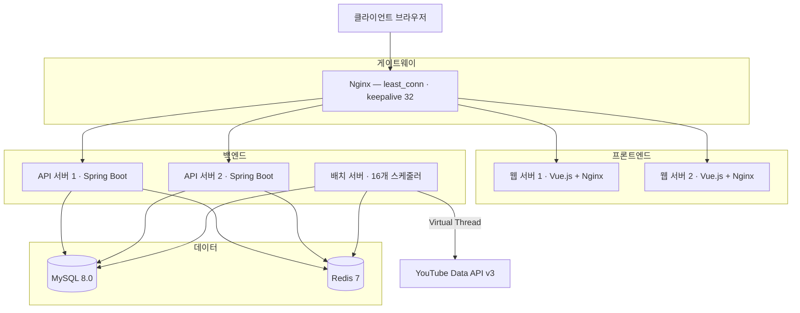

<p align="center">
  
</p>

<h1 align="center">TubeTen</h1>

<p align="center">
  YouTube 실시간 트렌드 분석 플랫폼 — Velocity 알고리즘 기반 급상승 영상 탐지
</p>

<p align="center">
  <strong>Live Demo</strong> &nbsp;·&nbsp; <a href="https://www.tubeten.co.kr">https://www.tubeten.co.kr</a>
</p>

<p align="center">
  
  
  
  
  
  
</p>

---

## 개요

조회수 절댓값이 아닌 **단위 시간당 증가 속도(Velocity)**로 YouTube 트렌드를 탐지하는 풀스택 웹 서비스입니다.  
3개국(KR·US·JP), 지역당 최대 9개 카테고리를 30분 주기로 수집·분석하며, 캐시 히트 기준 평균 **50ms** 응답을 제공합니다.

<div align="center">

| 지표 | Before | After |
|:---|:---:|:---:|
| 스냅샷 수집 시간 (Virtual Thread 도입) | 9분 24초 | **35초** |
| 타겟 수집 시간 (병렬 스레드 상한 제거) | ~29분 (KR) | **~10분 예상** |
| 랭킹 집계 시간 (DB 파티셔닝) | 182초 | **2초** |
| 번들 크기 (Gzip 압축) | 869 KB | **88.4 KB** |
| Redis 메모리 (Gzip 직렬화) | — | **70% 절감** |
| 배치 성공률 | 50% 미만 | **98.5%** |
| 캐시 히트율 | — | **95.2%** |

</div>

---

## 아키텍처

Docker Compose 8개 컨테이너로 구성된 자체 호스팅(NAS) 환경입니다.



**멀티 모듈 구조** — `Controller → Facade → Domain Service → Repository`  
계층 의존 방향은 **ArchUnit**으로 빌드 시 자동 검증합니다.

```
tubeten-back/
├── tubeten-common/   # 도메인, Facade, 인프라 공통 라이브러리
├── tubeten-api/      # REST API 서버
└── tubeten-batch/    # 30분 주기 스케줄러 (16개)
```

---

## 기술 스택

### Backend

| 기술 | 선택 이유 |
|------|----------|
| **Java 21** | Virtual Thread — I/O 블록 중 플랫폼 스레드 반납, 배치 병렬화 극대화 |
| **Spring Boot 3.5** | 멀티 모듈, Spring Security + Actuator 생태계 |
| **Spring Data JPA + QueryDSL** | 정적 타입 동적 쿼리, N+1 방지를 위한 fetch join / 벌크 쿼리 |
| **Resilience4j** | CircuitBreaker + Retry(지수 백오프) — YouTube API 장애 자동 차단 |
| **MySQL 8.0** | 일별 RANGE 파티셔닝 + DROP PARTITION(O(1)), 윈도우 함수 활용 |
| **Redis 7** | 3단계 캐시 계층 · AOF 영속화 · Gzip 압축 · ETag |
| **Logback** | 5파일 구조 + AsyncAppender + 14일 자동 롤링 |

### Frontend

| 기술 | 용도 |
|------|------|
| **Vue.js 3** (Composition API) | UI 프레임워크, 컴포저블 기반 관심사 분리 |
| **ECharts** | 트렌드 차트 · 랭킹 이력 · 스냅샷 시계열 |
| **Webpack** (Vue CLI) | 코드 스플리팅 · Tree Shaking · Gzip 3중 최적화 |
| **@prerenderer/webpack-plugin** | 빌드 타임 정적 HTML 생성 — Google 봇 SEO 최적화 |

### Test

**JUnit 5** · **jqwik** (Property-based, Velocity 불변식) · **ArchUnit** (계층 의존성) · **Testcontainers** (MySQL 통합)

---

## 기술적 도전과 해결

### 1. 배치 수집 시간 94% 단축 — Virtual Thread

790개 영상을 `FixedThreadPool(4)`로 처리하면 순차 실행으로 **9분 24초** 소요.  
`VirtualThreadPerTaskExecutor`로 전환해 16개 배치를 동시 실행하고, I/O 블록 중 플랫폼 스레드를 반납하도록 변경 → **35초**로 단축.  
30분 파이프라인 안에서 여유 구간이 확보되어 배치 실패율이 구조적으로 감소했습니다.

### 2. 랭킹 쿼리 타임아웃 → 일별 파티셔닝

모든 데이터가 `pMAX` 파티션에 집중되어 랭킹 쿼리(3중 조인)가 타임아웃 반복, 배치 성공률 50% 미만.  
`yt_video_snapshot` · `yt_trend_rank` 두 테이블에 일별 RANGE 파티셔닝 적용.  
만료 파티션을 `DROP PARTITION`(O(1) — InnoDB 테이블스페이스 직접 제거)으로 정리 → 집계 시간 **182초 → 2초**, 성공률 **98.5%**.

### 3. YouTube API 호출을 @Transactional로 감싸 DB 커넥션 누수

`collectTargets()`에 `@Transactional`이 선언된 상태에서 YouTube API(최대 23분) 대기 중 커넥션을 보유 → HikariCP 경보 반복.  
`@Transactional`을 제거하고 트랜잭션 경계를 DB 저장 메서드 단위로 분리.  
커넥션 보유 시간이 API 레이턴시(최대 23분)에서 INSERT 시간(수 ms)으로 단축, 경보 완전 해소.

### 4. UnexpectedRollbackException — 루프 내 예외와 외부 트랜잭션 충돌

`updateAllActiveCreators()`의 외부 `@Transactional` 안에서 채널별 예외를 `catch`해도 Spring이 트랜잭션을 **rollback-only**로 마킹 → 루프 종료 시 `UnexpectedRollbackException`.  
외부 메서드의 `@Transactional`을 제거하고, 채널별 메서드가 독립 트랜잭션을 소유하도록 변경.  
채널별 실패가 전체 배치에 전파되지 않고, 커넥션 장기 보유 문제도 함께 해소됐습니다.

### 5. yt_video_keyword 데드락 — 전파 속성 변경으로 갭 락 제거

`REQUIRES_NEW` 트랜잭션 안에서 수십 개의 `INSERT IGNORE`를 연속 실행하면 InnoDB 갭 락이 트랜잭션 종료 시까지 누적, 멀티 스레드 환경에서 교착 상태 반복 발생.  
`Propagation.NOT_SUPPORTED`로 변경해 각 INSERT가 auto-commit되도록 처리 → 갭 락 즉시 해제, 데드락 구조적 제거.

### 6. Resilience4j 형식적 도입 → 실질 동작으로

라이브러리는 `build.gradle`에 추가되어 있었으나 `application.yml` 설정이 없어 실제 동작은 수동 retry 루프(try/catch × 3회)뿐이었습니다.  
`Resilience4jConfig.java`를 신규 작성해 CB(COUNT_BASED 20건, 실패율 50% → OPEN)와 Retry(지수 백오프 1s→4s)를 정의.  
5xx·429는 재시도, `ChannelNotFoundException`·할당량 초과는 즉시 포기 — 불필요한 재시도 제거.

이후 운영 로그 분석을 통해 추가 튜닝 진행.  
타겟 수집 API 호출이 실측 ~10분씩 소요됨에도 슬로우콜 기준이 10초로 설정되어 **거의 모든 정상 호출이 슬로우콜로 기록** → CB가 불필요하게 OPEN되는 현상 확인.  
`slowCallDurationThreshold 10s → 300s`, `waitDurationInOpenState 60s → 120s`로 조정해 API 응답 특성에 맞는 임계값으로 정규화.

### 7. SEO 유입 0건 → 프리렌더링 도입

`site:tubeten.co.kr` 색인 1건, 검색 유입 전무. Vue SPA가 빈 HTML을 응답해 Google 봇이 thin content로 판정한 것이 원인.  
`@prerenderer/webpack-plugin + Puppeteer`로 빌드 타임에 9개 주요 라우트를 헤드리스 Chromium으로 렌더링, 정적 HTML을 `dist/<route>/index.html`에 저장.  
클라이언트 도착 후 Vue가 hydrate → SPA 동작은 그대로 유지하면서 Google 봇에는 완성된 HTML 제공.

### 8. 타겟 수집 병렬화 병목 — 스레드 풀 상한 제거

운영 로그에서 타겟 수집 소요 시간이 KR 기준 ~29분, US/JP ~24분으로 측정됨.  
코드를 역산하면 카테고리 병렬 스레드가 `Math.min(activeCategories.size(), 4)`로 고정되어  
KR 9개 카테고리가 4개씩 **3라운드(~29분)** 로 처리되고 있었음.  
상한을 제거해 카테고리 수만큼 동시 실행 → KR 기준 **1라운드(~10분)** 로 단축.  
비교: 지역(3) × 카테고리(최대 9) = 최대 27개 동시 YouTube API 호출로 rate limit 모니터링 병행.

### 9. 영상 분석 지표 4가지 버그 발견

운영 중인 `/video/:id` 화면을 심층 검토하다 발견한 버그들입니다.

- **viewDelta를 총 조회수로 사용** — 200만 조회수 영상이 히어로에 "3,200"으로 표시 → `viewCount` 필드로 교체
- **성장률 분모 오류** — 실제 스냅샷 2일치를 요청 기간 168h로 나눠 3.5배 낮게 산출 → 실제 시간 차이를 분모로 교체
- **카테고리 평균 풀스캔** — 날짜 조건(`90일`) + `LIMIT 1000` 추가로 스캔 범위 제한
- **7d 랭킹 차트 공백** — `yt_trend_rank`(3일 보관) + `yt_trend_rank_daily`(7일 집계) 하이브리드 쿼리로 병합

---

<p align="center">
  <strong>프로젝트 기간</strong>: 2026-01 ~ 현재 &nbsp;|&nbsp;
  <strong>버전</strong>: v3.5.5 &nbsp;|&nbsp;
  <strong>업데이트</strong>: 2026-05-15
</p>
