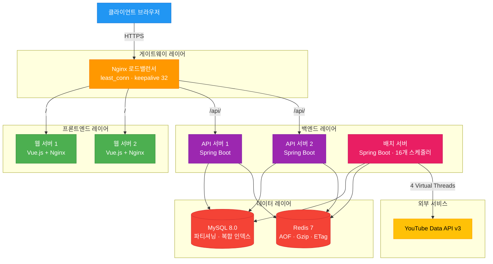
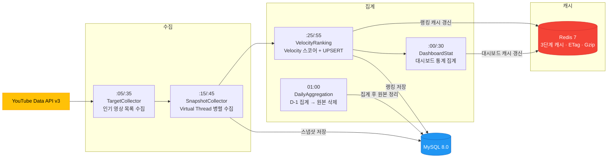

<p align="center">
  
</p>

<h1 align="center">TubeTen</h1>

<p align="center">
  YouTube 실시간 트렌드 분석 플랫폼 — Velocity 알고리즘 기반 급상승 영상 탐지
</p>

<p align="center">
  <strong>Live Demo</strong> &nbsp;·&nbsp; <a href="https://www.tubeten.co.kr">https://www.tubeten.co.kr</a>
</p>

<p align="center">
  
  
  
  
  
  
  
  
</p>

---

## 목차

- [1. 개요](#1-개요)
- [2. 시스템 아키텍처](#2-시스템-아키텍처)
- [3. 데이터 파이프라인](#3-데이터-파이프라인)
- [4. 기술 스택](#4-기술-스택)
- [5. 핵심 설계 결정](#5-핵심-설계-결정)
- [6. 성능 최적화](#6-성능-최적화)
- [7. 기술적 도전과 해결](#7-기술적-도전과-해결)

---

## 1. 개요

조회수 절댓값이 아닌 **단위 시간당 증가 속도(Velocity)**로 YouTube 트렌드를 탐지하는 풀스택 웹 애플리케이션입니다.  
3개국(KR/US/JP), DB 관리형 카테고리(현재 6개 활성)를 30분 주기로 수집하여 랭킹을 산출하고, 캐시 히트 기준 평균 50ms 응답을 제공합니다.

### 핵심 수치

<div align="center">

| 지표 | Before | After |
|:---|:---:|:---:|
| 배치 수집 시간 (Virtual Thread) | 9분 24초 | **35초** |
| 랭킹 집계 시간 (파티셔닝) | 182초 | **2초** |
| 번들 크기 (Gzip 적용) | 869 KB | **88.4 KB** |
| Redis 메모리 (Gzip 압축 직렬화) | — | **70% 절감** |
| DB 커넥션 (단일 통합 쿼리) | 4개 | **2개** |
| 캐시 히트율 | — | **95.2%** |
| 배치 성공률 | 50% 미만 | **98.5%** |

</div>

---

## 2. 시스템 아키텍처

### 전체 구조



### 멀티 모듈 구조

```
tubeten-back/
├── tubeten-common/   # 도메인, Facade, 인프라, 보안 공통 라이브러리
├── tubeten-api/      # REST API 서버 (랭킹·대시보드·크리에이터·분석·관리자)
└── tubeten-batch/    # 스케줄러 (16개 배치 작업)
```

**계층 의존성** — `Controller → Facade → Domain Service → Repository / Infrastructure`

Facade 계층을 두어 도메인 서비스 간 조율 로직과 외부 I/O 의존성을 Controller에서 격리했습니다.  
계층 간 의존 방향은 **ArchUnit**으로 테스트 시 강제합니다.

**인프라 구성** (Docker Compose 8개 컨테이너)

| 컨테이너 | 역할 | 비고 |
|---------|------|------|
| tubeten-gateway | Nginx 로드밸런서 | `least_conn`, 자동 재시도 3회, keepalive 32 |
| tubeten-web-1/2 | Frontend (Vue.js) | Gzip 압축, SPA history mode |
| tubeten-api-1/2 | Backend API | Spring Boot, 내부 8080 |
| tubeten-batch | 배치 스케줄러 | Spring Boot, 내부 8081 |
| tubeten-db | MySQL 8.0 | utf8mb4, max_connections=200 |
| tubeten-redis | Redis 7-alpine | AOF 영속화, 비밀번호 인증 |

---

## 3. 데이터 파이프라인

### 30분 주기 자동화 프로세스



### Velocity 알고리즘 (12시간 윈도우)

```
cur  = refTime 기준 윈도우 내 최신 스냅샷
prev = cur 이전 구간의 최신 스냅샷 (없으면 COALESCE(0))

Velocity Score = Δview × 1.0
               + Δlikes × 10.0
               + Δcomments × 5.0
```

> **조회수가 많아도 증가 속도가 느리면 하위 랭크**  
> 조회수 1,000만 (+1만/12h) → 10,000 pts  vs  조회수 10만 (+5만/12h) → **50,000 pts**

- 카테고리별 `trend_window_hours` 동적 적용 (음악 168h, 게임 24h 등)
- `ROW_NUMBER()` 기반 순위 부여, 최대 1,000위, UPSERT로 중복 방지
- prev 스냅샷 부재 시 `LEFT JOIN + COALESCE(prev.view_count, 0)` 처리

### 데이터 수명 주기

| 테이블 | 보관 기간 | 삭제 방식 | 비고 |
|--------|----------|-----------|------|
| `yt_video_snapshot` | **7일** | DROP PARTITION (O(1)) | 일별 파티셔닝, 집계 완료 확인 후 DROP |
| `yt_trend_rank` | **3일** | DROP PARTITION (O(1)) | 일별 파티셔닝, 미적용 환경은 배치 DELETE 폴백 |
| `yt_trend_rank_daily` | 영구 | — | avg/best/worst rank, snapshot_count |
| `yt_video_snapshot_daily` | 영구 | — | view/like/comment 일별 증가량 |
| `yt_dashboard_stat` | 90일 | 배치 DELETE | |
| `yt_creator_snapshot` | 90일 (주간 압축) | 주간 집계 후 중간 데이터 삭제 | |
| `batch_job_history` | 1년 | 배치 DELETE (1,000건 단위) | |

매일 01:00 `DailyAggregation`이 전일 원본을 집계 후 검증(0건이면 스킵)하여 데이터 손실을 방지합니다.  
파티션 DROP 시에는 `yt_video_snapshot_daily` 집계 완료 여부를 사전 확인하여 원본 데이터 영구 소실을 방어합니다.

---

## 4. 기술 스택

### Backend

| 기술 | 선택 이유 |
|------|----------|
| **Java 21** | Virtual Thread — I/O 블록 중 플랫폼 스레드 반납, 배치 병렬화 극대화 |
| **Spring Boot 3.5** | 멀티 모듈, Spring Security + Actuator 생태계 |
| **Spring Data JPA + QueryDSL** | 정적 타입 동적 쿼리, N+1 방지를 위한 fetch join / 벌크 쿼리 |
| **Resilience4j** | CircuitBreaker(COUNT_BASED, 실패율 50%) + Retry(지수 백오프 3회) — YouTube API 장애 차단 및 이벤트 전용 로그 파일 분리 |
| **Logback** | 5파일 구조(전체·에러·배치·레질리언스·아카이브), 비동기 AsyncAppender, 14일 일별 롤링 |
| **Flyway** | DB 마이그레이션 이력 관리 |
| **MySQL 8.0** | 일별 RANGE 파티셔닝 + DROP PARTITION(O(1)), 윈도우 함수(`ROW_NUMBER`, `LAG`) 활용 |
| **Redis 7** | 3단계 캐시 계층, AOF 영속화, Gzip 압축, ETag 보관 |
| **Micrometer + Actuator** | Prometheus 연동, `@LogExecution` AOP 성능 로깅 |

### Frontend

| 기술 | 용도 |
|------|------|
| **Vue.js 3** (Composition API) | UI 프레임워크 |
| **Pinia · Vue Router** | 상태 관리 · SPA 라우팅 |
| **ECharts** | 트렌드 차트, 랭킹 이력, 스냅샷 시계열 |
| **Axios** | HTTP 클라이언트 (인터셉터 기반 에러 핸들링) |
| **Webpack** (Vue CLI) | 코드 스플리팅 · Tree Shaking |

### Test

| 프레임워크 | 목적 |
|-----------|------|
| **JUnit 5** | 단위 테스트 |
| **jqwik** | Property-based Testing — Velocity 알고리즘 불변식 검증 |
| **ArchUnit** | 계층 의존성 방향 강제 |
| **Testcontainers** (MySQL) | 실제 DB 환경 통합 테스트 |

---

## 5. 핵심 설계 결정

### 배치 스케줄링 일원화

초기에는 `@Scheduled`와 DB 기반 `DynamicScheduler`가 공존했고, 두 스케줄러가 같은 메서드를 동시 호출하면서 중복 키 에러가 발생했습니다.

`@Scheduled`를 전부 제거하고 DB(`batch_master` 테이블) 기반 단일 스케줄링으로 일원화했습니다.

> **→** cron 변경이 재배포 없이 런타임에 반영. 레이스 컨디션이 구조적으로 제거됩니다.

### Redis 캐싱 전략

```
[랭킹 캐시] → [대시보드 캐시] → [스냅샷 캐시]
      ↑              ↑               ↑
  trend_window_hours 기반 카테고리별 동적 TTL
```

- **ETag 캐싱** — YouTube API 응답 ETag를 Redis에 24시간 보관. 변경 없는 영상은 상세 조회 스킵 → API 할당량 절감
- **Gzip 압축** — 직렬화된 캐시 데이터 압축, Redis 메모리 사용량 70% 감소
- **Stale-While-Revalidate** — 배치 실패 시 이전 캐시로 서비스 유지
- **Cache Stampede 방지** — `ConcurrentHashMap + CompletableFuture`로 동일 키 동시 요청을 첫 번째 스레드만 DB 조회하도록 직렬화

### 예외 계층 설계

```
BusinessException(ErrorCode)
    └── CreatorException / BatchException / ...
            └── GlobalExceptionHandler → HTTP 상태 코드 변환
```

도메인 예외가 `RuntimeException`을 직접 상속하면 HTTP 응답 코드가 500으로 고정되는 문제를 계층화로 해결했습니다.

### N+1 제거

페이지네이션 결과에서 영상별 조회수를 N번 쿼리하던 문제를 `ROW_NUMBER() OVER (PARTITION BY creator_id ORDER BY published_at DESC)` 윈도우 쿼리 + `GROUP BY` 단일 벌크 쿼리로 대체했습니다.

DTO에서 서비스를 직접 호출하던 구조를 제거하고, 컨트롤러에서 Map으로 사전 조회 후 주입하는 방식으로 변경했습니다.

### Resilience4j 정식 도입

라이브러리는 `build.gradle`에 추가되어 있었으나 `application.yml`에 `resilience4j:` 설정 블록이 없어 실제로는 동작하지 않는 상태였습니다. 재시도 로직은 `ResilienceManagerImpl`의 수동 루프(try/catch × 3회)로만 구현되어 있었고, 할당량 초과·채널 없음·권한 오류가 구분 없이 재시도 대상이 되고 있었습니다.

**`Resilience4jConfig.java`를 신규 작성하여 `youtube-api` 인스턴스를 직접 정의했습니다.**

| 항목 | 설정값 |
|------|-------|
| CircuitBreaker | COUNT_BASED 윈도우 20건, 실패율 50% → OPEN, OPEN 60초 유지 |
| 슬로우콜 | 10초 이상, 비율 80% → OPEN |
| Retry | 최대 3회, 지수 백오프 1s→2s→4s (최대 30s), 지터 ±10% |
| 재시도 대상 | 5xx, 429 TooManyRequests, 네트워크 오류 |
| 무시(즉시 포기) | `ChannelNotFoundException`, `YouTubeQuotaExceededException`, `YouTubeResilienceException` |

`ResilienceManagerImpl`의 수동 루프를 `CircuitBreaker.decorateSupplier(cb, Retry.decorateSupplier(retry, supplier))` 한 줄로 교체하고, 각 레지스트리 빈에 이벤트 컨슈머를 등록하여 CB 상태 전환·재시도 이벤트를 `resilience4j.events` 전용 로거로 기록합니다.

> **→** 인프라 장애(5xx/네트워크)는 재시도, 비즈니스 오류(채널 없음·할당량)는 즉시 포기. OPEN 상태에서 `CallNotPermittedException` 즉시 반환으로 배치 스레드 블로킹 차단.

### 구조적 로그 분리 (Logback)

초기에는 콘솔 출력만 있어 배치 에러가 발생했을 때 서버에 접속하여 실시간 출력을 확인하거나 Docker 컨테이너 로그를 탐색해야 했습니다. WARN 레벨 이상 이벤트가 별도로 모이지 않아 모니터링이 어려웠습니다.

`logback-spring.xml`을 전면 재설계하여 `spring.application.name`을 파일명 접두사로 활용하는 5종 파일 구조를 구성했습니다.

```
/app/logs/
├── tubeten-batch.log            INFO+  전체 로그
├── tubeten-batch-error.log      WARN+  에러 전용 (14일 보관)
├── tubeten-batch-batch.log      배치 스케줄러·파사드·YouTube API 전용
├── tubeten-batch-resilience.log CB·Retry 이벤트 전용
└── archive/                     일별 .gz 압축 보관 (14일 후 자동 삭제)
```

- **ThresholdFilter(WARN)** — 기존 `LevelFilter(ERROR only)`에서 변경, 중요 WARN(채널 비활성화·슬로우쿼리 등) 누락 방지
- **`additivity=false` 버그 수정** — 스케줄러 로거에 ERROR_FILE 어펜더 미참조 상태였던 버그 발견. `ASYNC_ERROR` appender-ref를 모든 `additivity=false` 로거에 명시
- **AsyncAppender** — `neverBlock=true`(전체·배치·레질리언스)로 로그 I/O가 배치 스레드를 블로킹하지 않음. `neverBlock=false`(에러)로 WARN/ERROR는 절대 드랍하지 않음
- **14일 자동 삭제** — `maxHistory=14`, `totalSizeCap` 초과 시 오래된 파일부터 자동 제거

### 카테고리 공통화 — DB 기반 동적 카테고리 시스템

초기에는 카테고리 목록이 프론트엔드 각 화면에 하드코딩되어 있어, 새 카테고리를 활성화하려면 `useDashboard.js`, `useChannelDashboard.js`, `App.vue` 등 여러 파일을 수동으로 수정하고 재배포해야 했습니다.

**구조적 문제**

- `useDashboard.js`, `useChannelDashboard.js`, `App.vue`에 카테고리 배열이 각각 독립적으로 정의됨
- `CATEGORY_NAMES` 정적 맵과 `FALLBACK_NAMES`가 두 파일에 중복 정의
- `CategoryTabs` 컴포넌트가 하드코딩된 4개 카테고리를 기본값 props로 보유
- `getCategoryName()` 함수가 정적 맵만 참조하여 DB 변경이 UI에 반영되지 않음

**해결 — 단일 데이터 흐름 확립**

```
DB (yt_category.active = 1)
  → GET /api/categories?region=KR       (신규 공개 엔드포인트)
    → stores/category.js                (Pinia, 지역별 캐싱)
      → useCategoryStore().getName()    ← 모든 컴포넌트 단일 진입점
        → fallback: CATEGORY_NAMES      (creatorHelpers.js 단일 소스)
```

- 백엔드에 인증 불필요한 `GET /api/categories` 엔드포인트 신규 추가
- `useCategoryStore` — 지역별 캐싱(`byRegion`), `fetchForRegion()` 호출 시 첫 번째만 API 요청, `getName(id, region)` fallback 포함
- 하드코딩 교체 파일: `useDashboard.js`, `useChannelDashboard.js`, `App.vue`, `RankHistoryChart.vue`, `ViralVelocityChart.vue`, `CategoryHeatmap.vue`, `Creators/index.vue`, `Creators/Detail.vue`
- `adminCategory.js`의 `toggleActive()` 에서 `categoryStore.invalidate(region)` 호출 — Admin에서 카테고리를 토글하는 즉시 프론트 캐시 무효화, 다음 페이지 진입 시 자동 갱신
- `CategoryTabs` props를 `required: true`로 변경하여 하드코딩 기본값 제거

> **→** DB에서 `active = 0 → 1`로 변경하는 것만으로 배치 수집 시작 + 전체 화면 카테고리 버튼 자동 추가. 재배포 불필요.

### 인사이트 API 통합 — 캐시 미적용 이중 호출 제거

크리에이터 상세 페이지에서 유사 크리에이터(`/insights/similar`)와 트렌드 영상(`/insights/trending-videos`)을 각각 별도 호출하고 있었습니다. 두 엔드포인트가 30분 TTL 인사이트 캐시를 거치지 않아 **매 페이지 로드마다 Jaccard 유사도 계산과 영상 검색 쿼리가 실행**됐습니다.

단일 `/insights` 엔드포인트 호출로 통합하고 `InsightCacheService`의 30분 캐시를 공유하도록 변경했습니다.

> **→** API 호출 2회 → 1회. 캐시 히트 시 인사이트 전체 즉시 반환. 프론트엔드는 `matchedKeywords` 필드를 활용해 연관 이유를 시각적으로 표시합니다.

---

## 6. 성능 최적화

### Virtual Thread 병렬 수집

```
790개 영상 처리 시 비교

Before (FixedThreadPool 4)
  → 16 배치 × 4개씩 순차 실행 → 수집 시간 9분 24초

After (VirtualThreadPerTaskExecutor)
  → 16 배치 동시 실행, I/O 블록 중 플랫폼 스레드 반납 → 수집 시간 ~35초
```

수집 시간 94% 단축 — 30분 파이프라인 안에서 여유 구간 확보.

### 일별 파티셔닝 + DROP PARTITION

초기 운영 시 `yt_video_snapshot`의 모든 데이터가 `pMAX` 파티션 하나에 집중되어, 랭킹 쿼리가 이 테이블을 서브쿼리로 3회 조인하면서 타임아웃이 빈번했습니다 (배치 성공률 50% 미만).

`yt_trend_rank`(80,000행/일), `yt_video_snapshot` 두 테이블에 일별 RANGE 파티셔닝을 적용하고, 보존 기간이 지난 파티션을 `DROP PARTITION`으로 즉시 제거했습니다.

```
[명명 규칙]
p + yyyyMMdd  (예: p20260506) — 9자 고정
pMAX          — 캐치올 파티션 (스케줄러 장애 시 데이터 유실 방지)

[관리 흐름 — 매일 01:00 DailyAggregationScheduler]
  Step 0-A: 오늘~+7일치 파티션 없으면 선제 생성 (버퍼)
  Step 0-B: 보존 기간 초과 파티션 DROP
            └─ DROP 전 yt_video_snapshot_daily 집계 완료 확인
               집계 미완료 → 보류 → 다음 날 자동 재시도
```

배치 DELETE(행 단위, undo log 팽창 + 인덱스 재구성)에서 DROP PARTITION(InnoDB 테이블스페이스 직접 제거)으로 전환하여 정리 연산이 O(n) → **O(1)** 로 개선됐습니다.

| 지표 | Before | After |
|------|--------|-------|
| 랭킹 집계 시간 | 182초 | **2초** |
| 배치 성공률 | 50% 미만 | **100%** |
| 만료 파티션 정리 | O(n) 배치 DELETE | **O(1) DROP PARTITION** |

### Frontend 번들 최적화

| 항목 | Before | After | 감소율 |
|------|--------|-------|--------|
| Total Bundle | 869 KB | 419 KB | 51.8% ↓ |
| CSS | 555 KB | 125 KB | 77.5% ↓ |
| Gzip 압축 후 | — | 88.4 KB | 89.8% ↓ |

- 9개 라우트 코드 스플리팅 (`webpackChunkName`)
- `backdrop-filter: blur()` 전면 제거 — 저사양 환경(NAS) CPU 블러 렌더링 병목 해소
- 섹션별 독립 스켈레톤 로딩 — 전체 블로킹 스피너 제거
- `sideEffects` + Tree Shaking + Gzip 3중 최적화

### HikariCP 커넥션 누수 근본 원인 해소

운영 환경에서 `HikariCP leakDetectionThreshold(10초)` 경고가 발생했습니다.

**원인 분석**

1. `yt_creator_video` 테이블에 `(creator_id, published_at)` 복합 인덱스가 없어 윈도우 함수의 PARTITION + ORDER 절이 풀 테이블 스캔 → 쿼리 지연 → 커넥션 보유 시간 임계값 초과
2. 목록 조회 API 한 번에 SUM + AVG를 별도 쿼리 2회 실행 → 커넥션 2개 동시 점유

**해결**

```sql
-- 1. 윈도우 함수 PARTITION + ORDER 절을 인덱스로 커버
ALTER TABLE yt_creator_video
  ADD INDEX idx_creator_published (creator_id, published_at DESC);

-- 2. SUM + AVG 두 번의 윈도우 쿼리를 단일 쿼리로 통합
SELECT t.creator_id,
       COALESCE(SUM(t.view_count), 0)        AS sum_view_count,
       COALESCE(ROUND(AVG(t.view_count)), 0) AS avg_view_count
FROM (
  SELECT creator_id, view_count,
         ROW_NUMBER() OVER (PARTITION BY creator_id ORDER BY published_at DESC) AS rn
  FROM yt_creator_video
  WHERE creator_id IN (:creatorIds)
) t
WHERE t.rn <= 10
GROUP BY t.creator_id
```

> **→** DB 커넥션 사용량 목록 3개 → 2개, 상세 4개 → 2개. `@LogExecution` AOP 어노테이션 추가로 이후 성능 회귀 감지 기준선 마련.

### 응답 시간

| 엔드포인트 | Cache Hit | Cache Miss |
|-----------|:--------:|:----------:|
| `/api/rankings` | 45ms | 180ms |
| `/api/dashboard` | 52ms | 210ms |
| `/api/shorts-analytics` | 50ms | 1,000ms |
| `/api/creator/search` | 38ms | 150ms |

---

## 7. 기술적 도전과 해결

### YouTube API 할당량 (일 10,000 units)

3개국 × 6개 카테고리를 30분마다 수집하면 할당량 초과가 임박했습니다.

- **ETag 캐싱** — API 응답 ETag를 Redis에 24시간 보관. 변경 없는 영상은 상세 조회 스킵
- **활성 타겟 한정** — 1시간 윈도우 내 활성 타겟만 수집 대상으로 제한
- **Circuit Breaker** — 할당량 초과 감지 시 즉시 차단, 배치 연쇄 실패 방지

### 랭킹 0건 문제 (배치 장애 시)

배치 장애로 스냅샷 수집이 12시간 이상 중단되면, 랭킹 쿼리의 prev 스냅샷 `INNER JOIN`이 매칭되지 않아 **전체 랭킹이 0건**으로 산출됐습니다.

prev 조인을 `LEFT JOIN`으로 변경하고 `COALESCE(prev.view_count, 0)` 처리하여, prev 데이터 부재 시에도 cur 스냅샷 기반으로 랭킹이 정상 생성됩니다.

### yt_video_keyword 데드락 — `NOT_SUPPORTED` 전파로 갭 락 제거

배치 실행 중 `yt_video_keyword` 테이블 INSERT 시 `Deadlock found when trying to get lock` 에러가 반복 발생했습니다. 3회 재시도 로직이 있었음에도 해소되지 않았습니다.

**원인 분석**

기존 `@Transactional(propagation = REQUIRES_NEW)`으로 묶인 배치 INSERT는 하나의 트랜잭션 안에서 수십 개의 `INSERT IGNORE`를 연속 실행했습니다. InnoDB는 각 `INSERT IGNORE`마다 갭 락(Gap Lock)을 트랜잭션 종료 시까지 축적하며, 여러 스레드가 같은 범위에 동시 삽입을 시도할 때 교착 상태가 발생합니다.

**해결**

```java
// Before: 단일 트랜잭션 안에서 갭 락 누적
@Transactional(propagation = Propagation.REQUIRES_NEW)

// After: 문장 단위 auto-commit → 갭 락 즉시 해제
@Transactional(propagation = Propagation.NOT_SUPPORTED)
```

`REQUIRES_NEW` 대신 `NOT_SUPPORTED`로 변경하여 각 `INSERT IGNORE`가 독립적으로 auto-commit되도록 했습니다. 갭 락이 문장 단위로 즉시 해제되므로 데드락이 구조적으로 발생할 수 없습니다.

> **→** 데드락 재시도 로직 자체가 불필요해졌습니다. 혹시 모를 순간적 충돌에 대비해 단일 키워드 단위 ThreadLocalRandom 지터 재시도(1회)만 남겼습니다.

### YouTube 채널 소실 — 불필요한 3회 재시도 + 자동 비활성화 누락

새벽 03:05~03:07 배치 로그에서 두 채널(id=164, id=258)에 대해 `Invalid channel response from YouTube API` 오류가 3회씩 반복되고, 이후 배치에서도 동일하게 재발하는 것을 발견했습니다.

**문제 1 — 영구 오류인데 3회 재시도**

채널 삭제·차단·비공개는 재시도로 해결되지 않는 영구 오류입니다. 그런데 `ResilienceManagerImpl`의 catch 순서상 `ChannelNotFoundException`이 일반 `Exception` 블록에 걸려 3회 재시도 후 실패하고 있었습니다.

```java
// ResilienceManagerImpl — ChannelNotFoundException 전용 catch 추가
} catch (ChannelNotFoundException e) {
    log.debug("채널 없음 (재시도 없음): {}", e.getMessage());
    throw e;  // 즉시 전파
}
```

**문제 2 — YouTube API가 200에 에러 JSON을 반환하는 케이스 미처리**

HTTP 응답 코드가 200이지만 body에 `{"error": {"code": 404, ...}}`가 포함된 경우, 기존 코드는 items 배열만 확인하여 `"Invalid channel response"`를 로깅하고 있었습니다. `ChannelNotFoundException`이 발생하지 않아 재시도까지 이어졌습니다.

`parseChannelResponse`에 error 키 선처리를 추가하여 4xx 에러 JSON이면 즉시 `ChannelNotFoundException`을 던지도록 수정했습니다.

**문제 3 — 채널 소실 후 자동 비활성화 누락**

`CreatorUpdateFacade`가 `ChannelNotFoundException`을 일반 `Exception`으로 처리하여 ERROR 로그만 남기고, 크리에이터는 ACTIVE 상태를 유지한 채 다음 배치에서 또 API를 호출했습니다.

`CreatorService.refreshCreatorInfo`에서 `ChannelNotFoundException` 포착 시 `creator.deactivate()` 후 저장하고, `CreatorUpdateFacade`에서는 WARN 레벨로 처리하도록 변경했습니다.

> **→** 소실 채널은 첫 발견 시점에 즉시 INACTIVE 전환되어 이후 배치 대상에서 영구 제외됩니다.

### 배치 타임아웃 반복 발생 — `batch_master` timeout_seconds 조정

운영 로그에서 두 스케줄러가 매 실행마다 타임아웃으로 중단되는 것을 확인했습니다.

| 스케줄러 | 기존 타임아웃 | 실제 소요 | 조치 |
|---------|------------|---------|------|
| `CreatorVideoTrendingSyncScheduler` | 600s | ~1,500s | 1,800s |
| `CreatorVideoCollectorScheduler` | 7,200s | ~8,000s | 10,800s |

Flyway 마이그레이션(`V26`)으로 `batch_master` 테이블 레코드를 UPDATE 처리하여 재배포 없이 반영했습니다. 동시에 `yt_video_keyword` 테이블에 `(video_id)` 인덱스와 `(video_id, keyword)` 유니크 키를 추가하여 데드락 픽스와 함께 키워드 중복 삽입 방어를 강화했습니다.

### 쇼츠 분석 쿼리 타임아웃

히트맵 쿼리에서 `category_id != 'all'` 부정 조건이 인덱스를 무력화했습니다.

2단계 쿼리(현재 시점 카테고리 목록 조회 → IN 절 필터링)로 분리하여 인덱스를 정확히 활용하도록 개선했습니다.  
Nginx의 느린 집계 API 타임아웃 오판 문제는 엔드포인트별 타임아웃 설정 분리로 해결했습니다.

`ShortsAnalyticsQueryService`의 `getCurrentAndPreviousStats` 쿼리(Q1)가 22초까지 치솟는 문제도 추가로 발견했습니다. DISTINCT ref_time 서브쿼리가 전체 이력을 스캔하는 것이 원인이었고, 24시간 윈도우 조건(`ref_time >= NOW() - INTERVAL 24 HOUR`)을 추가하여 스캔 범위를 배치 주기 내로 제한했습니다.

### 영상 분석 지표 — 4가지 버그 발견 및 수정

운영 중인 영상 분석 화면(`/video/:id`)의 지표들을 심층 검토하는 과정에서 4개의 버그를 발견하고 수정했습니다.

<details>
<summary>상세 보기</summary>

**① viewDelta를 총 조회수로 잘못 사용**

`VideoAnalyticsFacade.getVideoInfo`와 `getDetailAnalytics`에서 `yt_video_snapshot` 데이터가 없을 때 `TrendRank.viewDelta`(30분 단위 증분)를 총 조회수로 반환하는 버그.  
누적 조회수 200만인 영상이 히어로 영역에 "3,200"으로 표시됐습니다.  
→ 동일 엔티티의 `viewCount`(누적 조회수) 필드로 교체.

**② 시간당 성장률 분모 오류**

`calculateGrowthMetrics`가 실제 스냅샷 존재 범위와 무관하게 `PERIOD_HOURS.get(period)`(요청 기간)으로 나눴습니다.  
7d 요청 시 실제 스냅샷이 2일치뿐이면 168시간으로 나눠 시간당 조회수 증가율이 실제보다 3.5배 낮게 표시됩니다.  
→ `Duration.between(first, last).toMinutes() / 60.0`으로 실제 시간 차이를 분모로 교체.

**③ 카테고리 평균 인게이지먼트 풀스캔 + 편향**

`yt_video` 전체에 `category_id = ? AND view_count > 1000` 조건만으로 AVG 실행 → 수년치 데이터가 포함된 풀스캔.  
→ `published_at >= DATE_SUB(NOW(), INTERVAL 90 DAY)` 날짜 조건 + 서브쿼리 `LIMIT 1000` 추가.

**④ 7d 랭킹 차트 공백 — 하이브리드 쿼리 도입**

`yt_trend_rank`는 최근 3일치만 보관하므로 `period=7d` 조회 시 Day 4~7 구간이 완전히 비어 있었습니다.

```
Day 0~3  ←  yt_trend_rank        (30분 단위, 고해상도)
Day 4~7  ←  yt_trend_rank_daily  (일별 집계, 정오 시각 매핑)
            ↓ 단일 리스트로 병합 반환
```

`TrendRankDailyRepository`에 `findByVideoIdAndRegionCodeAndCategoryIdAndStatDateBetweenOrderByStatDateAsc` 메서드를 추가하여 기존 `(stat_date, region_code, category_id)` 복합 인덱스를 활용합니다.

</details>

### YouTube API 호출을 @Transactional로 감싸 발생한 DB 커넥션 누수

운영 환경에서 `HikariCP leakDetectionThreshold(5분)` 경보가 반복 발생했습니다.

**원인 분석**

`TargetCollectionService.collectTargets()`에 `@Transactional`이 선언되어 있어, YouTube API 호출(15~23분 소요) 전 단계에서 DB 커넥션을 획득하고 API 응답을 기다리는 동안 커넥션을 그대로 보유했습니다.

**해결**

`@Transactional`을 제거하고 트랜잭션 경계를 DB 저장 메서드 단위로 분리했습니다.

```java
// Before: YouTube API 호출 포함 전체가 하나의 트랜잭션
@Transactional
public int collectTargets(...) {
    List<...> videos = youtubeDataProvider.fetchPopularVideos(...);  // 최대 23분 API 대기
    videoService.saveYouTubeVideos(videos);   // DB 저장
    persistence.saveTargets(...);             // DB 저장
}

// After: 외부 I/O는 트랜잭션 밖. DB 저장 메서드가 각자 짧은 트랜잭션 소유
public int collectTargets(...) {
    List<...> videos = youtubeDataProvider.fetchPopularVideos(...);  // 트랜잭션 없음
    videoService.saveYouTubeVideos(videos);   // 내부 @Transactional
    persistence.saveTargets(...);             // 내부 @Transactional
}
```

> **→** 커넥션 보유 시간이 API 레이턴시(최대 23분)에서 DB INSERT 시간(수 ms)으로 단축. HikariCP 경보 완전 해소.

### UnexpectedRollbackException — @Transactional 루프와 내부 예외의 충돌

`CreatorUpdateScheduler`가 매일 03:00에 시작 후 599초 만에 `UnexpectedRollbackException`으로 실패하는 문제가 반복됐습니다.

**원인 분석**

`CreatorUpdateFacade.updateAllActiveCreators()`에 `@Transactional`이 선언된 상태에서, 내부 루프의 `creatorService.refreshCreatorInfo()`가 삭제된 채널에 대해 예외를 던졌습니다. Spring은 예외를 `catch`로 잡아도 이미 외부 트랜잭션을 **rollback-only**로 마킹하기 때문에, 루프가 끝나고 메서드 종료 시 커밋 단계에서 `UnexpectedRollbackException`이 발생합니다.

```
외부 @Transactional 시작
  └─ refreshCreatorInfo() 예외 발생
       └─ Spring: 트랜잭션 rollback-only 마킹
  └─ catch로 예외 잡음 → 루프 계속
외부 @Transactional 커밋 시도
  └─ rollback-only 감지 → UnexpectedRollbackException ❌
```

**해결**

`discoverCreators()`, `updateAllActiveCreators()`, `discoverRapidGrowthCreators()` 세 메서드에서 `@Transactional` 제거.  
개별 `refreshCreatorInfo()`, `saveCreator()` 메서드가 자체 `@Transactional`을 보유하므로 외부 트랜잭션이 불필요합니다.  
600초짜리 YouTube API 루프를 단일 트랜잭션으로 묶지 않으므로 커넥션 장기 보유 문제도 동시에 해소됩니다.

> **→** 채널별 실패가 전체 배치에 영향을 주지 않고, `UnexpectedRollbackException` 완전 해소.

### TransactionRequiredException — Repository @Modifying 쿼리에 트랜잭션 누락

`DataCleanupScheduler`가 매일 04:00에 `batch_job_history` 정리 단계에서 `TransactionRequiredException`으로 실패했습니다.

**원인 분석**

`BatchJobHistoryRepository.deleteOldHistoryBatch()`는 `@Modifying` 네이티브 DELETE 쿼리인데, 이를 호출하는 `default` 메서드 `deleteOldHistory()`와 스케줄러의 `cleanupBatchHistory()`에 `@Transactional`이 없었습니다. Spring Data JPA는 `@Modifying` 쿼리 실행 시 반드시 활성 트랜잭션을 요구합니다.

**해결**

```java
// BatchJobHistoryRepository
@Transactional   // 추가
@Modifying
@Query(value = "DELETE FROM batch_job_history WHERE started_at < :cutoffTime LIMIT :batchSize",
       nativeQuery = true)
int deleteOldHistoryBatch(...);
```

동일 패턴으로 이미 `@Transactional`이 적용되어 있는 `VideoTargetRepository.deleteOldTargetsBatch()`와 일관된 구조로 맞췄습니다.

> **→** `DataCleanupScheduler` 정상화, batch_job_history 정리 재개.

### 로드밸런서 트래픽 편중

API 서버 2대 운영 시 한쪽에만 트래픽이 집중됐습니다.  
Nginx 기본 round-robin에서 keepalive 커넥션이 단일 서버에 고정되는 것이 원인이었습니다.

`least_conn` 알고리즘으로 전환하고 `keepalive_requests`를 줄여 커넥션이 주기적으로 재분배되도록 조정했습니다.

### 저사양 환경(NAS) 운영

| 조치 | 내용 |
|------|------|
| JVM 힙 축소 | Batch 2GB→512MB, API 1GB→384MB |
| 커넥션 풀 축소 | HikariCP / Redis 풀 사이즈 최적화 |
| DB 레벨 필터링 | `findAll()` 제거, 쿼리 조건 강화 |
| 락 경합 완화 | 배치 스레드 풀 분리 + 파티셔닝 |

---

<p align="center">
  <strong>프로젝트 기간</strong>: 2026-01 ~ 현재 &nbsp;|&nbsp;
  <strong>버전</strong>: v3.5.3 &nbsp;|&nbsp;
  <strong>업데이트</strong>: 2026-05-08
</p>
