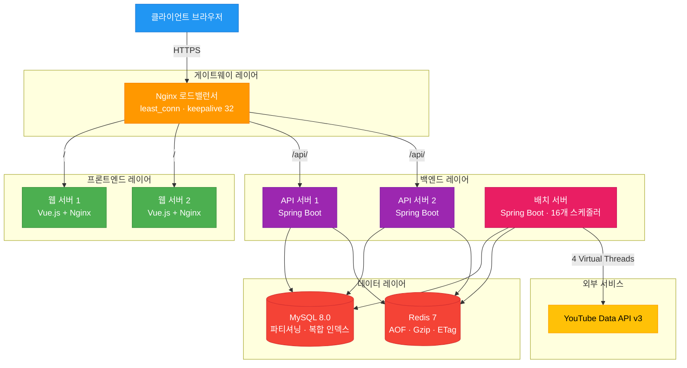
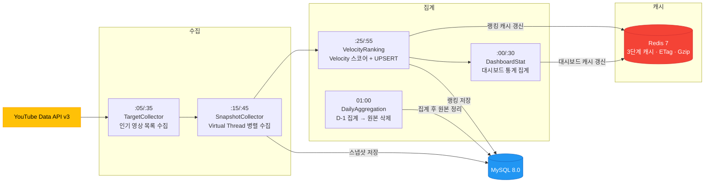

<p align="center">
  
</p>

<h1 align="center">TubeTen</h1>

<p align="center">
  YouTube 실시간 트렌드 분석 플랫폼 — Velocity 알고리즘 기반 급상승 영상 탐지
</p>

<p align="center">
  <strong>Live Demo</strong> &nbsp;·&nbsp; <a href="https://www.tubeten.co.kr">https://www.tubeten.co.kr</a>
</p>

<p align="center">
  
  
  
  
  
  
</p>

---

## 목차

- [1. 개요](#1-개요)
- [2. 시스템 아키텍처](#2-시스템-아키텍처)
- [3. 데이터 파이프라인](#3-데이터-파이프라인)
- [4. 기술 스택](#4-기술-스택)
- [5. 핵심 설계 결정](#5-핵심-설계-결정)
- [6. 성능 최적화](#6-성능-최적화)
- [7. 기술적 도전과 해결](#7-기술적-도전과-해결)

---

## 1. 개요

조회수 절댓값이 아닌 **단위 시간당 증가 속도(Velocity)**로 YouTube 트렌드를 탐지하는 풀스택 웹 애플리케이션입니다.  
3개국(KR/US/JP), 6개 카테고리를 30분 주기로 수집하여 랭킹을 산출하고, 캐시 히트 기준 평균 50ms 응답을 제공합니다.

### 핵심 수치

<div align="center">

| 지표 | Before | After |
|:---|:---:|:---:|
| 배치 수집 시간 (Virtual Thread) | 9분 24초 | **35초** |
| 랭킹 집계 시간 (파티셔닝) | 182초 | **2초** |
| 번들 크기 (Gzip 적용) | 869 KB | **88.4 KB** |
| Redis 메모리 (Gzip 압축 직렬화) | — | **70% 절감** |
| DB 커넥션 (단일 통합 쿼리) | 4개 | **2개** |
| 캐시 히트율 | — | **95.2%** |
| 배치 성공률 | 50% 미만 | **98.5%** |

</div>

---

## 2. 시스템 아키텍처

### 전체 구조



### 멀티 모듈 구조

```
tubeten-back/
├── tubeten-common/   # 도메인, Facade, 인프라, 보안 공통 라이브러리
├── tubeten-api/      # REST API 서버 (랭킹·대시보드·크리에이터·분석·관리자)
└── tubeten-batch/    # 스케줄러 (16개 배치 작업)
```

**계층 의존성** — `Controller → Facade → Domain Service → Repository / Infrastructure`

Facade 계층을 두어 도메인 서비스 간 조율 로직과 외부 I/O 의존성을 Controller에서 격리했습니다.  
계층 간 의존 방향은 **ArchUnit**으로 테스트 시 강제합니다.

**인프라 구성** (Docker Compose 8개 컨테이너)

| 컨테이너 | 역할 | 비고 |
|---------|------|------|
| tubeten-gateway | Nginx 로드밸런서 | `least_conn`, 자동 재시도 3회, keepalive 32 |
| tubeten-web-1/2 | Frontend (Vue.js) | Gzip 압축, SPA history mode |
| tubeten-api-1/2 | Backend API | Spring Boot, 내부 8080 |
| tubeten-batch | 배치 스케줄러 | Spring Boot, 내부 8081 |
| tubeten-db | MySQL 8.0 | utf8mb4, max_connections=200 |
| tubeten-redis | Redis 7-alpine | AOF 영속화, 비밀번호 인증 |

---

## 3. 데이터 파이프라인

### 30분 주기 자동화 프로세스



### Velocity 알고리즘 (12시간 윈도우)

```
cur  = refTime 기준 윈도우 내 최신 스냅샷
prev = cur 이전 구간의 최신 스냅샷 (없으면 COALESCE(0))

Velocity Score = Δview × 1.0
               + Δlikes × 10.0
               + Δcomments × 5.0
```

> **조회수가 많아도 증가 속도가 느리면 하위 랭크**  
> 조회수 1,000만 (+1만/12h) → 10,000 pts  vs  조회수 10만 (+5만/12h) → **50,000 pts**

- 카테고리별 `trend_window_hours` 동적 적용 (음악 168h, 게임 24h 등)
- `ROW_NUMBER()` 기반 순위 부여, 최대 1,000위, UPSERT로 중복 방지
- prev 스냅샷 부재 시 `LEFT JOIN + COALESCE(prev.view_count, 0)` 처리

### 데이터 수명 주기

| 테이블 | 보관 기간 | 비고 |
|--------|----------|------|
| `yt_video_snapshot` | 6개월 | 월별 RANGE 파티셔닝 |
| `yt_trend_rank` | **3일** | 집계 후 자동 삭제 |
| `yt_trend_rank_daily` | 영구 | avg/best/worst rank, snapshot_count |
| `yt_dashboard_stat` | 90일 | |
| `yt_creator_snapshot` | 90일 | |
| `batch_job_history` | 1년 | |

매일 01:00 `DailyAggregation`이 전일 원본을 집계 후 검증(0건이면 스킵)하여 데이터 손실을 방지합니다.

---

## 4. 기술 스택

### Backend

| 기술 | 선택 이유 |
|------|----------|
| **Java 21** | Virtual Thread — I/O 블록 중 플랫폼 스레드 반납, 배치 병렬화 극대화 |
| **Spring Boot 3.5** | 멀티 모듈, Spring Security + Actuator 생태계 |
| **Spring Data JPA + QueryDSL** | 정적 타입 동적 쿼리, N+1 방지를 위한 fetch join / 벌크 쿼리 |
| **Resilience4j** | Circuit Breaker + Retry + TimeLimiter — YouTube API 할당량 초과 자동 차단 |
| **Flyway** | DB 마이그레이션 이력 관리 |
| **MySQL 8.0** | 월별 파티셔닝, 윈도우 함수(`ROW_NUMBER`, `LAG`) 활용 |
| **Redis 7** | 3단계 캐시 계층, AOF 영속화, Gzip 압축, ETag 보관 |
| **Micrometer + Actuator** | Prometheus 연동, `@LogExecution` AOP 성능 로깅 |

### Frontend

| 기술 | 용도 |
|------|------|
| **Vue.js 3** (Composition API) | UI 프레임워크 |
| **Pinia · Vue Router** | 상태 관리 · SPA 라우팅 |
| **ECharts** | 트렌드 차트, 랭킹 이력, 스냅샷 시계열 |
| **Axios** | HTTP 클라이언트 (인터셉터 기반 에러 핸들링) |
| **Webpack** (Vue CLI) | 코드 스플리팅 · Tree Shaking |

### Test

| 프레임워크 | 목적 |
|-----------|------|
| **JUnit 5** | 단위 테스트 |
| **jqwik** | Property-based Testing — Velocity 알고리즘 불변식 검증 |
| **ArchUnit** | 계층 의존성 방향 강제 |
| **Testcontainers** (MySQL) | 실제 DB 환경 통합 테스트 |

---

## 5. 핵심 설계 결정

### 배치 스케줄링 일원화

초기에는 `@Scheduled`와 DB 기반 `DynamicScheduler`가 공존했고, 두 스케줄러가 같은 메서드를 동시 호출하면서 중복 키 에러가 발생했습니다.

`@Scheduled`를 전부 제거하고 DB(`batch_master` 테이블) 기반 단일 스케줄링으로 일원화했습니다.

> **→** cron 변경이 재배포 없이 런타임에 반영. 레이스 컨디션이 구조적으로 제거됩니다.

### Redis 캐싱 전략

```
[랭킹 캐시] → [대시보드 캐시] → [스냅샷 캐시]
      ↑              ↑               ↑
  trend_window_hours 기반 카테고리별 동적 TTL
```

- **ETag 캐싱** — YouTube API 응답 ETag를 Redis에 24시간 보관. 변경 없는 영상은 상세 조회 스킵 → API 할당량 절감
- **Gzip 압축** — 직렬화된 캐시 데이터 압축, Redis 메모리 사용량 70% 감소
- **Stale-While-Revalidate** — 배치 실패 시 이전 캐시로 서비스 유지
- **Cache Stampede 방지** — `ConcurrentHashMap + CompletableFuture`로 동일 키 동시 요청을 첫 번째 스레드만 DB 조회하도록 직렬화

### 예외 계층 설계

```
BusinessException(ErrorCode)
    └── CreatorException / BatchException / ...
            └── GlobalExceptionHandler → HTTP 상태 코드 변환
```

도메인 예외가 `RuntimeException`을 직접 상속하면 HTTP 응답 코드가 500으로 고정되는 문제를 계층화로 해결했습니다.

### N+1 제거

페이지네이션 결과에서 영상별 조회수를 N번 쿼리하던 문제를 `ROW_NUMBER() OVER (PARTITION BY creator_id ORDER BY published_at DESC)` 윈도우 쿼리 + `GROUP BY` 단일 벌크 쿼리로 대체했습니다.

DTO에서 서비스를 직접 호출하던 구조를 제거하고, 컨트롤러에서 Map으로 사전 조회 후 주입하는 방식으로 변경했습니다.

### 인사이트 API 통합 — 캐시 미적용 이중 호출 제거

크리에이터 상세 페이지에서 유사 크리에이터(`/insights/similar`)와 트렌드 영상(`/insights/trending-videos`)을 각각 별도 호출하고 있었습니다. 두 엔드포인트가 30분 TTL 인사이트 캐시를 거치지 않아 **매 페이지 로드마다 Jaccard 유사도 계산과 영상 검색 쿼리가 실행**됐습니다.

단일 `/insights` 엔드포인트 호출로 통합하고 `InsightCacheService`의 30분 캐시를 공유하도록 변경했습니다.

> **→** API 호출 2회 → 1회. 캐시 히트 시 인사이트 전체 즉시 반환. 프론트엔드는 `matchedKeywords` 필드를 활용해 연관 이유를 시각적으로 표시합니다.

---

## 6. 성능 최적화

### Virtual Thread 병렬 수집

```
790개 영상 처리 시 비교

Before (FixedThreadPool 4)
  → 16 배치 × 4개씩 순차 실행 → 수집 시간 9분 24초

After (VirtualThreadPerTaskExecutor)
  → 16 배치 동시 실행, I/O 블록 중 플랫폼 스레드 반납 → 수집 시간 ~35초
```

수집 시간 94% 단축 — 30분 파이프라인 안에서 여유 구간 확보.

### 월별 파티셔닝

초기 운영 시 `yt_video_snapshot`의 모든 데이터가 `pMAX` 파티션 하나에 집중되어, 랭킹 쿼리가 이 테이블을 서브쿼리로 3회 조인하면서 타임아웃이 빈번했습니다 (배치 성공률 50% 미만).

월별 RANGE 파티셔닝 적용 + `REORGANIZE PARTITION`으로 기존 데이터를 재분배한 결과:

| 지표 | Before | After |
|------|--------|-------|
| 랭킹 집계 시간 | 182초 | **2초** |
| 배치 성공률 | 50% 미만 | **100%** |

### Frontend 번들 최적화

| 항목 | Before | After | 감소율 |
|------|--------|-------|--------|
| Total Bundle | 869 KB | 419 KB | 51.8% ↓ |
| CSS | 555 KB | 125 KB | 77.5% ↓ |
| Gzip 압축 후 | — | 88.4 KB | 89.8% ↓ |

- 9개 라우트 코드 스플리팅 (`webpackChunkName`)
- `backdrop-filter: blur()` 전면 제거 — 저사양 환경(NAS) CPU 블러 렌더링 병목 해소
- 섹션별 독립 스켈레톤 로딩 — 전체 블로킹 스피너 제거
- `sideEffects` + Tree Shaking + Gzip 3중 최적화

### HikariCP 커넥션 누수 근본 원인 해소

운영 환경에서 `HikariCP leakDetectionThreshold(10초)` 경고가 발생했습니다.

**원인 분석**

1. `yt_creator_video` 테이블에 `(creator_id, published_at)` 복합 인덱스가 없어 윈도우 함수의 PARTITION + ORDER 절이 풀 테이블 스캔 → 쿼리 지연 → 커넥션 보유 시간 임계값 초과
2. 목록 조회 API 한 번에 SUM + AVG를 별도 쿼리 2회 실행 → 커넥션 2개 동시 점유

**해결**

```sql
-- 1. 윈도우 함수 PARTITION + ORDER 절을 인덱스로 커버
ALTER TABLE yt_creator_video
  ADD INDEX idx_creator_published (creator_id, published_at DESC);

-- 2. SUM + AVG 두 번의 윈도우 쿼리를 단일 쿼리로 통합
SELECT t.creator_id,
       COALESCE(SUM(t.view_count), 0)        AS sum_view_count,
       COALESCE(ROUND(AVG(t.view_count)), 0) AS avg_view_count
FROM (
  SELECT creator_id, view_count,
         ROW_NUMBER() OVER (PARTITION BY creator_id ORDER BY published_at DESC) AS rn
  FROM yt_creator_video
  WHERE creator_id IN (:creatorIds)
) t
WHERE t.rn <= 10
GROUP BY t.creator_id
```

> **→** DB 커넥션 사용량 목록 3개 → 2개, 상세 4개 → 2개. `@LogExecution` AOP 어노테이션 추가로 이후 성능 회귀 감지 기준선 마련.

### 응답 시간

| 엔드포인트 | Cache Hit | Cache Miss |
|-----------|:--------:|:----------:|
| `/api/rankings` | 45ms | 180ms |
| `/api/dashboard` | 52ms | 210ms |
| `/api/shorts-analytics` | 50ms | 1,000ms |
| `/api/creator/search` | 38ms | 150ms |

---

## 7. 기술적 도전과 해결

### YouTube API 할당량 (일 10,000 units)

3개국 × 6개 카테고리를 30분마다 수집하면 할당량 초과가 임박했습니다.

- **ETag 캐싱** — API 응답 ETag를 Redis에 24시간 보관. 변경 없는 영상은 상세 조회 스킵
- **활성 타겟 한정** — 1시간 윈도우 내 활성 타겟만 수집 대상으로 제한
- **Circuit Breaker** — 할당량 초과 감지 시 즉시 차단, 배치 연쇄 실패 방지

### 랭킹 0건 문제 (배치 장애 시)

배치 장애로 스냅샷 수집이 12시간 이상 중단되면, 랭킹 쿼리의 prev 스냅샷 `INNER JOIN`이 매칭되지 않아 **전체 랭킹이 0건**으로 산출됐습니다.

prev 조인을 `LEFT JOIN`으로 변경하고 `COALESCE(prev.view_count, 0)` 처리하여, prev 데이터 부재 시에도 cur 스냅샷 기반으로 랭킹이 정상 생성됩니다.

### 쇼츠 분석 쿼리 타임아웃

히트맵 쿼리에서 `category_id != 'all'` 부정 조건이 인덱스를 무력화했습니다.

2단계 쿼리(현재 시점 카테고리 목록 조회 → IN 절 필터링)로 분리하여 인덱스를 정확히 활용하도록 개선했습니다.  
Nginx의 느린 집계 API 타임아웃 오판 문제는 엔드포인트별 타임아웃 설정 분리로 해결했습니다.

### 영상 분석 지표 — 4가지 버그 발견 및 수정

운영 중인 영상 분석 화면(`/video/:id`)의 지표들을 심층 검토하는 과정에서 4개의 버그를 발견하고 수정했습니다.

<details>
<summary>상세 보기</summary>

**① viewDelta를 총 조회수로 잘못 사용**

`VideoAnalyticsFacade.getVideoInfo`와 `getDetailAnalytics`에서 `yt_video_snapshot` 데이터가 없을 때 `TrendRank.viewDelta`(30분 단위 증분)를 총 조회수로 반환하는 버그.  
누적 조회수 200만인 영상이 히어로 영역에 "3,200"으로 표시됐습니다.  
→ 동일 엔티티의 `viewCount`(누적 조회수) 필드로 교체.

**② 시간당 성장률 분모 오류**

`calculateGrowthMetrics`가 실제 스냅샷 존재 범위와 무관하게 `PERIOD_HOURS.get(period)`(요청 기간)으로 나눴습니다.  
7d 요청 시 실제 스냅샷이 2일치뿐이면 168시간으로 나눠 시간당 조회수 증가율이 실제보다 3.5배 낮게 표시됩니다.  
→ `Duration.between(first, last).toMinutes() / 60.0`으로 실제 시간 차이를 분모로 교체.

**③ 카테고리 평균 인게이지먼트 풀스캔 + 편향**

`yt_video` 전체에 `category_id = ? AND view_count > 1000` 조건만으로 AVG 실행 → 수년치 데이터가 포함된 풀스캔.  
→ `published_at >= DATE_SUB(NOW(), INTERVAL 90 DAY)` 날짜 조건 + 서브쿼리 `LIMIT 1000` 추가.

**④ 7d 랭킹 차트 공백 — 하이브리드 쿼리 도입**

`yt_trend_rank`는 최근 3일치만 보관하므로 `period=7d` 조회 시 Day 4~7 구간이 완전히 비어 있었습니다.

```
Day 0~3  ←  yt_trend_rank        (30분 단위, 고해상도)
Day 4~7  ←  yt_trend_rank_daily  (일별 집계, 정오 시각 매핑)
            ↓ 단일 리스트로 병합 반환
```

`TrendRankDailyRepository`에 `findByVideoIdAndRegionCodeAndCategoryIdAndStatDateBetweenOrderByStatDateAsc` 메서드를 추가하여 기존 `(stat_date, region_code, category_id)` 복합 인덱스를 활용합니다.

</details>

### 로드밸런서 트래픽 편중

API 서버 2대 운영 시 한쪽에만 트래픽이 집중됐습니다.  
Nginx 기본 round-robin에서 keepalive 커넥션이 단일 서버에 고정되는 것이 원인이었습니다.

`least_conn` 알고리즘으로 전환하고 `keepalive_requests`를 줄여 커넥션이 주기적으로 재분배되도록 조정했습니다.

### 저사양 환경(NAS) 운영

| 조치 | 내용 |
|------|------|
| JVM 힙 축소 | Batch 2GB→512MB, API 1GB→384MB |
| 커넥션 풀 축소 | HikariCP / Redis 풀 사이즈 최적화 |
| DB 레벨 필터링 | `findAll()` 제거, 쿼리 조건 강화 |
| 락 경합 완화 | 배치 스레드 풀 분리 + 파티셔닝 |

---

<p align="center">
  <strong>프로젝트 기간</strong>: 2026-01 ~ 현재 &nbsp;|&nbsp;
  <strong>버전</strong>: v3.5.1 &nbsp;|&nbsp;
  <strong>업데이트</strong>: 2026-04-23
</p>
