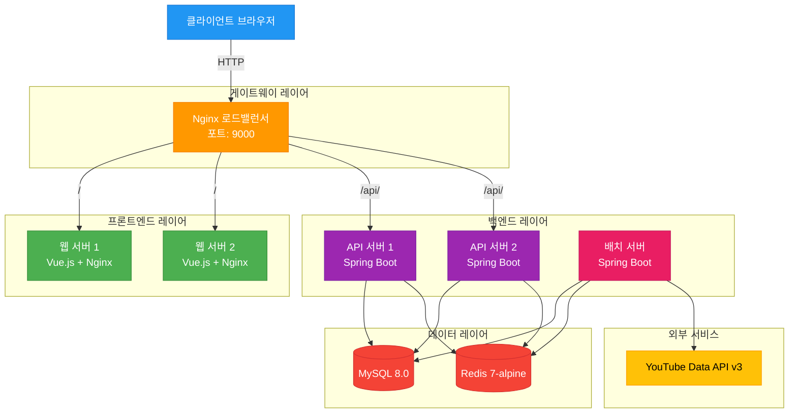
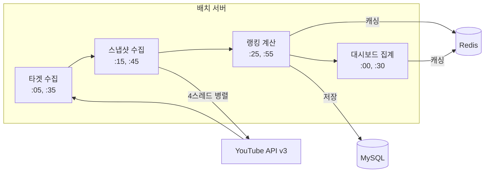
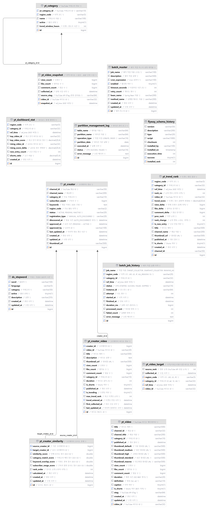

<p align="center">
  
</p>

<h1 align="center">TubeTen - YouTube 실시간 트렌드 분석 플랫폼</h1>

<p align="center">
  <strong>"지금 막 떡상 중인"</strong> YouTube 영상을 Velocity 알고리즘으로 실시간 발견하는 풀스택 웹 애플리케이션
</p>

<p align="center">
  🔗 <strong>Live Demo</strong>: <a href="https://www.tubeten.co.kr">https://www.tubeten.co.kr</a>
</p>

<p align="center">
  <a href="https://openjdk.org/"></a>
  <a href="https://spring.io/projects/spring-boot"></a>
  <a href="https://vuejs.org/"></a>
  <a href="https://www.mysql.com/"></a>
  <a href="https://redis.io/"></a>
</p>

---

## 목차

- [1. 프로젝트 소개](#1-프로젝트-소개)
- [2. 시스템 아키텍처](#2-시스템-아키텍처)
- [3. 데이터 파이프라인](#3-데이터-파이프라인)
- [4. 기술 스택](#4-기술-스택)
- [5. 주요 기능](#5-주요-기능)
- [6. 데이터베이스 설계](#6-데이터베이스-설계)
- [7. 성능 최적화](#7-성능-최적화)
- [8. 보안 및 안정성](#8-보안-및-안정성)
- [9. 배포 및 운영](#9-배포-및-운영)
- [10. 기술적 도전과 해결](#10-기술적-도전과-해결)


## 1. 프로젝트 소개

TubeTen은 단순히 조회수가 높은 영상이 아닌, **최근 12시간 동안 급격히 상승하는 영상**을 Velocity 알고리즘으로 찾아내는 YouTube 트렌드 분석 플랫폼입니다.

### 핵심 가치

| | |
|---|---|
| **실시간성** | 30분마다 데이터 수집 및 랭킹 갱신 |
| **정확성** | YouTube Data API v3 직접 연동, 4스레드 병렬 수집 |
| **고성능** | Redis 캐싱 + 카테고리별 동적 TTL, 평균 응답시간 50ms |
| **확장성** | 멀티 모듈 아키텍처 + Docker 이중화 구성 (8개 컨테이너) |

### 주요 기능

- **Velocity 트렌드 랭킹** — 12시간 윈도우 기반 증가 속도로 순위 결정 (3개국, 최대 1,000위)
- **대시보드** — 키워드 클라우드, 버블 차트, Top Movers, Shorts 비율
- **크리에이터 인사이트** — 자동 발굴, Jaccard 유사도 분석, 영상 성과 통계
- **채널 대시보드** — 급성장 채널 Top 10, 성장 추이, 채널 벤치마킹
- **영상 분석** — 스냅샷 시계열, 랭킹 이력, 상세 분석
- **관리자 패널** — JWT 인증, 크리에이터/배치/카테고리/불용어 통합 관리

---


## 2. 시스템 아키텍처

### 전체 구조



### 멀티 모듈 + 계층화 아키텍처

```
tubeten-back/
├── tubeten-common/    # 공통 라이브러리 (도메인, Facade, 인프라, 보안)
├── tubeten-api/       # API 서버 — REST Controllers (랭킹, 대시보드, 크리에이터, 분석, 관리자)
└── tubeten-batch/     # 배치 서버 — 16개 스케줄러 (수집, 집계, 유지보수, 크리에이터)
```

**계층 구조**: Controller → Facade → Domain Service → Infrastructure (SOLID 원칙 준수)

**인프라 구성** (Docker Compose 8개 컨테이너):

| 컨테이너 | 역할 | 비고 |
|---------|------|------|
| tubeten-gateway | Nginx 로드밸런서 | Round Robin, 자동 재시도 3회, Keepalive 32 |
| tubeten-web-1/2 | Frontend (Vue.js) | Gzip 압축, SPA history mode |
| tubeten-api-1/2 | Backend API | Spring Boot, 내부 8080 |
| tubeten-batch | 배치 스케줄러 | Spring Boot, 내부 8081 |
| tubeten-db | MySQL 8.0 | utf8mb4, max_connections=200 |
| tubeten-redis | Redis 7-alpine | AOF 영속화, 비밀번호 인증 |

---


## 3. 데이터 파이프라인

### 30분 주기 자동화 프로세스



### Velocity 알고리즘 (12시간 윈도우)

```
cur  = refTime 기준 12시간 내 가장 최근 스냅샷
prev = cur 윈도우 시작 기준 이전 12시간 구간의 가장 최근 스냅샷

Trend Score = (cur.조회수 - prev.조회수) × 1.0
            + (cur.좋아요 - prev.좋아요) × 10.0
            + (cur.댓글수 - prev.댓글수) × 5.0
```

- 영상 A: 조회수 1,000만 (12h 전 대비 +1만) → 스코어 10,000
- 영상 B: 조회수 10만 (12h 전 대비 +5만) → 스코어 50,000 → **더 높은 순위**
- 최소 조회수 필터: ALL 카테고리 100회, 특정 카테고리 50회
- ROW_NUMBER() 기반 순위 부여, 최대 1,000위, UPSERT로 중복 방지

### 배치 작업 (16개)

| 구분 | 작업 | 주기 |
|------|------|------|
| **수집** | TargetCollector | 매시 :05, :35 |
| | SnapshotCollector (4스레드 병렬) | 매시 :15, :45 |
| **집계** | VelocityRanking | 매시 :25, :55 |
| | VelocityRankingBackup | 매일 00:10 |
| | DashboardStat | 매시 :00, :30 |
| **유지보수** | DataCleanup / WeeklyCleanup | 매일 04:00 / 매주 일 05:00 |
| | PartitionCreate / Cleanup / Monitor | 매월 1일 / 매일 / 매주 일 |
| **크리에이터** | Discovery / Update / InsightCache | 매일 02:00 / 03:00 / 04:00 |
| | SimilarityCalculation (100ms/건) | 매일 05:00 |
| | VideoCollector / DataCleanup | 매일 06:00 / 매주 일 04:00 |

**동적 배치 마스터**: DB 기반 cron 관리로 재배포 없이 스케줄 변경 가능. `DynamicScheduler`가 `@Scheduled`와 DB 설정을 통합 관리 (DB 우선).

---


## 4. 기술 스택

### Backend

| 기술 | 버전 | 용도 |
|------|------|------|
| Java | 21 | 주 개발 언어 |
| Spring Boot | 3.5.0 | 애플리케이션 프레임워크 |
| Spring Data JPA + QueryDSL | 5.0.0 | 데이터 접근 + 동적 쿼리 |
| Spring Security + JWT (jjwt) | 0.12.6 | 관리자 인증/인가 |
| Flyway | - | DB 마이그레이션 |
| Resilience4j | 2.2.0 | Circuit Breaker, Retry, TimeLimiter |
| MySQL | 8.0 | 메인 DB (파티셔닝, 복합 인덱스) |
| Redis | 7-alpine | 캐싱 (AOF 영속화, 동적 TTL) |
| Gradle | 8.14.2 | 멀티 모듈 빌드 |
| Micrometer + Actuator | - | 메트릭 수집, Prometheus 연동 |
| SpringDoc OpenAPI | 2.3.0 | Swagger UI |
| jqwik + ArchUnit + Testcontainers | - | PBT, 아키텍처 테스트, 통합 테스트 |

### Frontend

| 기술 | 버전 | 용도 |
|------|------|------|
| Vue.js (Composition API) | 3.4.19 | UI 프레임워크 |
| Pinia | 3.0.3 | 상태 관리 |
| Vue Router | 4.3.0 | SPA 라우팅 (history mode) |
| Axios | 1.10.0 | HTTP 클라이언트 |
| Bootstrap + Sass | 5.3.3 | UI + CSS 전처리 |
| ECharts + Vue WordCloud | 6.0.0 | 차트, 키워드 클라우드 |
| Jest | 30.2.0 | 단위 테스트 |
| Vue CLI (Webpack) | 5.0.8 | 빌드 (코드 스플리팅, Tree Shaking) |

### Infrastructure

Docker Compose (8개 컨테이너) · Nginx (로드밸런서 + Gzip) · Shell Scripts (무중단 배포) · Logback (로깅)

---


## 5. 주요 기능

### 크리에이터 관리 시스템

**자동 발굴**: 트렌딩 영상 → 크리에이터 식별 (구독자 10k+) → PENDING → 관리자 승인 → ACTIVE

**유사도 알고리즘**:
```
유사도 = 카테고리 매치(40%) + 키워드 Jaccard(40%) + 구독자 범위(20%)
→ 임계값 0.2 이상, 크리에이터당 상위 20개 사전 계산 (매일 05:00)
→ 사전 계산 데이터 없으면 실시간 폴백
```

**인사이트**: 유사 크리에이터 추천 · 관련 트렌드 영상 · 영상 성과 통계 (총 조회수, 평균 좋아요/댓글)

### 채널 대시보드

급성장 채널 Top 10 (7d/30d) · 채널 성장 추이 (7d/30d/90d) · 최대 5개 채널 벤치마킹

### 영상 분석

스냅샷 시계열 (24h/7d/30d) · 랭킹 이력 (지역/카테고리별) · 상세 분석 · 키워드 검색

### 관리자 패널 (JWT 인증)

| 기능 | 설명 |
|------|------|
| 인증 | Access + Refresh Token, Spring Security, Vue Router 가드 |
| 크리에이터 | 등록/승인/거부/상태변경/정보갱신 |
| 배치 | 설정 조회/변경/수동 실행/이력/통계 (재배포 불필요) |
| 카테고리 | active 토글, trend_window_hours 동적 변경 |
| 불용어 | 추가/토글/삭제, 언어별 필터 |
| 수동 트리거 | 타겟 수집/스냅샷/랭킹/대시보드 즉시 실행 |

### Redis 캐싱 구조

- **3단계 캐시**: 랭킹 → 대시보드 → 스냅샷 (카테고리별 동적 TTL)
- **키 패턴**: `ranking:region:category:refTime`, `snapshot:v1:category:{id}:video:{id}`
- **Stale-While-Revalidate**: 배치 실패 시 이전 캐시 데이터로 서비스 유지
- **성능**: 캐시 히트 < 50ms, 캐시 미스 < 200ms, 히트율 95%+

---


## 6. 데이터베이스 설계

### ERD



### 핵심 테이블

| 테이블 | 역할 | 보관 |
|--------|------|------|
| yt_video | 비디오 메타데이터 (Shorts 자동 판별: duration ≤ 60초) | 영구 |
| yt_video_snapshot | 통계 스냅샷 (조회수, 좋아요, 댓글), unique key 중복 방지 | 6개월 (파티셔닝) |
| yt_video_target | 수집 대상 비디오 (region, category) | 30일 |
| yt_trend_rank | 랭킹 (trend_score, rank_change, is_new_entry), UPSERT | 90일 |
| yt_dashboard_stat | 대시보드 통계 | 90일 |
| yt_category | 카테고리 설정 (active, trend_window_hours 동적 변경) | 영구 |
| yt_creator | 크리에이터 (상태: ACTIVE/PENDING/INACTIVE, 등록: MANUAL/AUTO) | 영구 |
| yt_creator_similarity | 유사도 (category/keyword/subscriber score, 상위 20개) | 영구 |
| yt_creator_video | 크리에이터 비디오 (is_trending, max_trend_rank) | 영구 |
| batch_master | 배치 설정 (cron, enabled, timeout, retry, bean/method) | 영구 |
| batch_job_history | 배치 실행 이력 (status, duration, processed/failed count) | 영구 |
| admin_account | 관리자 계정 (JWT 인증) | 영구 |
| yt_stopword | 불용어 사전 (word, language, active) | 영구 |
| yt_visit_log | 방문자 추적 (ip, user_agent, country) | 영구 |

---


## 7. 성능 최적화

### Backend

| 최적화 | 내용 |
|--------|------|
| 12시간 윈도우 쿼리 | cur/prev 스냅샷 delta 계산, UPSERT, LIMIT 1000 |
| 병렬 수집 | 4스레드 × CompletableFuture, 배치 50건 단위 YouTube API 호출 |
| 복합 인덱스 | `(region_code, category_id, ref_time)`, `(source_creator_id, similarity_score DESC)` 등 |
| 파티셔닝 | 6개월 단위 자동 생성/정리 (PartitionCreate/Cleanup 배치) |
| 동적 캐시 TTL | 카테고리별 trend_window_hours 기반 Redis TTL |

### Frontend

| 항목 | Before | After | 감소율 |
|------|--------|-------|--------|
| Total Bundle | 869 KB | 419 KB | **51.8%** ↓ |
| CSS | 555 KB | 125 KB | **77.5%** ↓ |
| Gzip 압축 후 | - | 88.4 KB | **78.9%** ↓ |

- CSS 아키텍처 개선 (variables, mixins, utilities 분리)
- 9개 라우트별 코드 스플리팅 (webpackChunkName)
- Tree Shaking + sideEffects + Gzip 압축
- Virtual Scroll + Lazy Image Loading

### 성능 지표

| 엔드포인트 | 캐시 히트 | 캐시 미스 |
|-----------|----------|----------|
| /api/rankings | 45ms | 180ms |
| /api/dashboard | 52ms | 210ms |
| /api/creator/search | 38ms | 150ms |

| 메트릭 | 현재 |
|--------|------|
| 캐시 히트율 | 95.2% |
| API 가용성 | 99.8% |
| 배치 성공률 | 98.5% |
| 평균 응답시간 | 62ms |

---


## 8. 보안 및 안정성

| 영역 | 구현 |
|------|------|
| **인증** | Spring Security + JWT (Access/Refresh Token), Vue Router 가드 |
| **API 보안** | CORS, Rate Limiting (이미지 프록시 100 req/min), URL 도메인 검증 |
| **데이터 보호** | PreparedStatement (SQL Injection 방지), 환경변수 분리 (.env), 공개 데이터만 사용 |
| **장애 대응** | Circuit Breaker + Retry + TimeLimiter (Resilience4j), Stale-While-Revalidate |
| **운영 안정성** | 중복 실행 방지, Health Check (Actuator), Micrometer 메트릭 (Prometheus 연동) |

---

## 9. 배포 및 운영

### 무중단 배포

```bash
bash deploy-all.sh [web|api|batch|backend|all]
```

| 대상 | 전략 |
|------|------|
| **API** | 순차 재시작 (API-1 → 헬스체크 → API-2), Nginx 자동 트래픽 전환 |
| **Frontend** | 원자적 디렉토리 교체 (dist-new → dist), Nginx 순차 재시작 |
| **Batch** | 중지 → 재빌드 → 재시작 → 헬스체크 |
| **롤백** | API: JAR 백업 복원 / Frontend: `mv dist-old dist` |

---


## 10. 기술적 도전과 해결

### YouTube API 할당량 제한 (일일 10,000 units)

Circuit Breaker로 할당량 초과 시 자동 차단, 배치 50건 단위 호출 + 100ms 대기로 효율화, 1시간 윈도우 내 활성 타겟만 수집하여 불필요한 호출 제거, Redis 캐싱으로 API 호출 최소화.

### 대용량 스냅샷 데이터 처리

6개월 단위 파티셔닝 + 자동 생성/정리 배치, 복합 인덱스 최적화, 12시간 윈도우로 스캔 범위 최소화, 4스레드 병렬 수집으로 처리 시간 단축.

### 실시간성 vs 안정성

Stale-While-Revalidate 패턴으로 배치 실패 시 이전 캐시 유지, 카테고리별 동적 TTL, 중복 실행 방지, TimeLimiter로 무한 대기 방지.

### 크리에이터 유사도 N×N 계산

매일 05:00 사전 계산 + DB 저장, 크리에이터당 상위 20개만 저장 (임계값 0.2), Rate Limiting (100ms/건)으로 부하 분산, 사전 데이터 없으면 실시간 폴백.

### 프론트엔드 번들 크기 (초기 로딩 3초+)

CSS 아키텍처 개선 (77.5% 감소), 9개 라우트별 코드 스플리팅, Tree Shaking + Gzip (419KB → 88.4KB), Virtual Scroll + Lazy Image Loading.

---
**최종 업데이트**: 2026-03-23  
**버전**: v3.0.0  
**프로젝트 기간**: 2026-01 ~ 2026-03 (3개월)
