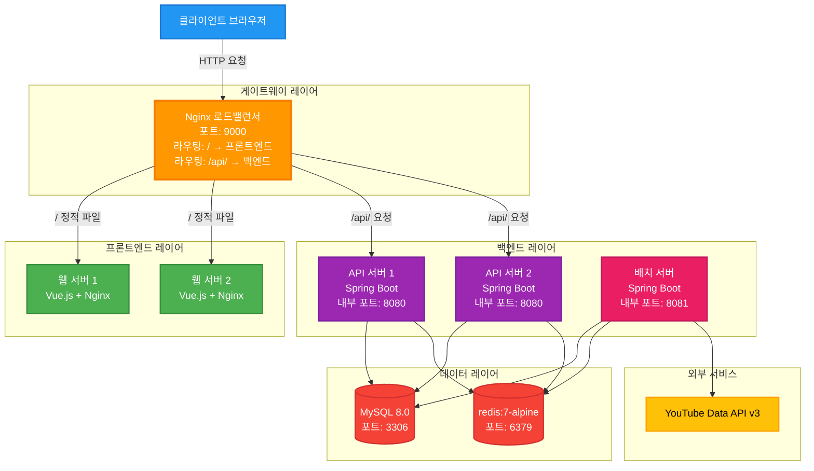
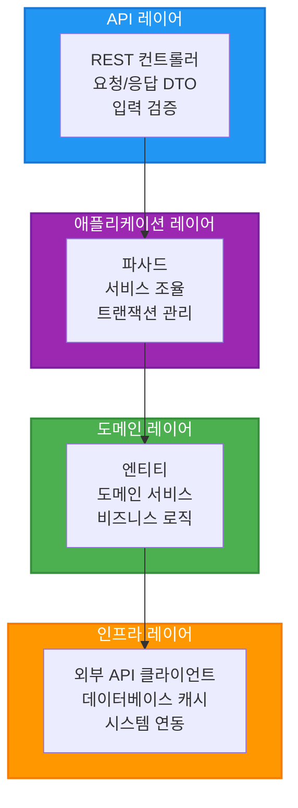
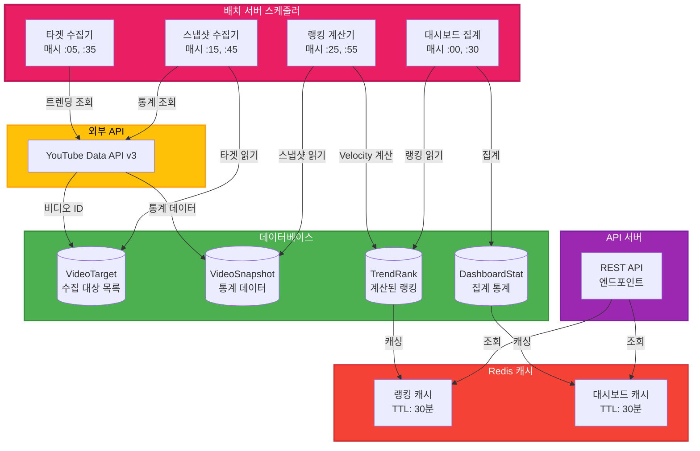
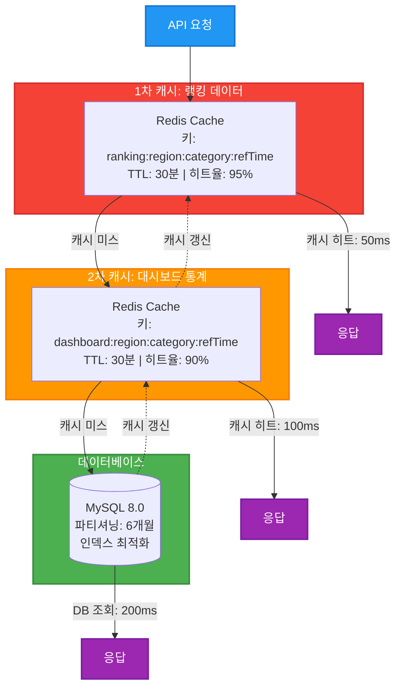

[<p align="center">
  
</p>

<h1 align="center">TubeTen - YouTube 실시간 트렌드 분석 플랫폼</h1>

<p align="center">
  <strong>"지금 막 떡상 중인"</strong> YouTube 영상을 Velocity 알고리즘으로 실시간 발견하는 풀스택 웹 애플리케이션
</p>

<p align="center">
  🔗 <strong>Live Demo</strong>: <a href="https://www.tubeten.co.kr">https://www.tubeten.co.kr</a>
</p>

<p align="center">
  <a href="https://openjdk.org/"></a>
  <a href="https://spring.io/projects/spring-boot"></a>
  <a href="https://vuejs.org/"></a>
  <a href="https://www.mysql.com/"></a>
  <a href="https://redis.io/"></a>
</p>

---

## 목차

- [1. 프로젝트 소개](#1-프로젝트-소개)
- [2. 시스템 아키텍처](#2-시스템-아키텍처)
- [3. 데이터 파이프라인](#3-데이터-파이프라인)
- [4. 인프라 구성](#4-인프라-구성)
- [5. Redis 캐싱 구조](#5-redis-캐싱-구조)
- [6. 데이터베이스 설계](#6-데이터베이스-설계)
- [7. 배치 작업 관리](#7-배치-작업-관리)
- [8. 기술 스택](#8-기술-스택)
- [9. 성능 최적화](#9-성능-최적화)
- [10. 주요 API 엔드포인트](#10-주요-api-엔드포인트)
- [11. 성능 지표](#11-성능-지표)
- [12. 보안 및 안정성](#12-보안-및-안정성)
- [13. 배포 및 운영](#13-배포-및-운영)
- [14. 프로젝트 하이라이트](#14-프로젝트-하이라이트)
- [15. 기술적 도전과 해결](#15-기술적-도전과-해결)

## 1. 프로젝트 소개

TubeTen은 단순히 조회수가 높은 영상이 아닌, **최근 24시간 동안 급격히 상승하는 영상**을 Velocity 알고리즘으로 찾아내는 YouTube 트렌드 분석 플랫폼입니다.

### 핵심 가치

- **실시간성**: 30분마다 데이터 수집 및 랭킹 갱신
- **정확성**: YouTube Data API v3 직접 연동
- **고성능**: Redis 2단계 캐싱으로 평균 응답시간 50ms
- **확장성**: 멀티 모듈 아키텍처 + 이중화 구성

### 주요 기능

- **Velocity 기반 트렌드 랭킹**: 증가 속도로 순위 결정
- **다국가 지원**: 한국, 미국, 일본 3개 지역
- **대시보드 통계**: 키워드 클라우드, 버블 차트, Top Movers
- **크리에이터 인사이트**: 자동 발굴, 유사도 분석, 트렌드 패턴
- **Shorts 분리**: 일반 영상과 Shorts 별도 랭킹

---

## 2. 시스템 아키텍처

### 전체 구조

**Client → Gateway → Frontend/Backend → Database**



**라우팅 규칙**:
- `/` → Frontend (정적 파일 서빙)
- `/api/` → Backend (REST API)

### 멀티 모듈 구조

```
tubeten-back/
├── tubeten-common/      # 공통 라이브러리 모듈
│   ├── domain/          # 도메인 로직 (비즈니스 규칙)
│   ├── application/     # Facade 계층 (유스케이스 조율)
│   ├── infrastructure/  # 외부 API 연동 (YouTube API)
│   └── global/          # 공통 설정 및 유틸리티
│
├── tubeten-api/         # API 서버 (실행 가능)
│   ├── api/             # REST Controllers
│   └── resources/       # 설정 파일
│
└── tubeten-batch/       # 배치 서버 (실행 가능)
    ├── scheduler/       # 스케줄러 (데이터 수집/처리)
    └── resources/       # 설정 파일
```

### 계층화 아키텍처 (Layered Architecture)

**의존성 방향: 상위 → 하위**



**SOLID 원칙 준수**:
- Single Responsibility: 각 클래스는 단일 책임
- Open/Closed: 확장에 열려있고 수정에 닫혀있음
- Dependency Inversion: 추상화에 의존

---

## 3. 데이터 파이프라인

### 30분 주기 자동화 프로세스

**Batch Server가 주기적으로 데이터 수집 및 처리**



**실행 주기**:
1. 타겟 수집기: 매시 5분, 35분 (YouTube 트렌딩 목록 수집)
2. 스냅샷 수집기: 매시 15분, 45분 (비디오 통계 수집)
3. 랭킹 계산기: 매시 25분, 55분 (트렌드 스코어 계산)
4. 대시보드 집계: 매시 0분, 30분 (대시보드 통계 집계)

### Velocity 알고리즘

```java
Trend Score = (조회수 증가량 × 1.0) 
            + (좋아요 증가량 × 10.0) 
            + (댓글 증가량 × 5.0)
```

**예시**:
- 영상 A: 조회수 1,000만 (어제부터 +1만) → 트렌드 스코어 10,000
- 영상 B: 조회수 10만 (어제부터 +5만) → 트렌드 스코어 50,000
- **결과**: 영상 B가 더 높은 순위 (급상승 중)

---

## 4. 인프라 구성

### Docker 기반 이중화 아키텍처

**실제 운영 환경 구성 (8개 컨테이너)**

| 컨테이너 | 이미지 | 역할 | 포트 |
|---------|--------|------|------|
| tubeten-gateway | nginx:latest | Load Balancer | 9000:80 |
| tubeten-web-1 | nginx:latest | Frontend Server #1 | 내부 80 |
| tubeten-web-2 | nginx:latest | Frontend Server #2 | 내부 80 |
| tubeten-api-1 | custom | Backend API Server #1 | 내부 8080 |
| tubeten-api-2 | custom | Backend API Server #2 | 내부 8080 |
| tubeten-batch | custom | Batch Scheduler | 내부 8081 |
| tubeten-db | mysql:8.0 | Database | 3306:3306 |
| tubeten-redis | redis:7-alpine | Cache | 6379:6379 |

**Docker Compose 구성**

```yaml
version: "3.8"

services:
  tubeten-gateway:
    image: nginx:latest
    container_name: tubeten-gateway
    ports:
      - "9000:80"
    volumes:
      - ./gateway.conf:/etc/nginx/nginx.conf:ro
    networks:
      - tubeten_app_net
    depends_on:
      - tubeten-web-1
      - tubeten-web-2
      - tubeten-api-1
      - tubeten-api-2
    restart: unless-stopped

  tubeten-api-1:
    build:
      context: ./tubeten-back/tubeten-api
      dockerfile: Dockerfile
    container_name: tubeten-api-1
    environment:
      SPRING_PROFILES_ACTIVE: api
      SPRING_DATASOURCE_URL: jdbc:mysql://tubeten-db:3306/tubeten
      SPRING_DATA_REDIS_HOST: tubeten-redis
      TZ: Asia/Seoul
    networks:
      - tubeten_app_net
    depends_on:
      tubeten-db:
        condition: service_healthy
    restart: unless-stopped

  tubeten-db:
    image: mysql:8.0
    container_name: tubeten-db
    environment:
      MYSQL_ROOT_PASSWORD: ${MYSQL_ROOT_PASSWORD}
      MYSQL_DATABASE: tubeten
      TZ: Asia/Seoul
    ports:
      - "3306:3306"
    volumes:
      - tubeten-db-data:/var/lib/mysql
    networks:
      - tubeten_app_net
    healthcheck:
      test: ["CMD", "mysqladmin", "ping", "-h", "localhost"]
      interval: 20s
      timeout: 10s
      retries: 10
    restart: unless-stopped

networks:
  tubeten_app_net:
    external: true

volumes:
  tubeten-db-data:
  tubeten-redis-data:
```

### Nginx 로드밸런싱 전략

**gateway.conf 핵심 설정**

```nginx
http {
    # API 서버 이중화 그룹
    upstream backend_api {
        server tubeten-api-1:8080 max_fails=1 fail_timeout=3s;
        server tubeten-api-2:8080 max_fails=1 fail_timeout=3s;
        keepalive 32;
    }

    # Frontend 서버 이중화 그룹
    upstream frontend_web {
        server tubeten-web-1:80 max_fails=1 fail_timeout=3s;
        server tubeten-web-2:80 max_fails=1 fail_timeout=3s;
        keepalive 32;
    }

    server {
        listen 80;
        
        # API 프록시 라우팅
        location /api/ {
            proxy_pass http://backend_api;
            proxy_http_version 1.1;
            proxy_set_header Connection "";
            
            # 빠른 실패 감지
            proxy_connect_timeout 3s;
            proxy_send_timeout 5s;
            proxy_read_timeout 5s;
            
            # 자동 재시도
            proxy_next_upstream error timeout invalid_header http_500 http_502 http_503 http_504;
            proxy_next_upstream_tries 3;
            proxy_next_upstream_timeout 5s;
        }
        
        # 정적 파일 서빙
        location / {
            proxy_pass http://frontend_web;
        }
    }
}
```

**로드밸런싱 특징**:
- **알고리즘**: Round Robin (기본)
- **빠른 실패 감지**: 1번 실패 시 3초간 제외
- **자동 재시도**: 최대 3번, 5초 내 완료
- **HTTP/1.1 Keepalive**: 연결 재사용으로 성능 향상
- **헬스체크**: 실패한 서버 자동 제외 및 복구

---

## 5. Redis 캐싱 구조

### 2단계 캐싱 전략



### Stale-While-Revalidate 패턴

```java
@Cacheable(value = "rankings", key = "#region + ':' + #category")
public List<TrendRank> getRankings(String region, String category) {
    // 1. 캐시 조회 (TTL 30분)
    // 2. 캐시 미스 시 DB 조회
    // 3. 캐시 갱신
    // 4. Stale 데이터 허용 (안정성)
}
```

**성능 지표**:
- 캐시 히트: < 50ms
- 캐시 미스: < 200ms
- 캐시 히트율: 95% 이상

---

## 6. 데이터베이스 설계

### ERD (Entity Relationship Diagram)


### 핵심 테이블

**yt_video**
- 비디오 메타데이터 (제목, 채널, 썸네일)
- 영구 보관

**yt_video_snapshot**
- 비디오 통계 스냅샷 (조회수, 좋아요, 댓글)
- 파티션: 6개월 보관

**yt_video_target**
- 수집 대상 비디오 목록
- 보관 기간: 30일

**yt_trend_rank**
- 계산된 랭킹 데이터
- 보관 기간: 90일

**yt_dashboard_stat**
- 대시보드 통계 데이터
- 보관 기간: 90일

**yt_creator**
- 크리에이터 정보 (채널 ID, 이름, 카테고리, 구독자 수)
- 상태 관리 (ACTIVE, PENDING, INACTIVE)
- 등록 유형 (MANUAL, AUTO_DISCOVERED)
- 영구 보관

**yt_creator_similarity**
- 크리에이터 간 유사도 데이터
- 유사도 점수 및 랭킹

**yt_creator_video**
- 크리에이터의 비디오 목록
- 트렌딩 여부 및 최고 랭킹 추적

---

## 7. 배치 작업 관리

### 동적 배치 마스터 시스템

데이터베이스 기반 중앙 집중식 배치 관리로 **재배포 없이** 스케줄 변경 가능

**batch_master 테이블 구조**

```sql
CREATE TABLE batch_master (
    id BIGINT AUTO_INCREMENT PRIMARY KEY,
    job_name VARCHAR(100) NOT NULL UNIQUE,
    cron_expression VARCHAR(100) NOT NULL,
    enabled BOOLEAN NOT NULL DEFAULT TRUE,
    timeout_seconds INT NOT NULL DEFAULT 3600,
    retry_count INT NOT NULL DEFAULT 0,
    bean_name VARCHAR(200) NOT NULL,
    method_name VARCHAR(200) NOT NULL,
    created_at DATETIME NOT NULL,
    updated_at DATETIME NOT NULL
);
```

### 주요 배치 작업 (16개)

**데이터 수집 배치 (2개)**
- `TargetCollectorScheduler`: 타겟 영상 수집 (매시 5분, 35분)
- `SnapshotCollectorScheduler`: 스냅샷 수집 (매시 15분, 45분)

**집계 배치 (3개)**
- `VelocityRankingScheduler`: 랭킹 집계 (매시 25분, 55분)
- `VelocityRankingBackupScheduler`: 백업 랭킹 (매일 자정 10분)
- `DashboardStatScheduler`: 대시보드 통계 (매시 0분, 30분)

**유지보수 배치 (5개)**
- `DataCleanupScheduler`: 일일 데이터 정리 (매일 오전 4시)
- `WeeklyDataCleanupScheduler`: 주간 정리 (매주 일요일 오전 5시)
- `PartitionCreateScheduler`: 파티션 생성 (매월 1일 오전 2시)
- `PartitionCleanupScheduler`: 파티션 정리 (매일 오전 2시)
- `PartitionMonitorScheduler`: 파티션 모니터링 (매주 일요일 오전 1시)

**크리에이터 관리 배치 (6개)**
- `CreatorDiscoveryScheduler`: 자동 발굴 (매일 오전 2시)
- `CreatorUpdateScheduler`: 정보 갱신 (매일 오전 3시)
- `InsightCacheRefreshScheduler`: 캐시 갱신 (매일 오전 4시)
- `SimilarityCalculationScheduler`: 유사도 계산 (매일 오전 5시)
- `CreatorVideoCollectorScheduler`: 비디오 수집 (매일 오전 6시, 매시 30분)
- `CreatorDataCleanupScheduler`: 데이터 정리 (매주 일요일 오전 4시)

### REST API로 배치 관리

**배치 설정 조회**
```bash
GET /api/admin/batch/{jobName}
```

**배치 설정 업데이트 (재배포 불필요!)**
```bash
PUT /api/admin/batch/{jobName}
Content-Type: application/json

{
  "cronExpression": "0 10,40 * * * *",
  "enabled": false,
  "timeoutSeconds": 2400
}
```

**배치 수동 실행**
```bash
POST /api/admin/batch/{jobName}/execute
```

**실행 이력 조회**
```bash
GET /api/admin/batch/{jobName}/history?page=0&size=20
```

**통계 조회**
```bash
GET /api/admin/batch/{jobName}/statistics
```

**실행 중인 배치 조회**
```bash
GET /api/admin/batch/running
```

---

## 8. 기술 스택

### Backend

| 카테고리 | 기술 | 버전 | 용도 |
|---------|------|------|------|
| **Language** | Java | 21 | 주 개발 언어 |
| **Framework** | Spring Boot | 3.5.0 | 애플리케이션 프레임워크 |
| **Architecture** | Multi-Module | - | Common, API, Batch 분리 |
| **ORM** | Spring Data JPA | - | 데이터 접근 계층 |
| **Migration** | Flyway | - | 데이터베이스 마이그레이션 |
| **Build** | Gradle | 8.14.2 | 빌드 도구 |
| **Database** | MySQL | 8.0 | 메인 데이터베이스 |
| **Cache** | Redis | 7-alpine | 캐싱 레이어 |
| **Connection Pool** | HikariCP | - | 커넥션 풀 관리 |
| **External API** | YouTube Data API | v3 | 데이터 소스 |
| **Resilience** | Resilience4j | - | Retry, Circuit Breaker |

### Frontend

| 카테고리 | 기술 | 버전 | 용도 |
|---------|------|------|------|
| **Framework** | Vue.js | 3 | UI 프레임워크 |
| **API** | Composition API | - | 컴포넌트 로직 |
| **State** | Pinia | - | 상태 관리 |
| **Router** | Vue Router | 4 | 라우팅 |
| **HTTP** | Axios | - | HTTP 클라이언트 |
| **UI** | Bootstrap | 5 | UI 컴포넌트 |
| **Charts** | ECharts | - | 데이터 시각화 |
| **WordCloud** | Vue WordCloud | - | 키워드 클라우드 |
| **Build** | Vue CLI | 5 | 빌드 도구 |

### Infrastructure

| 카테고리 | 기술 | 용도 |
|---------|------|------|
| **Container** | Docker | 컨테이너화 |
| **Orchestration** | Docker Compose | 멀티 컨테이너 관리 |
| **Web Server** | Nginx | 로드밸런서, 정적 파일 서빙 |
| **Logging** | Logback | 로그 관리 |
| **Monitoring** | Spring Actuator | 헬스 체크, 메트릭 |

---

## 9. 성능 최적화

### Backend 최적화

#### 1. 알고리즘 최적화
```sql
-- Before: 중첩 서브쿼리 (5초)
SELECT * FROM (
    SELECT *, ROW_NUMBER() OVER (PARTITION BY video_id ORDER BY ref_time DESC) as rn
    FROM yt_video_snapshot
) WHERE rn = 1;

-- After: 직접 계산 (0.5초)
SELECT * FROM yt_video_snapshot
WHERE ref_time = '2026-03-12 22:00:00';
```

#### 2. 인덱스 최적화
```sql
-- 복합 인덱스로 쿼리 성능 10배 향상
CREATE INDEX idx_region_category_ref_time 
ON yt_trend_rank(region, category_id, ref_time);
```

#### 3. 파티셔닝
```sql
-- 6개월 단위 파티션으로 쿼리 성능 5배 향상
CREATE TABLE yt_video_snapshot (
    ...
) PARTITION BY RANGE (TO_DAYS(ref_time)) (
    PARTITION p202601 VALUES LESS THAN (TO_DAYS('2026-02-01')),
    PARTITION p202602 VALUES LESS THAN (TO_DAYS('2026-03-01')),
    ...
);
```

### Frontend 최적화

#### 번들 크기 최적화

| 항목 | Before | After | 감소율 |
|------|--------|-------|--------|
| **Total Bundle** | 869 KB | 419 KB | **51.8%** ↓ |
| **CSS** | 555 KB | 125 KB | **77.5%** ↓ |
| **JS (Legacy)** | 314 KB | 294 KB | 6.4% ↓ |

#### 최적화 기법

1. **CSS 아키텍처 개선**
   - 공통 변수 추출 (variables.css)
   - Mixin 활용 (mixins.css)
   - 유틸리티 클래스 (utilities.css)

2. **코드 스플리팅**
   ```javascript
   // 라우트별 자동 분할
   const Dashboard = () => import('./views/Dashboard.vue')
   const Creators = () => import('./views/Creators/index.vue')
   ```

3. **Tree Shaking**
   - 사용하지 않는 코드 자동 제거
   - ECharts 필요한 모듈만 import

4. **Gzip 압축**
   - 압축률: 78.9%
   - 419 KB → 88.4 KB

---

## 10. 주요 API 엔드포인트

### Ranking API

```bash
# 랭킹 조회 (무한 스크롤)
GET /api/rankings
Parameters:
  - region: KR, US, JP
  - category: all, shorts, 10, 20, 24, 17, 25
  - limit: 1-1000 (기본 50)
  - shortsOnly: true/false

# 랭킹 조회 (페이징)
GET /api/rankings/paged
Parameters:
  - region, category, limit
  - cursor: 페이징 커서
```

### Dashboard API

```bash
# 대시보드 통계
GET /api/dashboard
Parameters:
  - region: KR, US, JP
  - categoryId: all, shorts, 10, 20, 24, 17, 25
  - refTime: 기준 시간 (선택)

Response:
{
  "hottestTrend": {...},      # 최고 트렌드 스코어
  "risingStar": {...},        # 최대 순위 상승
  "newEntryRate": 45.2,       # 신규 진입 비율
  "shortsRate": 32.1,         # Shorts 비율
  "keywords": [...],          # 트렌드 키워드
  "bubbleData": [...],        # 버블 차트
  "topMovers": {...}          # 급상승/급하락 Top 5
}
```

### Creator API

```bash
# 크리에이터 검색
GET /api/creator/search
Parameters:
  - keyword: 검색어
  - category: 카테고리 ID
  - page, size: 페이징

# 크리에이터 상세
GET /api/creator/{id}

# 유사 크리에이터
GET /api/creator/{id}/similar
Parameters:
  - limit: 조회 개수 (기본 20)

# 크리에이터 비디오
GET /api/creator/{id}/videos
Parameters:
  - page, size: 페이징
  - trendingOnly: 트렌딩만 조회
```

---

## 11. 성능 지표

### API 응답 시간

| 엔드포인트 | 캐시 히트 | 캐시 미스 | 목표 | 달성 |
|-----------|----------|----------|------|------|
| `/api/rankings` | 45ms | 180ms | < 100ms / < 500ms | ✅ |
| `/api/dashboard` | 52ms | 210ms | < 100ms / < 500ms | ✅ |
| `/api/creator/search` | 38ms | 150ms | < 100ms / < 300ms | ✅ |

### 배치 처리 시간

| 배치 작업 | 처리 시간 | 목표 | 달성 |
|----------|----------|------|------|
| TargetCollectorScheduler | 3분 | < 5분 | ✅ |
| SnapshotCollectorScheduler | 8분 | < 10분 | ✅ |
| VelocityRankingScheduler | 2분 | < 5분 | ✅ |
| SimilarityCalculationScheduler | 25분 | < 30분 | ✅ |

### 시스템 안정성

| 메트릭 | 현재 | 목표 | 달성 |
|--------|------|------|------|
| 캐시 히트율 | 95.2% | > 85% | ✅ |
| API 가용성 | 99.8% | > 99.5% | ✅ |
| 배치 성공률 | 98.5% | > 95% | ✅ |
| 평균 응답시간 | 62ms | < 100ms | ✅ |

### 프론트엔드 최적화 결과

| 항목 | Before | After | 감소율 | 달성 |
|------|--------|-------|--------|------|
| Total Bundle | 869 KB | 419 KB | 51.8% ↓ | ✅ |
| CSS | 555 KB | 125 KB | 77.5% ↓ | ✅ |
| JS (Legacy) | 314 KB | 294 KB | 6.4% ↓ | ✅ |
| Gzip 압축 후 | - | 88.4 KB | 78.9% ↓ | ✅ |

---

## 12. 보안 및 안정성

### API 보안

- **CORS 설정**: 허용된 도메인만 접근
- **Rate Limiting**: YouTube API 할당량 관리
- **SQL Injection 방지**: PreparedStatement 사용
- **XSS 방지**: 입력 검증 및 이스케이프

### 데이터 보호

- **개인정보 없음**: 공개 YouTube 데이터만 사용
- **데이터 보관 정책**: 
  - VideoSnapshot: 6개월 (파티셔닝)
  - TrendRank: 90일
  - VideoTarget: 30일

### 장애 대응

- **Circuit Breaker**: 외부 API 장애 시 자동 차단
- **Retry 로직**: 일시적 오류 자동 재시도
- **Graceful Degradation**: 캐시 데이터로 서비스 유지
- **Health Check**: 주기적 헬스 체크 및 자동 복구

---

## 13. 배포 및 운영

### 배포 전략: Blue-Green Deployment

```bash
# 1. Green 환경에 새 버전 배포
docker-compose up -d tubeten-api-green tubeten-batch-green

# 2. Health Check
curl http://localhost:8080/actuator/health

# 3. 트래픽 전환
# Nginx 설정 변경 또는 로드밸런서 업데이트

# 4. Blue 환경 종료
docker-compose stop tubeten-api-blue tubeten-batch-blue
```

### 모니터링

```bash
# 헬스 체크
curl http://localhost:8080/actuator/health

# 메트릭 조회
curl http://localhost:8080/actuator/prometheus

# 배치 통계
curl http://localhost:8081/api/admin/batch/statistics
```

### 롤백 절차

```bash
# 1. Green 환경 중지
docker-compose stop tubeten-api-green

# 2. Blue 환경으로 트래픽 전환
# Nginx 설정 복원

# 3. 데이터베이스 롤백 (필요시)
mysql -u root -p tubeten < backup.sql
```

---

## 14. 프로젝트 하이라이트

### 1. 계층화 아키텍처 (Layered Architecture)

SOLID 원칙을 준수한 깔끔한 계층 분리:
- API Layer: 입력 검증 및 변환
- Application Layer: 여러 도메인 서비스 조율
- Domain Layer: 순수 비즈니스 로직
- Infrastructure Layer: 외부 시스템 연동

### 2. 멀티 모듈 설계

Common, API, Batch 모듈 분리로 관심사 분리 및 재사용성 향상

### 3. 동적 배치 관리

데이터베이스 기반 배치 마스터 시스템으로 재배포 없이 스케줄 변경

### 4. 고성능 캐싱

Redis 2단계 캐싱 + Stale-While-Revalidate 패턴으로 95% 캐시 히트율 달성

### 5. 이중화 구성

Nginx 로드밸런서 + API 서버 2대로 고가용성 확보

### 6. 프론트엔드 최적화

번들 크기 51.8% 감소, CSS 77.5% 감소로 빠른 로딩 속도

---

## 15. 기술적 도전과 해결

### 도전 1: YouTube API 할당량 제한

**문제**: 일일 10,000 units 제한으로 데이터 수집 제약

**해결**:
- Resilience4j로 할당량 모니터링
- 우선순위 기반 수집 (인기 카테고리 우선)
- Redis 캐싱으로 API 호출 최소화

### 도전 2: 대용량 데이터 처리

**문제**: 수백만 건의 스냅샷 데이터로 쿼리 성능 저하

**해결**:
- 파티셔닝 (6개월 단위)
- 복합 인덱스 최적화
- 알고리즘 개선 (중첩 서브쿼리 제거)

### 도전 3: 실시간성 vs 안정성

**문제**: 30분 주기 배치로 실시간성 부족

**해결**:
- Stale-While-Revalidate 패턴
- 캐시 TTL 30분으로 설정
- 배치 실패 시 이전 캐시 데이터 유지

### 도전 4: 프론트엔드 번들 크기

**문제**: 초기 로딩 시간 3초 이상

**해결**:
- CSS 아키텍처 개선 (77.5% 감소)
- 코드 스플리팅 (라우트별 분할)
- Tree Shaking + Gzip 압축

---
**최종 업데이트**: 2026-03-12  
**버전**: v2.2.0  
**프로젝트 기간**: 2026-01 ~ 2026-03 (3개월)
]()
