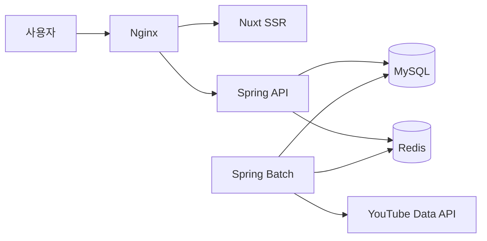

<p align="center">
  
</p>

<h1 align="center">TubeTen</h1>

<p align="center">
  YouTube 공개 데이터를 수집해 현재 빠르게 성장하는 영상과 채널을 보여주는 트렌드 분석 서비스
</p>

<p align="center">
  Java·Spring Boot 기반 데이터 수집과 API 개발을 중심으로 만든 개인 프로젝트
</p>

<p align="center">
  <a href="https://www.tubeten.co.kr"><strong>Live Service</strong></a>
  &nbsp;·&nbsp;
  <a href="https://www.tubeten.co.kr/api/swagger-ui.html"><strong>API Docs</strong></a>
  &nbsp;·&nbsp;
  <a href="https://www.tubeten.co.kr/api/docs"><strong>OpenAPI JSON</strong></a>
</p>

<p align="center">
  
  
  
  
  
  
</p>

---

## 프로젝트 소개

TubeTen은 단순 누적 조회수보다 **최근 조회수·좋아요·댓글의 변화량**을 중심으로 YouTube 콘텐츠의 성장 흐름을 보여주는 서비스입니다.

한국·미국·일본의 인기 영상과 크리에이터 데이터를 주기적으로 수집하고 다음 기능을 제공합니다.

- 국가·카테고리별 실시간 인기 영상
- 트렌드 대시보드와 Shorts 분석
- 영상 상세 성장 추이
- 크리에이터 검색과 성장 리포트
- 채널 성장률 비교
- 주간 트렌드 리포트

> YouTube의 공식 순위를 복제하는 서비스가 아니라, YouTube Data API의 공개 데이터를 자체적으로 수집하고 변화량을 계산해 보여주는 프로젝트입니다.

## 직접 확인할 수 있는 결과물

| 결과물 | 링크 |
|---|---|
| 운영 서비스 | [www.tubeten.co.kr](https://www.tubeten.co.kr) |
| 실시간 인기 영상 | [YouTube Top 10](https://www.tubeten.co.kr/youtube-top10) |
| API 문서 | [Swagger UI](https://www.tubeten.co.kr/api/swagger-ui.html) |
| OpenAPI 명세 | [OpenAPI JSON](https://www.tubeten.co.kr/api/docs) |

## 담당한 작업

개인 프로젝트로 시작해 백엔드를 중심으로 기능을 구현하고 실제 운영 환경에서 발생한 문제를 반복적으로 개선했습니다.

| 영역 | 수행 내용 |
|---|---|
| 데이터 수집 | YouTube API를 이용한 영상·채널 수집과 30분 단위 스냅샷 저장 |
| 랭킹 | 최근 변화량을 이용한 급상승 점수 계산과 국가·카테고리별 순위 생성 |
| API | 랭킹, 영상 분석, 크리에이터, 대시보드 조회 API 구현 |
| 데이터베이스 | MySQL 인덱스, 일별 파티션, 보관 기간과 정리 배치 적용 |
| 캐시 | Redis와 사전 생성 JSON을 이용한 반복 조회 부하 감소 |
| 운영 | Docker Compose 배포, health check, 로그·배치 이력 확인 |
| 프론트엔드 | Nuxt SSR 화면과 백엔드 API 연결, 기본 SEO와 반응형 화면 구성 |

프론트엔드와 인프라도 직접 다뤘지만, 이 프로젝트에서 가장 자신 있게 설명할 수 있는 부분은 **Spring 기반 데이터 수집·배치·조회 API와 운영 중 성능 개선 과정**입니다.

## 시스템 구성



백엔드는 공통 도메인, API, Batch 모듈로 나눴습니다.

```text
tubeten-common  도메인, 저장소, 공통 서비스
tubeten-api     사용자·관리자 API, 인증, OpenAPI
tubeten-batch   데이터 수집, 랭킹 집계, 데이터 정리
```

API와 Batch를 별도 프로세스로 실행해 사용자 조회와 데이터 수집 작업이 같은 실행 자원을 직접 경쟁하지 않도록 구성했습니다.

## 데이터 처리 흐름

```text
YouTube Data API
  → 수집 대상 영상
  → 영상 스냅샷
  → 변화량 계산
  → 국가·카테고리별 랭킹
  → Redis·대시보드 JSON 캐시
  → REST API
  → Nuxt 화면
```

핵심 데이터는 30분 단위로 갱신합니다. 원본 데이터가 계속 쌓여 조회와 저장 공간에 부담을 주지 않도록 테이블별 보관 기간과 일별 파티션을 적용했습니다.

## 운영하며 개선한 사례

### 1. 외부 API 수집 시간을 줄였습니다

초기에는 YouTube API 응답을 순차적으로 기다려 영상 스냅샷 수집에 약 9분이 걸렸습니다.

Java 21 Virtual Thread로 외부 API 요청을 병렬화하되, DB 저장 구간에는 별도의 동시성 제한을 두었습니다. 네트워크 요청 수를 늘리면서도 DB 커넥션 풀이 한꺼번에 소진되지 않게 조정했습니다.

운영 환경에서 약 790개 영상 기준 수집 시간이 **9분 24초에서 약 35초 수준**으로 줄어드는 것을 확인했습니다. 이 수치는 고정된 벤치마크가 아니라 당시 운영 데이터와 외부 API 상태에서 관측한 결과입니다.

### 2. 긴 트랜잭션으로 인한 DB 커넥션 점유를 줄였습니다

외부 API 호출까지 포함한 메서드에 트랜잭션이 걸려 있으면 네트워크 응답을 기다리는 동안에도 DB 커넥션이 유지될 수 있었습니다.

외부 API 호출과 작업 조율에서는 긴 트랜잭션을 제거하고, 실제 저장 구간에만 짧은 트랜잭션을 적용했습니다. 여러 건의 저장은 batch UPSERT로 합쳐 DB 왕복 횟수도 줄였습니다.

이를 통해 외부 API 지연이 곧바로 DB 커넥션 부족으로 이어질 가능성을 낮췄습니다.

### 3. 데이터 증가에 맞춰 조회 범위를 제한했습니다

랭킹과 영상 스냅샷이 계속 누적되면서 일부 집계 쿼리가 오래된 데이터까지 읽는 문제가 있었습니다.

- 조회에 필요한 최근 시간 범위를 SQL에 명시
- 실제 쿼리 조건에 맞춘 복합 인덱스 적용
- 날짜 단위 RANGE 파티션 사용
- 만료 데이터는 파티션 단위로 정리
- 대시보드와 Shorts 응답은 미리 생성해 저장

최근 Shorts 시계열과 히트맵 조회는 운영 데이터 약 44만 행 기준으로 각각 약 **51ms, 47ms**가 관측됐습니다. 데이터량과 캐시 상태에 따라 달라질 수 있으므로 고정된 응답 시간 보장으로 사용하지 않습니다.

### 4. 배치 실행 상태를 DB에 기록했습니다

스케줄러 로그만으로는 재시작이나 timeout 이후 작업이 실제로 끝났는지 판단하기 어려웠습니다.

작업 시작·완료·실패 상태와 처리 건수, 실행 시간을 DB에 기록했습니다. 같은 작업의 중복 실행을 막기 위해 실행 주체와 유효 시간을 DB에 함께 저장하며, 운영 중에는 이 이력과 애플리케이션 로그를 같이 확인합니다.

## API 문서와 호환성

[Swagger UI](https://www.tubeten.co.kr/api/swagger-ui.html)에서 운영 중인 공개 API의 요청 파라미터와 응답 모델을 확인할 수 있습니다.

- OpenAPI 3.1 사용
- 운영 서비스와 같은 도메인에서 Swagger UI 제공
- 관리자·내부 처리 API는 공개 문서에서 제외
- 정적 `swagger.yaml`은 Redocly CLI로 구조 검증
- `master` push와 pull request에서 GitHub Actions 자동 실행
- 기존 offset 방식과 새로운 snapshot cursor 방식을 함께 지원

snapshot cursor는 첫 요청의 데이터 기준 시각과 마지막 순위를 다음 요청에 전달합니다. 새로운 랭킹 배치가 완료되는 도중에도 사용자가 보던 시점의 다음 페이지를 이어서 조회하기 위한 방식입니다.

## 운영 방식

| 상황 | 대응 방식 |
|---|---|
| YouTube API 일시 오류 | Retry와 CircuitBreaker 적용, 일부 영상 누락은 부분 성공으로 기록 |
| Redis 장애 | 캐시 오류를 기록하고 DB 조회로 fallback |
| API 배포 | 2개 API 컨테이너를 순차 교체하고 health 확인 |
| Batch 배포 | Flyway 이력과 배치 로그 확인 후 단일 컨테이너 교체 |
| 데이터 증가 | 보관 기간과 파티션 정리 상태 확인 |
| 조회 지연 | 실행 계획, 조회 행 수, 인덱스 사용 여부를 함께 확인 |

운영 설정을 무조건 크게 잡기보다 API 응답 시간, DB 커넥션 사용량, 배치 단계별 실행 시간을 확인한 뒤 조정하는 것을 원칙으로 삼았습니다.

## 기술 스택

| 분류 | 기술 |
|---|---|
| Backend | Java 21, Spring Boot 3.5, Spring Data JPA, QueryDSL, JdbcTemplate |
| Batch | Spring Scheduler, Virtual Thread, Flyway |
| Database | MySQL 8, Redis 7 |
| Resilience | Resilience4j Retry, CircuitBreaker |
| Frontend | Nuxt 3, Vue 3, Pinia, ECharts |
| Infra | Docker Compose, Nginx |
| API Contract | OpenAPI 3.1, Swagger UI, Redocly CLI |

## 검증

| 검증 항목 | 결과 |
|---|---|
| Backend | JUnit 5 — 34 suites, 73 tests, 실패 0 |
| Spring context | API·Batch test profile 기동 확인 |
| Frontend | ESLint, vue-tsc typecheck 통과 |
| Production build | API·Batch와 Nuxt production build 통과 |
| OpenAPI | Redocly CLI 구조 검증과 GitHub Actions 통과 |
| UI regression | 주요 사용자 화면 3개 viewport 기준 이미지 비교 |

테스트 환경은 운영 MySQL과 완전히 같지 않습니다. 따라서 배포 전에는 Flyway 이력, 실제 인덱스와 파티션, 컨테이너 health와 로그를 별도로 확인합니다.

## 이 프로젝트를 통해 배운 점

- 외부 API 병렬 처리와 DB 동시성은 별도로 제한해야 한다는 점
- 트랜잭션 범위가 DB 커넥션 사용 시간에 직접 영향을 준다는 점
- 인덱스는 개수보다 실제 쿼리 조건과 실행 계획이 중요하다는 점
- 배치는 성공 여부뿐 아니라 중복 실행과 timeout 이후 상태까지 기록해야 한다는 점
- 성능 수치는 측정 시점의 데이터량과 조건을 함께 밝혀야 한다는 점
- 배포 후 확인 절차와 rollback 경로도 기능 구현의 일부라는 점

---

<p align="center">
  <strong>프로젝트 기간</strong>: 2026.01 ~ 현재
  &nbsp;·&nbsp;
  <strong>역할</strong>: 백엔드 중심 개인 프로젝트
  &nbsp;·&nbsp;
  <strong>업데이트</strong>: 2026-07-20
</p>
