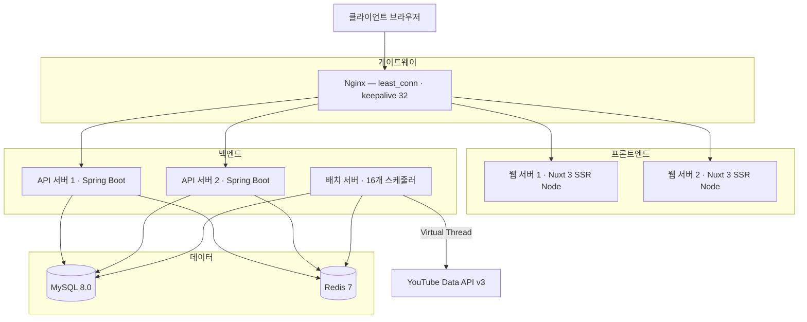
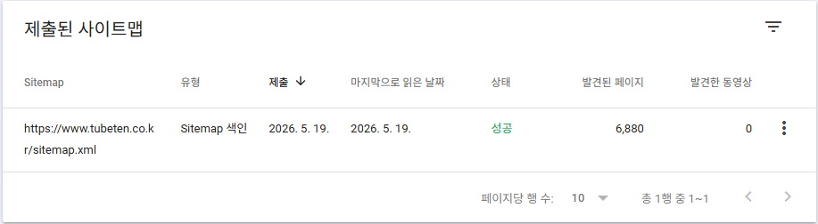

<p align="center">
  
</p>

<h1 align="center">TubeTen</h1>

<p align="center">
  YouTube 실시간 트렌드 분석 플랫폼 — Velocity 알고리즘 기반 급상승 영상 탐지
</p>

<p align="center">
  <strong>Live Demo</strong> &nbsp;·&nbsp; <a href="https://www.tubeten.co.kr">https://www.tubeten.co.kr</a>
  &nbsp;|&nbsp;
  <strong>API Docs</strong> &nbsp;·&nbsp; <a href="https://app.swaggerhub.com/apis-docs/tubeten/tubeten-api/v2.0.0?view=elementsDocs">SwaggerHub Docs</a>
</p>

<p align="center">
  
  
  
  
  
  
</p>

---

## 개요

조회수 절댓값이 아닌 **단위 시간당 증가 속도(Velocity)**로 YouTube 트렌드를 탐지하는 풀스택 웹 서비스입니다.  
3개국(KR·US·JP), 지역당 최대 9개 카테고리를 30분 주기로 수집·분석하며, 캐시 히트 기준 평균 **50ms** 응답을 제공합니다.

<div align="center">

| 개선 항목 | Before | After |
|:---|:---:|:---:|
| 스냅샷 수집 (Virtual Thread + Semaphore) | 9분 24초 | **35초 — 94% 단축** |
| 크리에이터 갱신 (Virtual Thread + Semaphore) | 1,297초 | **~160초 — 88% 단축** |
| 랭킹 집계 (DB 파티셔닝) | 182초 | **2초 — 99% 단축** |
| 랭킹 집계 타임아웃 (SQL CTE 조건 수정) | 91초 반복 실패 | **정상** |
| JS 번들 크기 (Gzip) | 869 KB | **88.4 KB — 90% 감소** |
| Redis 메모리 (Gzip 직렬화) | — | **70% 절감** |
| 배치 성공률 | 50% 미만 | **98.5%** |

</div>

---

## 아키텍처

Docker Compose 8개 컨테이너로 구성된 자체 호스팅(NAS) 환경입니다.



**멀티 모듈 구조** — `Controller → Facade → Domain Service → Repository`  
계층 의존 방향은 **ArchUnit**으로 빌드 시 자동 검증합니다.

```
tubeten-back/
├── tubeten-common/   # 도메인, Facade, 인프라 공통 라이브러리
├── tubeten-api/      # REST API 서버
└── tubeten-batch/    # 배치 스케줄러 (batch_master 기반 16개 작업)
```

---

## 기술 스택

### Backend

| 기술 | 선택 이유 |
|:---|:---|
| **Java 21** | Virtual Thread — I/O 블록 중 플랫폼 스레드 반납, 배치 병렬화 극대화 |
| **Spring Boot 3.5** | 멀티 모듈, Spring Security + Actuator 생태계 |
| **Spring Data JPA + QueryDSL** | 정적 타입 동적 쿼리, N+1 방지를 위한 fetch join / 벌크 쿼리 |
| **Resilience4j** | CircuitBreaker + Retry(지수 백오프) — YouTube API 장애 자동 차단 |
| **MySQL 8.0** | 일별 RANGE 파티셔닝 + DROP PARTITION(O(1)), 윈도우 함수 활용 |
| **Redis 7** | 3단계 캐시 계층 · AOF 영속화 · Gzip 압축 · ETag |

### Frontend

| 기술 | 용도 |
|:---|:---|
| **Nuxt 3** (Vue 3 Composition API) | SSR 프레임워크 — 라우트별 SSR/CSR 전략 분리, SEO 핵심 페이지 서버 렌더링 |
| **Nitro** | Nuxt 3 서버 엔진 — devProxy, 라우트 캐시, SSR 런타임 |
| **Pinia** | 전역 상태 관리 — 랭킹·카테고리 스토어, SSR hydration |
| **ECharts** | 트렌드 차트 · 랭킹 이력 · 채널 벤치마크 (레이더/바/라인) |
| **Font Awesome** | 사이드바·UI 아이콘 시스템 |

### Test

**JUnit 5** · **jqwik** (Property-based, Velocity 불변식) · **ArchUnit** (계층 의존성) · **Testcontainers** (MySQL 통합)

---

## 기술적 도전과 해결

> 운영 로그 분석 → 원인 추적 → 해결의 흐름으로 정리했습니다.

---

### 성능 최적화

---

#### 1. 스냅샷 수집 94% 단축 — Virtual Thread + Semaphore 이중 설계

> **9분 24초 → 35초**

- **문제** — 790개 영상 스냅샷을 `FixedThreadPool(4)`로 처리. 4개씩 순차 실행되어 30분 파이프라인 내 완료 불가
- **원인** — Platform Thread는 YouTube API I/O 대기 중에도 스레드를 점유. YouTube API 레이턴시 × 스레드 4개 = 구조적 병목
- **해결** — `VirtualThreadPerTaskExecutor`로 전환해 16개 배치를 동시 실행. I/O 블록 중 캐리어 스레드를 반납해 실질적 병렬화 달성. DB 저장 단계는 `Semaphore(8)`로 동시 실행 수를 제한해 HikariCP 커넥션 풀 고갈 방지 — YouTube API 호출(I/O, 커넥션 불필요)과 DB 저장(JDBC blocking)을 구간별로 다르게 제어
- **결과** — **9분 24초 → 35초**. 30분 파이프라인에 여유 구간 확보, 배치 실패율 구조적 감소

---

#### 2. 랭킹 집계 타임아웃 → 일별 파티셔닝

> **182초 → 2초, 성공률 50% → 98.5%**

- **문제** — `yt_video_target → yt_video_snapshot → yt_video` 3중 조인 랭킹 쿼리가 타임아웃 반복. 배치 성공률 50% 미만
- **원인** — 모든 데이터가 `pMAX` 파티션에 누적되어 파티션 프루닝이 무효화, 전체 풀스캔 발생
- **해결** — `yt_video_snapshot` · `yt_trend_rank` 두 테이블에 일별 RANGE 파티셔닝 적용. 만료 파티션은 `DROP PARTITION`(O(1) — InnoDB 테이블스페이스 직접 제거, DELETE 스캔 없음)으로 정리
- **결과** — 집계 시간 **182초 → 2초**, 배치 성공률 **98.5%**

---

#### 3. SQL CTE 누적 풀스캔 — 파티셔닝 이후 타임아웃 재발

> **91초 타임아웃 반복 → 정상**

- **문제** — 파티셔닝 이후에도 category 17·20에서 91초 타임아웃이 주기적으로 재발
- **원인** — 랭킹 쿼리의 `target` CTE가 `ref_time` 조건 없이 `yt_video_target` 전 기간을 풀스캔. 30분 배치 × 30일 누적 = 수십만 행이 `yt_video_snapshot`과 JOIN됨. 파티셔닝 대상이 아닌 테이블이라 파티션 프루닝도 적용되지 않음
- **해결** — CTE에 `AND ref_time >= ?` (T-8h) 추가. 기존 인덱스 `idx_ref(region_code, category_id, ref_time)`를 그대로 재활용해 range scan으로 전환
- **결과** — 타임아웃 해소. `yt_video_target`이 이후에도 계속 누적되지만 쿼리 범위가 8시간으로 고정

```sql
-- Before: ref_time 조건 없음 → 전 기간 수십만 행 DISTINCT
SELECT DISTINCT video_id FROM yt_video_target
WHERE region_code = ? AND category_id = ?

-- After: 비교 윈도우(T-8h) 범위로 제한
SELECT DISTINCT video_id FROM yt_video_target
WHERE region_code = ? AND category_id = ?
  AND ref_time >= ?   -- prevWindowStart
```

---

#### 4. 크리에이터 갱신 배치 병렬화 — Virtual Thread + Semaphore

> **1,297초(21분) → ~160초**

- **문제** — 537명 크리에이터를 순차 갱신하면 YouTube API 레이턴시(~2.4초/명)가 누적, 21분 소요
- **원인** — 단순 for 루프 + `Thread.sleep(100ms)` rate limiting. Platform Thread 기반이라 I/O 대기 중 스레드 점유
- **해결** — `VirtualThreadPerTaskExecutor` + `Semaphore(8)` 설계. HikariCP 풀(20) 내 안전 범위를 사전에 산정 — `스냅샷 DB저장(8) + 랭킹 집계(3) + 크리에이터 갱신(8) = 19 < 20`. Spring Boot 3.5 + HikariCP 5.1+는 내부적으로 `synchronized` → `ReentrantLock` 전환이 완료되어 Virtual Thread pinning 없음을 확인 후 적용
- **결과** — **1,297초 → ~160초** (8배 단축). 크리에이터 수가 1,000명으로 늘어도 Semaphore 값 조정만으로 대응 가능

```java
// try-with-resources close() = shutdown() + awaitTermination (JDK 21)
try (ExecutorService executor = Executors.newVirtualThreadPerTaskExecutor()) {
    for (Creator creator : activeCreators) {
        executor.submit(() -> updateSingleCreator(creator, successCount, failCount));
    }
}

private void updateSingleCreator(...) {
    creatorUpdateSemaphore.acquire();       // 동시 호출 8개 제한
    try {
        creatorService.refreshCreatorInfo(creator.getId());
        Thread.sleep(RATE_LIMIT_MS);        // 반납 전 대기로 burst 방지
    } finally {
        creatorUpdateSemaphore.release();
    }
}
```

---

### 안정성 · 동시성

---

#### 5. @Transactional이 감싼 YouTube API 호출 → DB 커넥션 누수

- **문제** — HikariCP 커넥션 풀 경보 반복, 드물게 커넥션 대기 타임아웃 발생
- **원인** — `collectTargets()`에 `@Transactional`이 선언된 상태에서 YouTube API 호출(최대 23분) 동안 커넥션을 보유. YouTube API 레이턴시가 HikariCP 커넥션 점유 시간과 직결되는 구조
- **해결** — 외부 메서드의 `@Transactional` 제거, 트랜잭션 경계를 DB 저장 메서드 단위로 축소
- **결과** — 커넥션 보유 시간: API 레이턴시(최대 23분) → INSERT 실행 시간(수 ms). 커넥션 풀 경보 완전 해소

---

#### 6. UnexpectedRollbackException — 루프 내 예외와 외부 트랜잭션 충돌

- **문제** — `updateAllActiveCreators()` 루프 종료마다 `UnexpectedRollbackException` 발생, 배치 전체 실패
- **원인** — 외부 `@Transactional` 범위 안에서 채널별 예외를 `catch`해도 Spring은 트랜잭션을 rollback-only로 마킹. `catch`로 예외를 삼켜도 루프 종료 시점에 commit이 불가능해 예외 발생
- **해결** — 외부 `@Transactional` 제거. 채널별 저장 메서드가 각자 독립 트랜잭션을 소유하도록 변경
- **결과** — 채널별 실패가 전체 배치에 전파되지 않음. 1개 채널 API 오류가 나머지 536개 처리를 중단시키지 않아 배치 성공률 안정화

---

#### 7. InnoDB 갭 락 누적 → 데드락 — 트랜잭션 전파 속성 변경

- **문제** — 멀티 스레드 환경에서 `yt_video_keyword` INSERT 시 데드락 반복 발생
- **원인** — `REQUIRES_NEW` 트랜잭션 안에서 수십 개의 `INSERT IGNORE`를 연속 실행하면 InnoDB 갭 락이 트랜잭션 종료까지 누적. 여러 스레드가 동일 인덱스 범위에 접근할 때 교착 상태 발생
- **해결** — `Propagation.NOT_SUPPORTED`로 변경해 각 INSERT가 즉시 auto-commit되도록 처리. 갭 락이 INSERT 완료 시점에 즉시 해제
- **결과** — 데드락 완전 해소. 트랜잭션 범위를 INSERT 단위로 최소화해 잠금 보유 시간 단축

---

#### 8. Resilience4j 형식적 도입 → 운영 데이터 기반 임계값 튜닝

- **문제** — `build.gradle`에 의존성만 존재하고 `application.yml` 설정이 없어 실제 동작은 수동 retry 루프(3회)뿐
- **1차 해결** — `Resilience4jConfig.java` 신규 작성. CB(COUNT_BASED 20건, 실패율 50% → OPEN) + Retry(지수 백오프 1s→4s) 구성. 5xx·429는 재시도, `ChannelNotFoundException`·할당량 초과는 즉시 포기하도록 예외별 분기
- **운영 후 문제** — 배포 후 로그에서 정상 API 호출(~10분 소요)이 슬로우콜 기준(10초)을 초과해 CB가 OPEN 상태로 전환. 이후 실제로 성공해야 할 API 호출이 모두 reject되어 배치 전체가 서킷브레이커에 의해 차단되는 현상 발생
- **2차 튜닝** — `slowCallDurationThreshold 10s → 300s`, `waitDurationInOpenState 60s → 120s`로 조정. YouTube API 응답 특성(~10분)에 맞는 임계값으로 정규화
- **결과** — 불필요한 CB OPEN 해소. 실제 장애와 정상 슬로우콜을 구분해 배치 안정성 확보

---

### 데이터 · 캐시

---

#### 9. Redis KEYS 안티패턴 → 인덱스 셋 패턴으로 O(N) 블로킹 해소

- **문제** — 배치 로그에서 `RedisCommandTimeoutException`(3초 timeout 2회 연쇄) 발견. elapsed=32.7초 경고 동반
- **원인** — `InsightCacheRefreshScheduler`가 531명 크리에이터 각각에 대해 `KEYS creator:insight:{id}:*`를 호출. Redis는 싱글스레드이므로 O(N) 전체 키스페이스 스캔 동안 다른 모든 클라이언트 요청이 차단됨. 531회 × 전체 스캔 = 누적 블로킹. 키가 늘수록 선형 악화
- **해결** — `cache()` 시점에 데이터 키를 크리에이터별 인덱스 SET(`creator:insight:_idx:{id}`)에 SADD. `invalidate()`는 SMEMBERS로 해당 크리에이터의 키 목록만 조회 후 일괄 DEL. 인덱스 셋에 `data TTL + 1h grace` TTL 부여해 zombie set 무한 누적 방지
- **결과** — Redis 블로킹 구조적 제거. invalidate 1회 비용: O(N) 전체 스캔 → O(K), K≈1~2

| 동작 | Before | After |
|:---|:---|:---|
| `invalidate(creator)` | `KEYS {id}:*` — O(N) 블로킹 | `SMEMBERS _idx:{id}` — O(K), K≈1~2 |
| Redis 블로킹 | 스캔 시간 내내 차단 | 없음 |

---

#### 10. 운영 중 발견한 데이터 파이프라인 오류 추적

운영 중인 영상·채널 분석 화면을 직접 데이터와 대조하며 검토하다 발견한 오류들입니다.

**영상 분석 지표 불일치**

- `viewCount` 자리에 `viewDelta`를 사용해 200만 조회수 영상이 "3,200"으로 표시 → 필드 교체
- 성장률 분모를 요청 기간(168h)으로 고정 — 실제 스냅샷이 2일치만 있어도 168h로 나눠 3.5배 과소 산출 → 실제 스냅샷 간 경과 시간을 분모로 교체
- 7일 랭킹 차트에 4일치 공백 — `yt_trend_rank`(3일 보관) 단독 쿼리로는 4~7일 구간이 빔 → `yt_trend_rank_daily`(7일 집계)와 하이브리드 쿼리로 구간 보완

**채널 대시보드 성장률 null / 0.0**

- `TopGrowthProjection` 인터페이스에 `getViewGrowthRate()` 미선언 → JPA가 프로젝션 결과를 매핑하지 못해 null 반환
- `GrowthRateCalculator`가 스냅샷 간 조회수 차이가 아닌 최신 스냅샷 절대값을 분모로 사용하는 계산 오류
- `TopGrowthRanker`의 `GrowthRateResult → TopGrowthChannel` 변환 시 `viewGrowthRate` 필드 누락

세 레이어(Projection → Calculator → Ranker)가 각각 독립적인 오류를 갖고 있어 개별 레이어 단위 테스트가 없었다면 발견이 어려웠을 케이스. 이후 Projection 인터페이스 계약 검증, 계산 로직 단위 테스트를 추가했습니다.

---

### 프론트엔드 버그 추적

---

#### 11. SPA 재진입 시 영상 목록 사라짐 — `<style scoped>` @import 전역 누수

- **증상** — `/youtube-top10` → 다른 페이지 → 복귀 시 영상 제목·채널이 사라짐. F5로만 복구 가능
- **초기 오진** — Vue `<Transition>` enter/leave 클래스가 stuck 상태가 된 것으로 진단했으나, `visibilityState === "hidden"` 상태에서 rAF 미발화·컴포지터 throttling에 의한 측정 아티팩트임을 확인. `computed display` 레이아웃 측정으로 실제 원인을 재접근
- **원인** — Vue `<style scoped>` 안의 `@import`는 scope가 적용되지 않아 전역으로 동작(Vue 명세상 알려진 제약). `TopMovers.css`의 `.rank-info { display: none }`이 전역 적용됨. 첫 로드 시 TopMovers CSS가 로드되지 않아 정상 동작. SPA 재진입(대시보드 경유)으로 CSS가 cascade 후순위에 진입하면 같은 특이도의 `display: flex`를 `display: none`이 override
- **수정** — 컨테이너 한정 selector로 특이도를 상향해 cascade 순서에 무관하게 youtube-top10에 매칭되지 않도록 처리
- **결과** — 재진입 시 영상 목록 정상 표시. 이후 `<style scoped>` @import 사용 금지 및 공통 클래스명 prefix 규칙(`tm-`, `yt-`) 도입

```css
/* Before — TopMovers.css의 규칙이 전역 누수 */
.rank-info { display: none; }

/* After — 컨테이너 한정, 특이도 상향 */
.top-movers-container .rank-info { display: none; }
```

**채널 검색 드롭다운 클리핑 — CSS overflow 전파 규칙**

- CSS 명세상 `overflow-y: auto` 설정 시 `overflow-x`도 `auto`로 강제 전환 → 사이드바 전체가 양방향 클리핑 컨텍스트 형성 → `position: absolute` 드롭다운 클리핑. 사이드바 `overflow: visible`로 변경하고 채널 목록 박스에만 독립적인 `overflow-y: auto` 적용

**프론트엔드 Race Condition**

- `videoExplore.setRegion()`에서 `Promise.all([loadCategories(), search()])` 동시 실행 → 카테고리 로드 전에 검색이 완료돼 이전 지역 카테고리로 결과가 채워지는 문제. `await loadCategories()` 완료 후 `await search()` 순차 실행으로 수정
- useDashboard 카운트다운의 중복 fetch 방지 로직을 문자열 비교(`!== '갱신 중...'`)로 처리 → fetch 지연 시 interval 재진입으로 무력화. `isFetchingFromCountdown` boolean flag + `finally` 해제로 교체

---

### 인프라

---

#### 12. Vue SPA Google 색인 실패 → Nuxt 3 SSR 마이그레이션으로 근본 해결

> **빌드 타임 프리렌더링 한계 → 서버사이드 렌더링(SSR)으로 전환**

**SPA 시절 문제:** `site:tubeten.co.kr` 색인 1건, 검색 유입 전무. Vue SPA가 빈 HTML을 응답해 Google 봇이 thin content로 판정.

| 원인 | SPA 당시 수정 | Nuxt 3 SSR 후 |
|:---|:---|:---|
| 빈 HTML 응답 | `@prerenderer/webpack-plugin` 빌드 타임 렌더링 | `useAsyncData` + SSR으로 완성된 HTML 서버 응답 |
| robots.txt JS 차단 | Disallow 규칙 제거 | 해당 없음 |
| localStorage 리디렉션 | Nginx 301로 대체 | Nuxt `navigateTo` 서버 리디렉션 |
| Soft 404 | sitemap 정리 | SSR에서 없는 리소스 → `navigateTo('/creators', 301)` |

**Nuxt 3 SSR 구현:**
- 라우트별 렌더링 전략 분리: SEO 노출 대상(`/trends/**`, `/creators/**`, `/dashboard`, `/channel-dashboard`, `/shorts-analytics`, `/video-explorer`, `/weekly-ranking`, `/about`) → SSR | `/youtube-top10` → SSR + 60초 엣지 캐시 | `/video/**`·`/admin/**` → CSR + noindex
- `useAsyncData`로 서버에서 데이터 패칭 → 완성된 HTML + JSON-LD를 Googlebot에 응답
- 백엔드 `SitemapService`: DB 기반 동적 사이트맵 자동 생성. DB 오류 시 유효한 XML fallback 반환
- `lastmod`: 데이터 기반 페이지는 실제 DB 수정일 기준. 매일 today로 고정 시 Google이 신뢰하지 않아 크롤 주기 최적화 제외됨
- 영상 상세 API 404 시 `/youtube-top10`으로 리디렉션 — 만료 URL 방문자 회수
- JSON-LD (WebSite·VideoObject·Person 스키마), 라우트별 canonical 태그 동적 적용

<div align="center">



> 초기 개선 당시 Google Search Console 기준 sitemap **6,880개 URL 등록 성공** (2026-05-19). 이후 운영 데이터 보존 정책에 맞춰 개별 영상 대량 색인보다 허브·크리에이터 중심 색인으로 조정

</div>

---

#### 13. API 문서 자동화 — GitHub Actions → SwaggerHub 자동 동기화

- **Before** — 구현 변경 시 SwaggerHub에 수동 복붙, 누락 빈번
- **After** — `swagger.yaml` 수정 → git push → GitHub Actions → SwaggerHub API POST
- `swagger.yaml`을 Single Source of Truth로 관리. `info.version` 기준으로 SwaggerHub 문서 버전을 자동 발행하고, 공개 문서 링크는 API 소비자용 `apis-docs` 뷰로 연결

---

### 알고리즘

---

#### 14. 순위 급변 완화 — Velocity 파라미터 운영 데이터 기반 튜닝

**현상:** 신규 영상이 등록 직후 1위 → 수 사이클 만에 200위권으로 급락 반복

| 파라미터 | Before | After |
|:---|:---:|:---:|
| `VELOCITY_WINDOW_HOURS` | 2h | **4h** |
| 상대 성장률 계수 | 500,000 | **300,000** |
| `NEW_VIDEO_BONUS_SCORE` | 8,000 | **3,000** |

- **윈도우 2h → 4h** — 비교 윈도우가 2h이면 바이럴 스파이크가 경계를 넘어가는 순간 delta ≈ 0으로 수직 폭락. 4h로 확장하면 스파이크가 윈도우에 4시간 머물러 점수가 완만하게 감소
- **계수 500,000 → 300,000** — 구독자 소규모 채널의 상대 성장률이 과도하게 증폭되어 점수 폭발. 계수를 낮춰 절대 delta 비중을 높임
- **보너스 8,000 → 3,000** — 실제 점수 범위(~50K) 대비 보너스가 최대 160%로 과도, 신규 영상이 데이터 없이도 자동으로 1위에 진입하는 문제 방지

```
TrendScore = view_delta
           + (view_delta × 300,000 / max(view_count, 100,000))
           + like_delta × 15
           + comment_delta × 8
           + (신규 진입 보너스: 3,000)
```

---

<p align="center">
  <strong>프로젝트 기간</strong>: 2026-01 ~ 현재 &nbsp;|&nbsp;
  <strong>버전</strong>: v2.3.0 &nbsp;|&nbsp;
  <strong>업데이트</strong>: 2026-07-08
</p>
