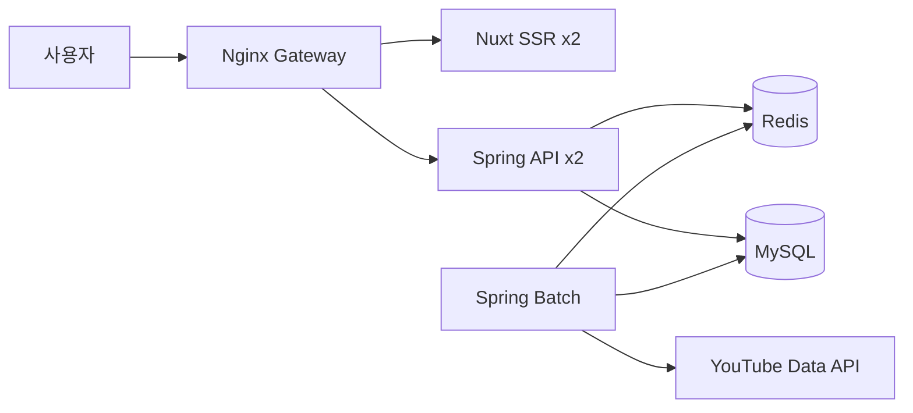

<p align="center">
  
</p>

<h1 align="center">TubeTen</h1>

<p align="center">
  YouTube 공개 데이터의 변화량을 수집·분석해 성장 중인 영상과 채널을 보여주는 트렌드 서비스
</p>

<p align="center">
  <a href="https://www.tubeten.co.kr"><strong>Live Service</strong></a>
  &nbsp;·&nbsp;
  <a href="https://www.tubeten.co.kr/api/swagger-ui.html"><strong>Public API</strong></a>
  &nbsp;·&nbsp;
  <a href="https://www.tubeten.co.kr/api/docs"><strong>OpenAPI JSON</strong></a>
</p>

---

## 프로젝트 요약

TubeTen은 단순 누적 조회수가 아니라 최근 조회수·좋아요·댓글의 **변화 속도**를 기준으로 콘텐츠 성장 흐름을 분석합니다. 한국·미국·일본 데이터를 주기적으로 수집해 랭킹, 영상 분석, 크리에이터 성장 지표와 주간 리포트를 제공합니다.

| 항목 | 내용 |
|---|---|
| 기간·인원 | 2026.01 ~ 현재 · 개인 프로젝트 |
| 담당 범위 | 백엔드 중심 설계·개발·운영, Nuxt SSR 및 Docker 배포 |
| 핵심 과제 | 외부 API 병렬 수집, DB 부하 제어, 시계열 조회 최적화, 배치 신뢰성 |
| 운영 환경 | Java 21, Spring Boot 3.5, Nuxt 3, MySQL 8, Redis 7, Nginx, Docker Compose |

> 실제 운영 데이터와 장애를 기반으로 병목을 찾고, 변경 범위와 검증 기준을 정한 뒤 점진적으로 개선한 프로젝트입니다.

## 주요 기능

- 국가·카테고리별 실시간 인기 영상 랭킹
- 영상 조회수·반응·순위 변화 분석
- Shorts 및 크리에이터 성장 분석
- 채널 비교와 주간 트렌드 리포트
- 공개 API와 OpenAPI 3.1 문서

## 시스템 구성


```mermaid
flowchart LR
    User[사용자] --> Gateway[Nginx Gateway]
    Gateway --> Nuxt[Nuxt SSR x2]
    Gateway --> API[Spring API x2]
    API --> Redis[(Redis)]
    API --> MySQL[(MySQL)]
    Batch[Spring Batch] --> YouTube[YouTube Data API]
    Batch --> MySQL
    Batch --> Redis
```

```text
tubeten-common  도메인·저장소·공통 서비스
tubeten-api     공개/관리자 API·인증·OpenAPI
tubeten-batch   데이터 수집·랭킹 집계·보관 기간 정리
```

API와 Batch를 별도 프로세스로 분리해 사용자 조회와 무거운 수집·집계 작업이 같은 스레드와 메모리를 경쟁하지 않도록 했습니다.

## 대표 개선 경험

### 1. 외부 API 수집 시간을 9분대에서 35초 수준으로 단축

- **문제:** YouTube API를 순차 호출해 약 790개 영상 수집에 9분 24초 소요
- **판단:** 네트워크 대기는 Virtual Thread로 병렬화하되 외부 API와 DB 저장 동시성은 별도 제한
- **결과:** 동일 규모 기준 약 35초 수준으로 단축하고 batch UPSERT로 DB 왕복 감소

가상 스레드 수를 처리량으로 간주하지 않고, 외부 API 한도와 DB 커넥션 수를 실제 병목으로 관리했습니다.

### 2. 외부 I/O와 DB 트랜잭션 경계 분리

- **문제:** 외부 API 응답을 기다리는 동안 DB 커넥션까지 장시간 점유
- **판단:** 작업 조율과 네트워크 호출에서는 트랜잭션을 제거하고 저장 구간만 짧게 분리
- **결과:** 외부 API 지연이 DB 풀 고갈로 전파될 가능성을 낮추고 저장 단위를 명확하게 관리

### 3. 데이터 증가에 대응하는 조회·보관 구조 적용

- 최근 시간 범위를 SQL 조건에 명시하고 실행 계획 기반 복합 인덱스 적용
- 시계열 테이블을 날짜 단위로 파티셔닝하고 만료 데이터는 파티션 단위 정리
- 대시보드와 Shorts 집계는 사전 생성 후 Redis/JSON으로 제공
- 약 44만 행 환경에서 Shorts 시계열·히트맵 조회가 각각 약 51ms·47ms로 관측

측정값은 당시 운영 데이터와 캐시 조건 기준이며, 인덱스를 무조건 추가하지 않고 쓰기 비용과 중복 여부도 함께 검토했습니다.

### 4. 배치 실행 상태와 중복 실행을 운영 데이터로 관리

- 시작·완료·실패 상태, 처리 건수와 실행 시간을 DB에 기록
- 작업 소유자와 lease 만료 시각을 저장해 다중 인스턴스 중복 실행 방지
- timeout과 재시작 이후에도 로그와 DB 이력을 함께 대조할 수 있도록 구성
- raw 데이터 보관 기간과 정리 순서를 코드·Flyway·운영 문서에서 일관되게 관리

### 5. 새 랭킹 알고리즘을 shadow 방식으로 평가

공개 랭킹은 안정된 `velocity-v1`을 유지하고, 후보 알고리즘은 별도 버전으로 feature·24시간 미래 성장 label·Recall@10·NDCG@10·Rank Churn을 저장합니다. 최소 14일 paired 평가와 범위별 품질 기준을 통과하기 전에는 운영 랭킹을 교체하지 않습니다.

V2.3은 shadow 모니터링 대상이며, 검증이 끝나기 전 성과 수치로 사용하지 않습니다.

## Public API 설계

[Swagger UI](https://www.tubeten.co.kr/api/swagger-ui.html)는 운영 서비스와 같은 도메인에서 공개 조회·분석 API만 제공합니다.

| 공개 | 제외 |
|---|---|
| 랭킹, 대시보드 조회, 영상 분석·탐색 | 관리자 인증·계정·배치 실행 API |
| Shorts, 크리에이터, 채널 비교 | 강제 갱신, 이벤트 수집 API |
| 트렌드 리포트, 카테고리 | 이미지 프록시, sitemap 내부 API |

차단 목록만 관리하면 새 관리자 API가 실수로 노출될 수 있어 `springdoc.paths-to-match` **allowlist**를 사용합니다. Gateway는 Swagger UI 자산과 `/api/docs`만 백엔드로 전달하고, 문서 응답에는 `noindex`와 보안 헤더를 적용합니다.

정적 [swagger.yaml](./swagger.yaml)은 동적 공개 명세와 같은 범위를 유지하며 Redocly CLI와 GitHub Actions로 검증합니다.

## 운영과 배포

| 상황 | 대응 |
|---|---|
| YouTube API 일시 오류 | Retry·Circuit Breaker, 항목 단위 부분 성공 기록 |
| Redis 장애 | 캐시 오류 격리 후 DB 조회 fallback |
| API/Nuxt 배포 | 2개 컨테이너 순차 교체와 health gate |
| Gateway 변경 | 새 설정 사전 검증 후 컨테이너 재생성, 내부·공개 gzip 확인 |
| Batch 배포 | Flyway 적용 주체를 Batch로 단일화하고 API는 schema validation만 수행 |

운영 설정을 먼저 키우기보다 API 응답 시간, DB 조회 범위, 커넥션 사용량과 배치 단계별 실행 시간을 확인한 뒤 조정합니다.

## 검증

| 영역 | 최근 확인 결과 |
|---|---|
| Backend | 공통/API JUnit 130건 통과, 실패 0 |
| Public OpenAPI | 공개 allowlist 및 관리자·운영 경로 제외 회귀 테스트 통과 |
| API Contract | OpenAPI 3.1, Redocly CLI 검증 통과 |
| Frontend | Nuxt 검사·production build·성능 예산 통과 |
| UI regression | Playwright 279건 중 190 통과, viewport 조건 89건 제외, 실패 0 |
| Deployment | Compose 설정, shell 문법, 컨테이너 health와 공개 gzip 확인 |

자동 테스트 결과와 운영 성능은 같은 의미로 보지 않습니다. 배포 전후에는 Flyway 이력, 실제 인덱스·파티션, 컨테이너 health와 운영 로그를 별도로 확인합니다.

## 기술 스택

| 분류 | 기술 |
|---|---|
| Backend | Java 21, Spring Boot 3.5, JPA, QueryDSL, JdbcTemplate |
| Data & Batch | MySQL 8, Redis 7, Flyway, Virtual Thread |
| Resilience | Resilience4j Retry, Circuit Breaker |
| Frontend | Nuxt 3, Vue 3, Pinia, ECharts |
| Infra | Docker Compose, Nginx |
| Quality | JUnit 5, Playwright, OpenAPI 3.1, Redocly CLI, GitHub Actions |

## 이 프로젝트에서 보여주고 싶은 역량

- 기능 구현보다 먼저 데이터 흐름과 실제 병목을 확인하는 문제 해결 방식
- 외부 API 동시성, DB 트랜잭션과 커넥션을 분리해서 보는 백엔드 설계
- 스키마 변경, 보관 기간, 배치 재시작과 rollback까지 포함하는 운영 관점
- 새 알고리즘을 즉시 교체하지 않고 지표와 shadow 데이터로 판단하는 변경 관리
- 백엔드·프론트·Gateway·배포 검증을 하나의 서비스 흐름으로 연결하는 End-to-End 책임감

---

<p align="center">
  <strong>Backend-focused End-to-End Project</strong>
  &nbsp;·&nbsp;
  <strong>Updated</strong>: 2026-08-24
</p>
