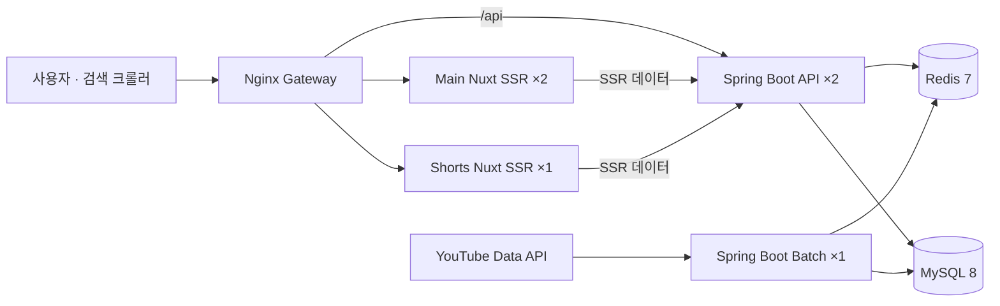
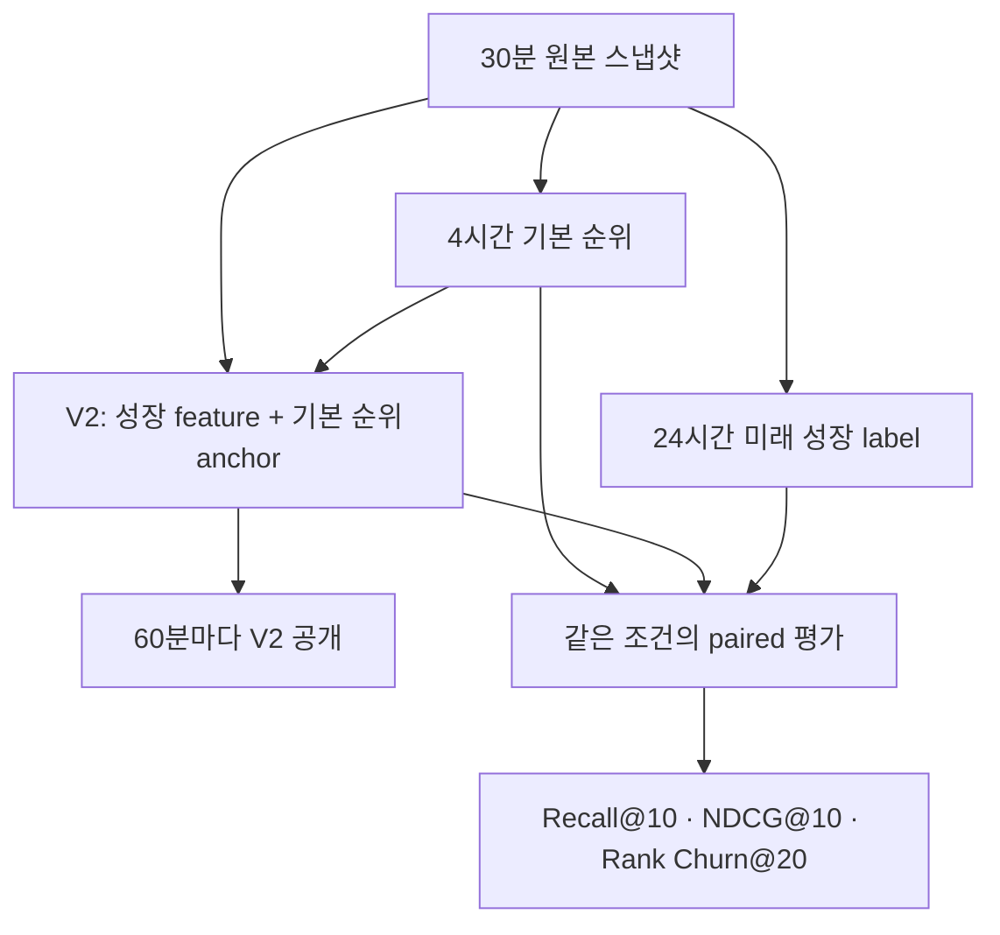
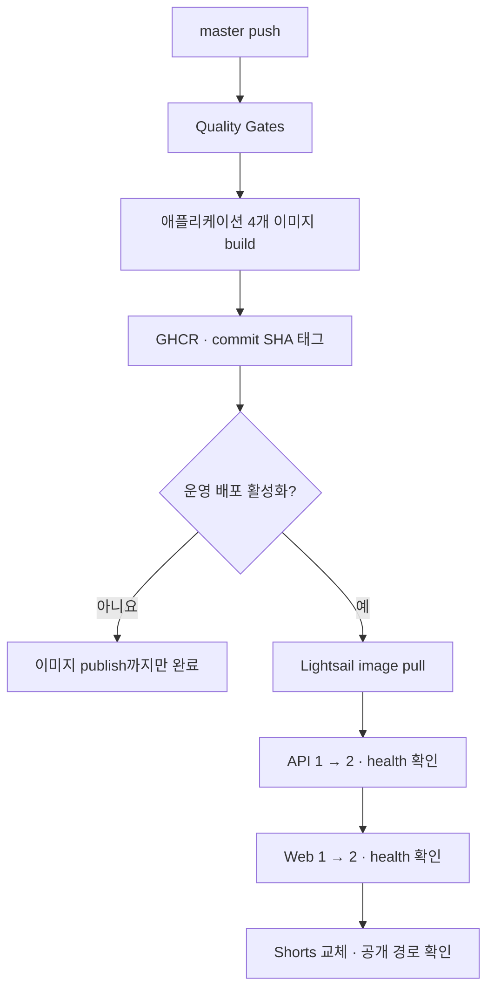

<p align="center">
  
</p>

<h1 align="center">TubeTen</h1>

<p align="center">
  YouTube 공개 데이터의 변화량을 수집·분석해<br/>
  지금 성장하는 영상과 채널을 보여주는 트렌드 분석 서비스
</p>

<p align="center">
  <a href="https://www.tubeten.co.kr"><strong>Live Service</strong></a>
  &nbsp;·&nbsp;
  <a href="https://www.tubeten.co.kr/api/swagger-ui.html"><strong>Public API</strong></a>
  &nbsp;·&nbsp;
  <a href="https://www.tubeten.co.kr/api/docs"><strong>OpenAPI JSON</strong></a>
</p>

---

## 프로젝트 개요

TubeTen은 누적 조회수가 큰 콘텐츠보다 **최근 조회수·좋아요·댓글이 빠르게 증가하는 콘텐츠**를 찾습니다. 한국·미국·일본의 공개 데이터를 주기적으로 수집하고, 성장 속도와 지속성·신뢰도를 함께 계산해 영상·Shorts·크리에이터 랭킹과 분석 지표를 제공합니다.

이 프로젝트에서는 기능 구현에 그치지 않고 데이터 수집, 알고리즘 검증, 장애 격리, 배포와 운영까지 하나의 서비스 흐름으로 설계했습니다. 변경할 때는 먼저 운영 로그와 실행 계획을 확인하고, 작은 단위로 적용한 뒤 자동 테스트와 실제 운영 지표를 분리해 검증합니다.

| 항목 | 내용 |
|---|---|
| 기간·형태 | 2026.01 ~ 현재 · 개인 프로젝트 |
| 담당 범위 | 기획, 백엔드, 데이터 모델링, Batch, Nuxt SSR, 인프라와 운영 |
| 핵심 과제 | 외부 API 병렬 수집, 시계열 데이터 관리, 랭킹 품질 검증, 무중단에 가까운 순차 배포 |
| 운영 환경 | AWS Lightsail Ubuntu 24.04 · 8GB RAM · 2 vCPU · Docker Compose |
| 서비스 구성 | Main Web 2개, API 2개, Shorts 1개, Batch 1개, MySQL 1개, Redis 1개 |

## 시스템 구성


```mermaid
flowchart LR
    User["사용자 · 검색 크롤러"] --> Gateway["Nginx Gateway"]
    Gateway --> Main["Main Nuxt SSR ×2"]
    Gateway --> Shorts["Shorts Nuxt SSR ×1"]
    Gateway -- "/api" --> API["Spring Boot API ×2"]
    Main -- "SSR 데이터" --> API
    Shorts -- "SSR 데이터" --> API
    API --> Redis[(Redis 7)]
    API --> MySQL[(MySQL 8)]
    YouTube["YouTube Data API"] --> Batch["Spring Boot Batch ×1"]
    Batch --> MySQL
    Batch --> Redis
```

```text
tubeten-common  도메인·저장소·공통 서비스
tubeten-api     공개/관리자 API·인증·OpenAPI
tubeten-batch   데이터 수집·랭킹 집계·보관주기 관리
tubeten-nuxt    Main Nuxt SSR
tubeten-shorts  Shorts 전용 Nuxt SSR
```

### 주요 설계 판단

- 사용자 요청을 처리하는 API와 무거운 수집·집계 Batch를 별도 프로세스로 분리했습니다.
- Main Web과 API는 각각 2개를 유지하고 Nginx upstream으로 분산합니다.
- Shorts는 메인과 별도 앱으로 운영하되, 현재 트래픽에는 1개 인스턴스면 충분하다고 판단했습니다.
- Batch는 반드시 1개만 실행하며 DB claim은 오배포로 잠시 실행이 겹치는 상황을 방어하는 보조 안전장치로 사용합니다.
- MySQL과 Redis는 Docker 내부 network에만 두고, 외부 서비스 포트는 Gateway의 80/443만 공개합니다. 관리자 SSH 22는 별도로 관리합니다.
- 운영 서버에서는 소스를 빌드하지 않고 검증된 GHCR 이미지만 pull합니다.

## 대표 문제 해결

### 1. 외부 API 수집 시간을 9분대에서 약 35초로 단축

**문제**

YouTube API를 제한된 고정 스레드로 호출하면서 약 790개 영상의 스냅샷 수집에 9분 24초가 걸렸습니다. 네트워크 응답 대기와 DB 저장이 전체 실행 시간을 함께 늘리고 있었습니다.

**판단과 구현**

- 네트워크 I/O는 Java 21 Virtual Thread로 병렬화했습니다.
- 외부 API 호출과 DB 저장의 동시성 한도를 분리했습니다.
- 저장은 개별 재시도 대신 MySQL batch UPSERT로 변경했습니다.
- 작업 조율 구간의 트랜잭션을 제거하고 실제 저장 구간만 짧게 묶었습니다.

**결과**

당시 동일 규모 수집에서 다음 결과를 관측했습니다. 과거 측정값이며 현재 실행 시간이나 SLA를 뜻하지 않습니다.

| 수집 대상 | 변경 전 | 변경 후 |
|---|---:|---:|
| 영상 약 790개 | 9분 24초 | 약 35초 |

Virtual Thread 수 자체를 처리량으로 보지 않고 YouTube quota, DB connection pool과 저장 속도를 실제 제한 조건으로 관리했습니다.

### 2. 증가하는 시계열 데이터의 조회 비용과 보관 비용 관리

**문제**

30분 단위 스냅샷이 계속 쌓이면서 최근 데이터 조회와 만료 데이터 삭제가 같은 테이블의 성능과 잠금에 영향을 줄 수 있었습니다.

**판단과 구현**

- 최근 시간 범위를 모든 주요 조회 조건에 명시했습니다.
- `EXPLAIN` 결과를 기준으로 복합 인덱스를 구성하고 중복 인덱스는 만들지 않았습니다.
- 대용량 시계열 테이블은 날짜 단위로 파티셔닝했습니다.
- 만료 데이터는 대량 `DELETE`보다 파티션 단위로 제거하고, 비파티션 환경에만 제한된 fallback을 남겼습니다.
- 대시보드와 Shorts 집계는 미리 계산해 Redis/JSON으로 제공합니다.

**결과**

약 44만 행을 기준으로 Shorts 시계열 조회 약 51ms, 히트맵 조회 약 47ms를 관측했습니다. 측정값은 당시 운영 데이터와 캐시 조건의 결과로 관리하며, 데이터 증가 후에도 같은 수치를 보장한다고 과장하지 않습니다.

### 3. Batch 실행을 재현 가능한 운영 데이터로 관리

**문제**

Scheduler 로그만으로는 어떤 기준 시각의 작업이 시작·완료됐는지, 재시작 후 같은 작업이 다시 실행됐는지 판단하기 어려웠습니다.

**판단과 구현**

- 작업명, 기준 시각, 시작·종료 시각, 처리 건수와 실패 원인을 DB 이력으로 남겼습니다.
- `job_name`을 claim의 유일 키로 두고 owner·ref time·lease를 기록해 같은 작업의 중복 진입을 차단했습니다.
- `SUCCESS`, `PARTIAL_SUCCESS`, `FAILED`를 구분해 일부 외부 API 실패를 전체 성공으로 숨기지 않았습니다.
- Compose profile과 고정 서비스 정의로 운영 Batch 컨테이너를 하나만 유지했습니다.

**운영 원칙**

claim을 다중 Scheduler 운영 근거로 사용하지 않습니다. 정상 구조는 Batch 1개이며, 강제 재배포 전에는 유효 claim과 최근 실행 이력을 먼저 확인합니다.

### 4. Shadow 평가를 거쳐 랭킹 V2 전환

**문제**

새 점수 공식이 직관적으로 좋아 보여도 실제 미래 성장 영상을 더 잘 찾는지, 기존 랭킹을 지나치게 흔들지는 별도 검증이 필요했습니다.

**판단과 구현**

- 후보 알고리즘의 feature와 24시간 미래 성장 label을 별도 버전으로 저장했습니다.
- 기존 V1과 후보 V2를 같은 날짜·국가·카테고리 조건으로 paired 평가했습니다.
- Recall@10, NDCG@10과 Rank Churn을 함께 확인했습니다.
- 공개 전환 후에도 기본 순위는 V2의 60% anchor와 품질 비교 기준으로 유지했습니다.


```mermaid
flowchart TB
    Snapshot["30분 원본 스냅샷"] --> Base["4시간 기본 순위"]
    Snapshot --> V2["V2: 성장 feature + 기본 순위 anchor"]
    Base --> V2
    V2 --> Public["60분마다 V2 공개"]
    Snapshot --> Label["24시간 미래 성장 label"]
    Base --> Evaluation["같은 조건의 paired 평가"]
    V2 --> Evaluation
    Label --> Evaluation
    Evaluation --> Metrics["Recall@10 · NDCG@10 · Rank Churn@20"]
```

**결과**

현재 공개 랭킹은 `velocity-v2`만 사용합니다. V2 데이터가 불완전하거나 조회에 실패하면 이전 순위를 조용히 대신 보여주지 않고 503을 반환합니다. 알고리즘의 공개 이름과 세부 계산 revision을 분리해 재튜닝 이력과 운영 응답의 호환성을 함께 관리합니다. 점수와 평가 기준은 [랭킹 알고리즘 문서](./docs/06_랭킹_알고리즘.md)에 정리했습니다.

### 5. NAS 운영 환경을 AWS Lightsail과 이미지 배포 구조로 전환

**문제**

기존 Synology NAS에서는 Reverse Proxy와 NAS 경로에 운영 설정이 결합돼 있었고, 서버에서 직접 빌드하는 방식은 재현성과 배포 시간을 관리하기 어려웠습니다.

**판단과 구현**

- MySQL dump를 사전 복원해 절차를 검증한 뒤 최종 dump와 checksum으로 데이터를 이전했습니다.
- DNS와 TLS를 Lightsail 고정 IP와 Nginx Gateway 기준으로 전환했습니다.
- MySQL·Redis host port를 제거하고 애플리케이션 network 내부에서만 접근하게 했습니다.
- GitHub Actions에서 API·Batch·Main Nuxt·Shorts 이미지를 만들고 commit SHA 태그로 GHCR에 저장합니다.
- 배포 스크립트가 API와 Main Web을 한 인스턴스씩 교체하고 health를 확인한 뒤 다음 인스턴스로 진행합니다.


```mermaid
flowchart TB
    Push["master push"] --> Gates["Quality Gates"]
    Gates --> Build["애플리케이션 4개 이미지 build"]
    Build --> GHCR["GHCR · commit SHA 태그"]
    GHCR --> Enabled{"운영 배포 활성화?"}
    Enabled -- "아니요" --> Published["이미지 publish까지만 완료"]
    Enabled -- "예" --> Pull["Lightsail image pull"]
    Pull --> API["API 1 → 2 · health 확인"]
    API --> Web["Web 1 → 2 · health 확인"]
    Web --> Shorts["Shorts 교체 · 공개 경로 확인"]
```

Batch와 DB·Redis는 일반 애플리케이션 push에서 재기동하지 않습니다. DB 변경이 있는 배포는 `docs/sql`의 다음 버전 SQL을 운영 DB에 수동 적용해 스키마를 확인한 뒤 같은 SHA의 Batch, API와 Web을 배포합니다.

## 장애를 전제로 한 운영 설계

| 장애 또는 변경 | 대응 |
|---|---|
| YouTube API 일시 오류 | Retry·Circuit Breaker, 항목 단위 부분 성공과 실패 원인 기록 |
| Redis 장애 | 캐시 예외를 격리하고 MySQL 조회로 fallback |
| API/Web 한 인스턴스 장애 | Nginx upstream의 정상 인스턴스로 재시도 |
| 신규 이미지 이상 | 정상 인스턴스를 유지하며 이전 commit SHA로 순차 rollback |
| Batch 재기동 | 유효 claim과 실행 이력을 확인하고 단일 컨테이너만 기동 |
| 수동 SQL 적용 불일치 | 추가 변경 중지, 적용 SQL과 운영 스키마를 먼저 비교 |
| 데이터 증가 | 조회 범위·실행 계획·파티션과 보관주기를 함께 점검 |

8GB RAM을 모두 사용하도록 값을 키우는 대신 컨테이너 제한 합계와 실제 peak를 구분합니다. 메모리 여유를 남기고 2 vCPU, DB I/O, Hikari pending과 Batch 실행 시간을 함께 관찰해 한 번에 하나의 병목만 조정합니다.

## Public API와 보안 경계

[Swagger UI](https://www.tubeten.co.kr/api/swagger-ui.html)는 운영 서비스와 같은 도메인에서 공개 조회 API만 제공합니다.

| 공개 | 제외 |
|---|---|
| 랭킹, 영상 분석·탐색, 대시보드 | 관리자 인증·계정 API |
| Shorts, 크리에이터, 채널 비교 | Batch 실행·강제 갱신 API |
| 트렌드 리포트, 카테고리 | 내부 이벤트·이미지 프록시 API |

새 관리자 API가 문서에 자동 노출되는 것을 막기 위해 `springdoc.paths-to-match` allowlist를 사용합니다. 정적 [swagger.yaml](./swagger.yaml)은 동적 공개 명세와 범위를 맞추고 Redocly CLI와 GitHub Actions에서 검증합니다.

- JWT, DB password와 YouTube API key는 운영 `.env`로 주입합니다.
- 실제 Secret과 운영 fallback을 저장소에 두지 않습니다.
- GA4에 User-ID나 개인정보를 전달하지 않습니다.
- 동의가 필요한 지역은 Consent Mode 기본값을 먼저 적용하고 Google CMP 선택을 반영합니다.

## 품질과 검증

| 영역 | 검증 기준 |
|---|---|
| Backend | JUnit 단위·계약 테스트, MySQL/Redis Testcontainers 통합 테스트 |
| Batch | 실제 Bean 매핑, 종료 상태, claim과 보관주기 회귀 테스트 |
| OpenAPI | 공개 allowlist, 관리자 경로 제외, OpenAPI 3.1·Redocly 검증 |
| Frontend | ESLint, Nuxt typecheck, production SSR build, 성능 예산 |
| Browser | Playwright 핵심 화면, viewport, 접근성, 키보드와 SEO 검사 |
| Deployment | Compose 설정, shell 문법, 순차 health gate와 공개 HTTPS smoke test |

CI 성공을 운영 성공과 동일하게 취급하지 않습니다. 배포 후에는 컨테이너 health뿐 아니라 실제 스키마와 데이터 최신 시각, Gateway 경로와 다음 Batch cycle을 별도로 확인합니다.

## 기술 스택

| 분류 | 기술 |
|---|---|
| Backend | Java 21, Spring Boot 3.5, JPA, QueryDSL, JdbcTemplate |
| Data & Batch | MySQL 8, Redis 7, versioned SQL, Virtual Thread |
| Resilience | Resilience4j Retry, Circuit Breaker |
| Frontend | Nuxt 3, Vue 3, Pinia, ECharts |
| Infra | AWS Lightsail, Docker Compose, Nginx, Let's Encrypt |
| CI/CD | GitHub Actions, GHCR, commit SHA 기반 배포 |
| Quality | JUnit 5, Testcontainers, Playwright, OpenAPI 3.1, Redocly CLI |

## 의도적으로 하지 않은 것

- 한 대의 서버에 Kubernetes를 도입하지 않았습니다. 현재 규모에는 Docker Compose와 순차 health gate가 더 단순합니다.
- `latest` 이미지를 운영 기준으로 사용하지 않습니다. 배포와 rollback은 commit SHA로 추적합니다.
- 일반 push에서 Batch를 자동 재기동하지 않습니다. 실행 중 작업과 수동 DB 변경 순서를 보호하는 편이 중요합니다.
- 긴 파일이라는 이유만으로 프론트엔드를 잘게 분리하거나 공통 UI 패키지를 만들지 않았습니다.
- 지표 없이 thread, connection pool과 캐시 크기를 올리지 않습니다.

## 이 프로젝트에서 보여주는 역량

- 문제를 코드보다 운영 데이터와 실행 흐름에서 먼저 찾는 진단 능력
- 외부 API, 트랜잭션, DB connection과 저장 처리량을 분리해 보는 백엔드 설계
- 데이터 증가를 조회·인덱스·파티션·보관주기의 전체 수명주기로 관리하는 역량
- 알고리즘을 shadow 지표로 검증하고 불완전한 공개 데이터를 차단하는 변경 관리
- 스키마, 배포, rollback과 장애 대응까지 포함해 서비스를 끝까지 운영하는 책임감
- 현재 규모에 필요한 복잡도만 선택하고 확장 조건을 명확히 남기는 기술적 판단

---

<p align="center">
  <strong>Backend-focused, End-to-End Ownership</strong>
</p>
